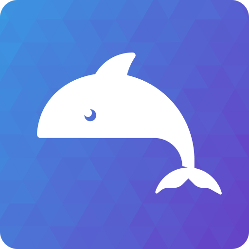
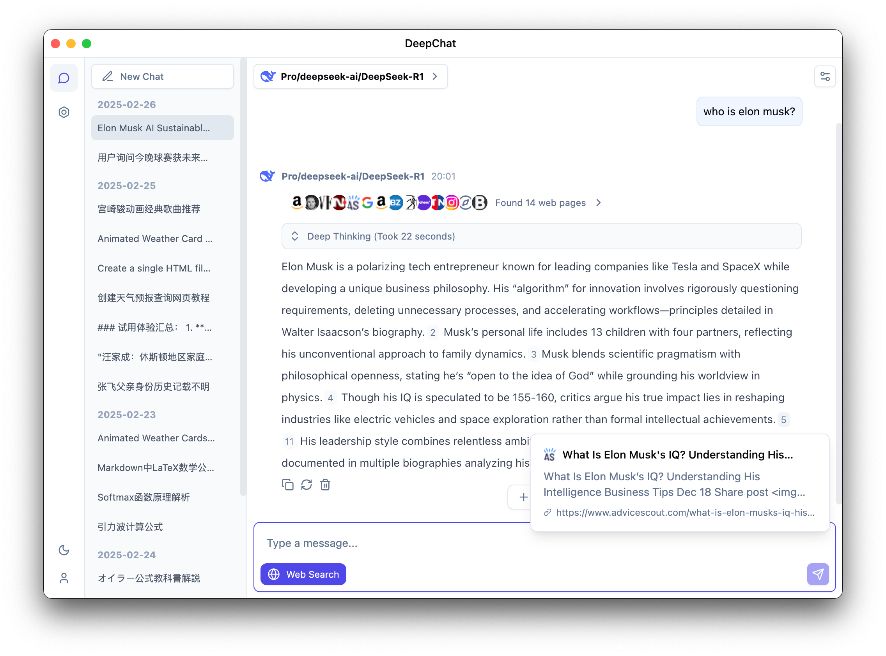
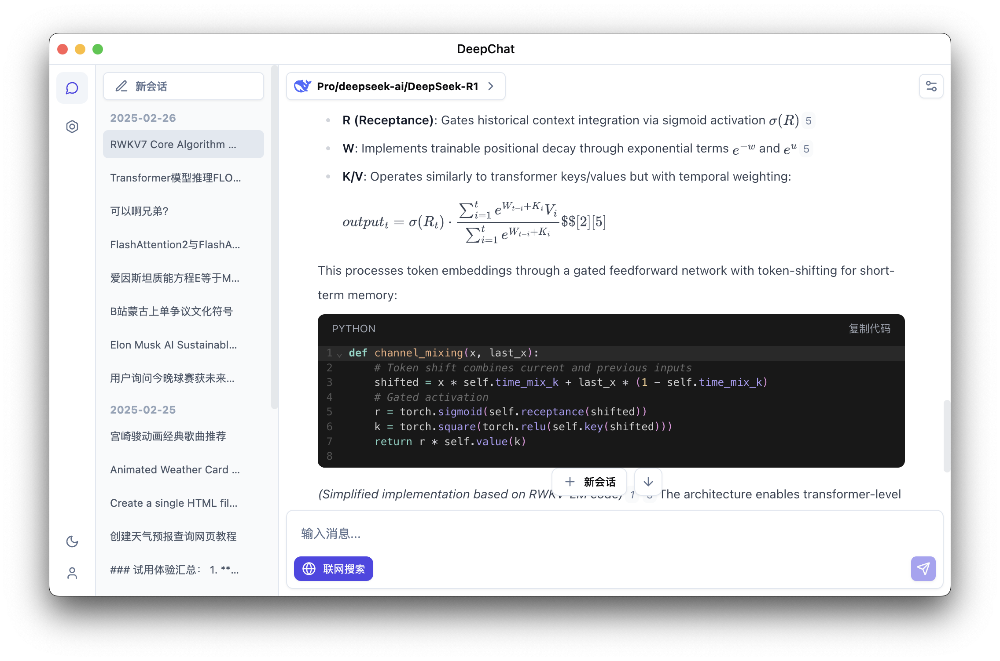
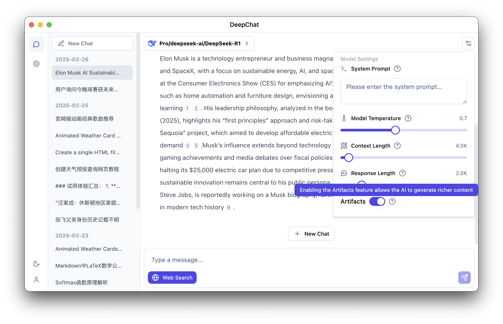

<p align='center'>

</p>

<h1 align="center">DeepChat</h1>

<p align="center">Dolphins are good friends of whales, and DeepChat is your good assistant</p>

<div align="center">
  <a href="./README.zh.md">中文</a> / English
</div>

### Reasoning

<p align='center'>

</p>

### Search

<p align='center'>

</p>

### Latex

<p align='center'>

</p>

### Artifacts support

<p align='center'>

</p>

## Main Features

- 🌐 Supports multiple model cloud services: DeepSeek, OpenAI, Silicon Flow, etc.
- 🏠 Supports local model deployment: Ollama
- 🚀 Multi-channel chat concurrency support, switch to other conversations without waiting for the model to finish generating, efficiency Max
- 💻 Supports multiple platforms: Windows, macOS, Linux
- 📄 Complete Markdown rendering, excellent code module rendering
- 🌟 Easy to use, with a complete guide page, you can get started immediately without understanding complex concepts

## Currently Supported Model Providers

<table>
  <tr align="center">
    <td>
      <br/>
      <a href="https://ollama.com">Ollama</a>
    </td>
    <td>
      <br/>
      <a href="https://deepseek.com/">Deepseek</a>
    </td>
    <td>
      <br/>
      <a href="https://www.siliconflow.cn/">Silicon</a>
    </td>
    <td>
      <br/>
      <a href="https://chat.qwenlm.ai">QwenLM</a>
    </td>
  </tr>
  <tr align="center">
    <td>
      <br/>
      <a href="https://console.volcengine.com/ark/">Doubao</a>
    </td>
    <td>
      <br/>
      <a href="https://platform.minimaxi.com/">MiniMax</a>
    </td>
    <td>
      <br/>
      <a href="https://fireworks.ai/">Fireworks</a>
    </td>
    <td>
      <br/>
      <a href="https://ppinfra.com/">PPIO</a>
    </td>
  </tr>
  <tr align="center">
    <td>
      <br/>
      <a href="https://openai.com/">OpenAI</a>
    </td>
    <td>
      <br/>
      <a href="https://gemini.google.com/">Gemini</a>
    </td>
    <td>
      <br/>
      <a href="https://github.com/marketplace/models">GitHub Models</a>
    </td>
    <td>
      <br/>
      <a href="https://moonshot.ai/">Moonshot</a>
    </td>
  </tr>
  <tr align="center">
    <td>
      <br/>
      <a href="https://openrouter.ai/">OpenRouter</a>
    </td>
    <td>
      <br/>
      <a href="https://azure.microsoft.com/en-us/products/ai-services/openai-service">Azure OpenAI</a>
    </td>
    <td colspan="2">
          Compatible with any model provider in openai/gemini API format
    </td>
  </tr>
</table>

## Other Features

- Support for local model management with Ollama
- Support for local file processing
- Artifacts support
- Customizable search engines (parsed through models, no API adaptation required)
- MCP support (built-in npx, no additional node environment installation needed)
- Support for multimodality models
- Local chat data backup and recovery
- Compatibility with any model provider in OpenAI, Gemini, and Anthropic API formats

## Development

Please read the [Contribution Guidelines](./CONTRIBUTING.md)
Windows and Linux are packaged by GitHub Action.
For Mac-related signing and packaging, please refer to the [Mac Release Guide](https://github.com/ThinkInAIXYZ/deepchat/wiki/Mac-Release-Guide).

### Install dependencies

```bash
$ npm install
$ npm run installRuntime
# if got err: No module named 'distutils'
$ pip install setuptools
# for windows x64
$ npm install --cpu=x64 --os=win32 sharp
# for mac apple silicon
$ npm install --cpu=arm64 --os=darwin sharp
# for mac intel
$ npm install --cpu=x64 --os=darwin sharp
# for linux x64
$ npm install --cpu=x64 --os=linux sharp
```

### Start development

```bash
$ npm run dev
```

### Build

```bash
# For windows
$ npm run build:win

# For macOS
$ npm run build:mac

# For Linux
$ npm run build:linux

# Specify architecture packaging
$ npm run build:win:x64
$ npm run build:win:arm64
$ npm run build:mac:x64
$ npm run build:mac:arm64
$ npm run build:linux:x64
$ npm run build:linux:arm64
```

## Star History

[](https://star-history.com/#ThinkInAIXYZ/deepchat&Date)

## Contributors

Thank you for considering contributing to deepchat! The contribution guide can be found in the [Contribution Guidelines](./CONTRIBUTING.md).

<a href="https://github.com/ThinkInAIXYZ/deepchat/graphs/contributors">
  
</a>

# 📃 License

[LICENSE](./LICENSE)
