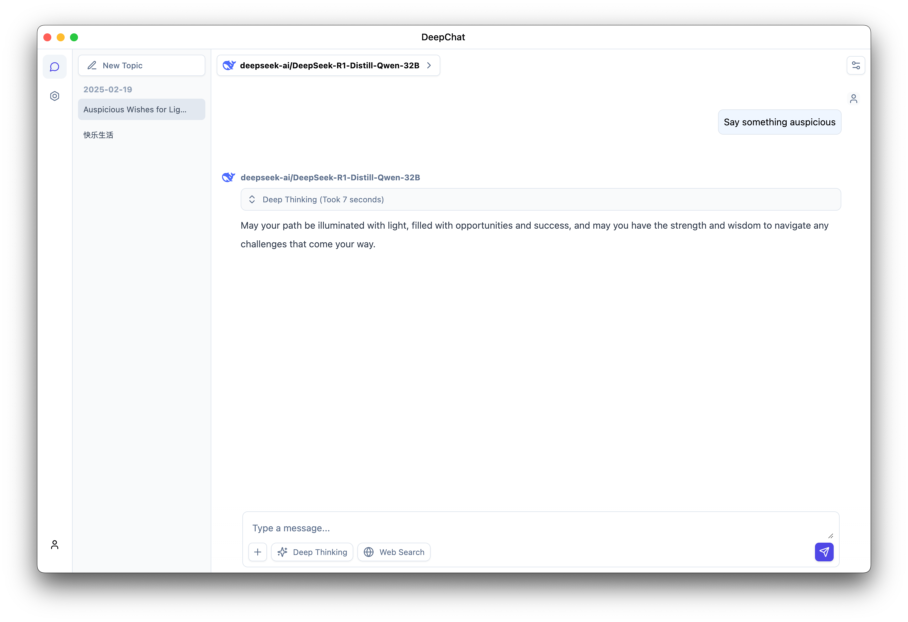

<p align='center'>

</p>

<h1 align="center">DeepChat</h1>

<p align="center">Dolphins are good friends of whales, and DeepChat is your good assistant</p>

<div align="center">
  <a href="./README.zh.md">中文</a> / English
</div>

<p align='center'>

</p>

## Main Features

- 🌐 Supports multiple model cloud services: DeepSeek, OpenAI, Silicon Flow, etc.
- 🏠 Supports local model deployment: Ollama
- 🚀 Multi-channel chat concurrency support, switch to other conversations without waiting for the model to finish generating, efficiency Max
- 💻 Supports multiple platforms: Windows, macOS, Linux
- 📄 Complete Markdown rendering, excellent code module rendering
- 🌟 Easy to use, with a complete guide page, you can get started immediately without understanding complex concepts

## TODO List
- [ ] Support for llama.cpp local model
- [ ] Support for local file processing
- [ ] Mermaid chart visualization
- [ ] Search integration (local + cloud API)
- [ ] MCP support
- [ ] Multi-modal model support
- [ ] Local chat data synchronization and encryption

## Development

### Install dependencies

```bash
$ npm install
```

### Start development

```bash
$ npm run dev
```

### Build

```bash
# For windows
$ npm run build:win

# For macOS
$ npm run build:mac

# For Linux
$ npm run build:linux

# Specify architecture packaging
$ npm run build:win:x64
$ npm run build:win:arm64
$ npm run build:mac:x64
$ npm run build:mac:arm64
$ npm run build:linux:x64
$ npm run build:linux:arm64
```
# 📃 License
[LICENSE](./LICENSE)
