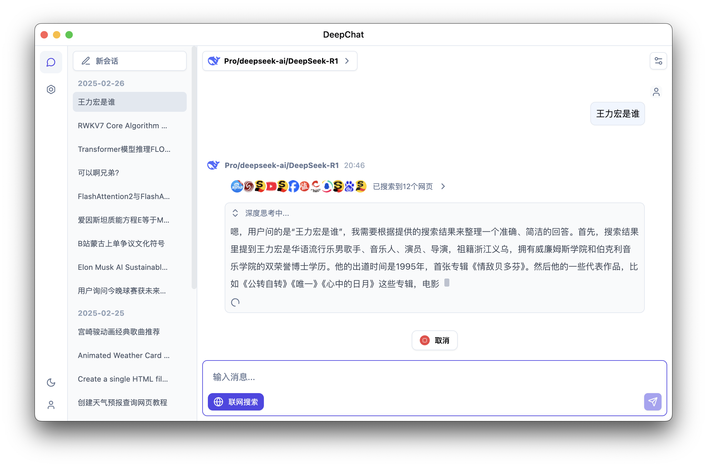
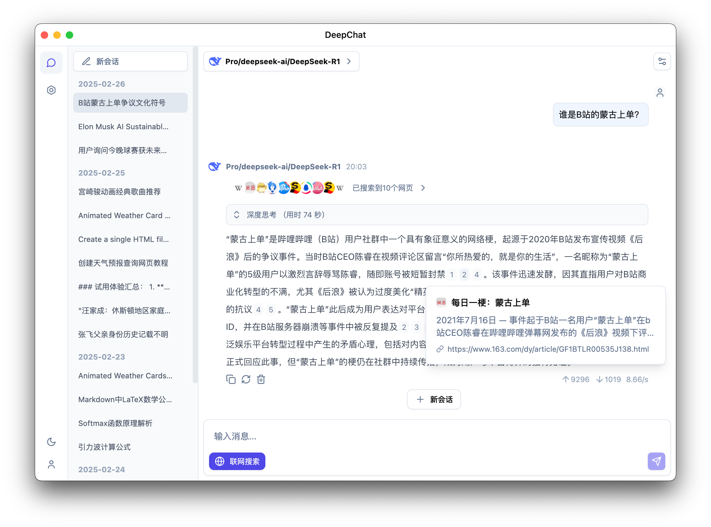

<p align='center'>

</p>

<h1 align="center">DeepChat</h1>

<p align="center">海豚是鲸鱼的好朋友，DeepChat是你的好助手</p>

<div align="center">
  中文 / <a href="./README.md">English</a>
</div>

### 深度思考

<p align='center'>

</p>

### 支持搜索 (纯本地直接向搜索引擎发起)

<p align='center'>

</p>

### Latex 公式支持

<p align='center'>

</p>

### Artifacts 特性

<p align='center'>

</p>
## 主要特性

- 🌐 支持多个模型云服务：DeepSeek、OpenAI、硅基流动等
- 🏠 支持本地模型部署：Ollama
- 🚀 多路聊天并发支持，无需等待模型生成完毕便可以切换到其他会话，效率Max
- 💻 支持多平台：Windows、macOS、Linux
- 📄 完整的 Markdown 渲染，优秀的代码模块渲染
- 🌟 简单易用，完善的引导页，不了解复杂的概念也能立刻上手

## 目前支持的模型供应商

<table>
  <tr align="center">
    <td>
      <br/>
      <a href="https://ollama.com">Ollama</a>
    </td>
    <td>
      <br/>
      <a href="https://deepseek.com/">Deepseek（深度求索）</a>
    </td>
    <td>
      <br/>
      <a href="https://www.siliconflow.cn/">硅基流动</a>
    </td>
    <td>
      <br/>
      <a href="https://chat.qwenlm.ai">QwenLM</a>
    </td>
  </tr>
  <tr align="center">
    <td>
      <br/>
      <a href="https://console.volcengine.com/ark/">火山引擎</a>
    </td>
    <td>
      <br/>
      <a href="https://minimaxi.com/">MiniMax大模型</a>
    </td>
    <td>
      <br/>
      <a href="https://fireworks.ai/">Fireworks</a>
    </td>
    <td>
      <br/>
      <a href="https://ppinfra.com/">PPIO派欧云</a>
    </td>
  </tr>
  <tr align="center">
    <td>
      <br/>
      <a href="https://openai.com/">OpenAI</a>
    </td>
    <td>
      <br/>
      <a href="https://gemini.google.com/">Gemini</a>
    </td>
    <td>
      <br/>
      <a href="https://github.com/marketplace/models">GitHub Models</a>
    </td>
    <td>
      <br/>
      <a href="https://moonshot.ai/">Moonshot</a>
    </td>
  </tr>
  <tr align="center">
    <td>
      <br/>
      <a href="https://openrouter.ai/">OpenRouter</a>
    </td>
    <td>
      <br/>
      <a href="https://azure.microsoft.com/en-us/products/ai-services/openai-service">Azure OpenAI</a>
    </td>
    <td colspan="2">
      兼容任意 openai/gemini 格式API的供应商
    </td>
  </tr>
</table>

## 其他特性

- 支持 Ollama 本地模型管理
- 支持本地文件处理
- Artifacts 支持
- 自定义任意搜索引擎（通过模型解析，无需API适配）
- MCP支持（内置npx，无需额外安装node环境）
- 多模态模型支持
- 本地聊天数据备份与恢复
- 支持OpenAi、Gemini、Anthropic三种格式的任意模型提供方

## 开发

请先阅读 [贡献指南](./CONTRIBUTING.zh.md)
Windows 和 Linux 由 Github Action 打包
Mac相关签名打包查看 [Mac 打包指南](https://github.com/ThinkInAIXYZ/deepchat/wiki/Mac-%E6%89%93%E5%8C%85%E6%8C%87%E5%8D%97)

### 安装依赖

```bash
$ npm install
$ npm run installRuntime
# if got err: No module named 'distutils'
$ pip install setuptools
# for windows x64
$ npm install --cpu=x64 --os=win32 sharp
# for mac apple silicon
$ npm install --cpu=arm64 --os=darwin sharp
# for mac intel
$ npm install --cpu=x64 --os=darwin sharp
# for linux x64
$ npm install --cpu=x64 --os=linux sharp
```

### 开始开发

```bash
$ npm run dev
```

### 构建

```bash
# For windows
$ npm run build:win

# For macOS
$ npm run build:mac

# For Linux
$ npm run build:linux

# 指定架构打包
$ npm run build:win:x64
$ npm run build:win:arm64
$ npm run build:mac:x64
$ npm run build:mac:arm64
$ npm run build:linux:x64
$ npm run build:linux:arm64
```

## Star

[](https://star-history.com/#ThinkInAIXYZ/deepchat&Date)

## 贡献者列表

感谢所有参与建设deepchat的贡献者！如果你也想参与，请阅读 [贡献指南](./CONTRIBUTING.md)。

<a href="https://github.com/ThinkInAIXYZ/deepchat/graphs/contributors">
  
</a>

# 📃 许可证

[LICENSE](./LICENSE)
