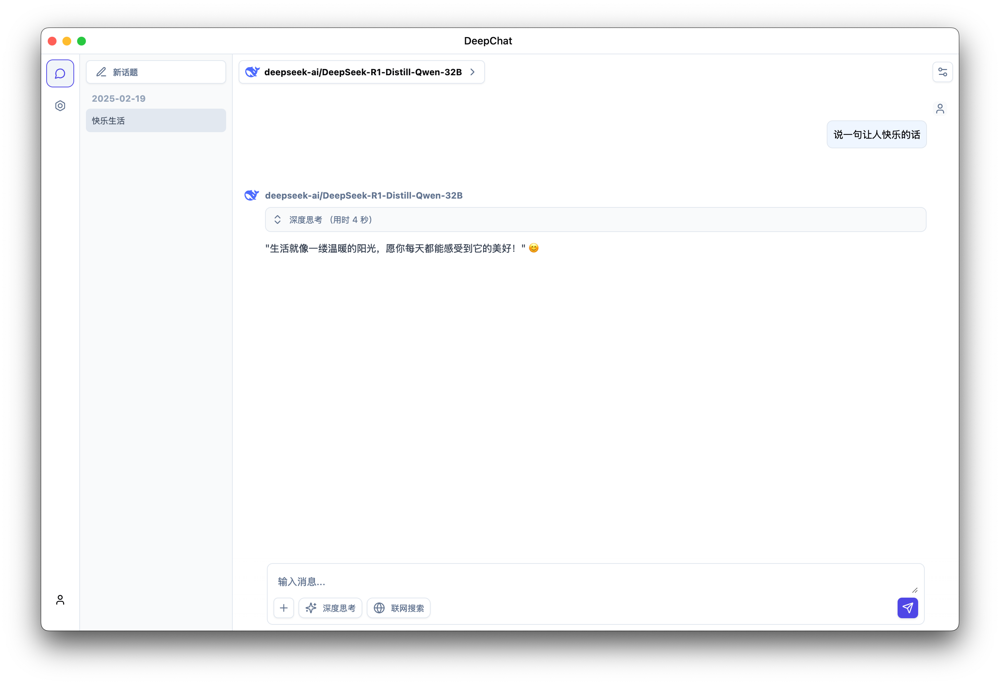

<p align='center'>

</p>

<h1 align="center">DeepChat</h1>

<p align="center">海豚是鲸鱼的好朋友，DeepChat是你的好助手</p>

<div align="center">
  中文 / <a href="./README.md">English</a>
</div>

<p align='center'>

</p>

## 主要特性

- 🌐 支持多个模型云服务：DeepSeek、OpenAI、硅基流动等
- 🏠 支持本地模型部署：Ollama
- 🚀 多路聊天并发支持，无需等待模型生成完毕便可以切换到其他会话，效率Max
- 💻 支持多平台：Windows、macOS、Linux
- 📄 完整的 Markdown 渲染，优秀的代码模块渲染
- 🌟 简单易用，完善的引导页，不了解复杂的概念也能立刻上手

## 即将推出（TODO）
- [ ] 支持 llama.cpp 本地模型
- [ ] 支持本地文件处理
- [ ] Mermaid 图表可视化
- [ ] 搜索集成（本地+云端API）
- [ ] MCP支持
- [ ] 多模态模型支持
- [ ] 本地聊天数据同步和加密


## 开发

请先阅读 [贡献指南](./CONTRIBUTING.zh.md)

### 安装依赖

```bash
$ npm install
```

### 开始开发

```bash
$ npm run dev
```

### 构建

```bash
# For windows
$ npm run build:win

# For macOS
$ npm run build:mac

# For Linux
$ npm run build:linux

# 指定架构打包
$ npm run build:win:x64
$ npm run build:win:arm64
$ npm run build:mac:x64
$ npm run build:mac:arm64
$ npm run build:linux:x64
$ npm run build:linux:arm64
```
# 📃 许可证
[LICENSE](./LICENSE)

