# DeepChat 当前架构概览

本文档描述 `2026-07-13` 的当前主架构。renderer-main boundary 使用 typed routes/events；agent
执行层使用显式 kind router、两个 typed backend，以及 DeepChat 专属 loop。

## 主链路

```mermaid
flowchart LR
    Renderer["Renderer / Stores / Views"] --> Client["renderer/api clients"]
    Client --> Bridge["window.deepchat / preload bridge"]
    Bridge --> Contracts["shared/contracts routes + events"]
    Contracts --> Routes["src/main/routes dispatcher"]
    Routes --> SessionOwners["explicit session owners<br/>search / translation / export / usage / catalog"]
    Routes --> Ports["core session/chat services + narrow ports"]
    Ports --> SessionFacade["AgentSessionPresenter<br/>core session façade"]
    SessionFacade --> Manager["AgentManager<br/>descriptor.kind router"]
    Manager --> DeepBackend["typed DeepChat backend"]
    Manager --> AcpBackend["direct ACP backend"]
    DeepBackend --> DeepRuntime["DeepChatAgentRuntime"]
    DeepRuntime --> DeepInstance["DeepChatAgentInstance"]
    DeepInstance --> Loop["DeepChatLoopEngine + LoopRun"]
    AcpBackend --> AcpRuntime["AcpAgentRuntime"]
    AcpRuntime --> AcpInstance["AcpAgentInstance"]
    Loop --> Tools["ToolPresenter ports"]
    Loop --> Tape["TapeRecorder / message projection"]
    Loop --> Memory["MemoryRuntimeCoordinator"]
    AcpInstance --> Projection["ACP message/Tape/event/trace adapters"]
```



关键边界：

- `AgentManager` 只解析 executable descriptor 和 app session 的 `agentId`，再按 canonical
  `descriptor.kind` 选择 backend；它不拥有 prompt、tool、Tape 或 Memory。
- `kind=acp` 使用 direct ACP backend 和外部 ACP protocol loop，不进入 `DeepChatLoopEngine`。
- `kind=deepchat + providerId=acp` 仍是受支持的兼容组合：session 走 DeepChat backend/loop，provider
  选择才进入 `AcpProvider` adapter。
- `AgentSessionPresenter` 是 core session façade，保留 session CRUD、title、turn、transfer/subagent 与
  shared projection 编排。history、translation、export、usage、RTK、catalog 和 startup migrations 由
  typed routes/lifecycle hooks 直接组合各自 owner。
- `AgentRuntimePresenter` 仍初始化 `DeepChatAgentRuntime`，并保留 DeepChat state/delegate、message、Tape、
  prompt/tool/provider adapter wiring；它不再实现 unified agent interface，也不负责 ACP runtime 构造。

## 模块职责

| 模块 | 位置 | 职责 |
| --- | --- | --- |
| renderer clients | `src/renderer/api/` | typed renderer clients，吸收 bridge/channel 细节 |
| shared contracts | `src/shared/contracts/` | route registry、schema、typed event catalog |
| main routes | `src/main/routes/` | typed route dispatch、services、handlers，以及 session history/translation owners |
| `AgentManager` | `src/main/agent/manager/agentManager.ts` | executable descriptor lookup、app-session lookup、explicit kind routing |
| backend contracts | `src/main/agent/manager/` | required common/kind facets、typed DeepChat backend、direct ACP backend |
| shared agent data | `src/main/agent/shared/` | descriptor/codec、legacy DTO boundary、app-session shell、shared data ports |
| DeepChat runtime | `src/main/agent/deepchat/instance/` | lazy per-session instance cache与 session-owned state |
| DeepChat loop | `src/main/agent/deepchat/loop/` | `LoopRun`、provider/tool round state machine、fixed awaited commits与窄 ports |
| DeepChat Memory adapter | `src/main/agent/deepchat/memory/` | sole runtime coordinator、prompt contributor、background ingestion observer |
| ACP runtime | `src/main/agent/acp/` | catalog、launch、client/process/session/protocol、direct instance/runtime |
| `AgentSessionPresenter` | `src/main/presenter/agentSessionPresenter/` | core session lifecycle/turn/assignment façade与 shared projection operations |
| session boundary owners | `src/main/routes/sessions/`, `src/main/presenter/exporter/agentSessionExporter.ts`, `src/main/presenter/usageStatsService.ts` | history、translation、current export、usage dashboard/backfill |
| startup maintenance | `src/main/presenter/startupMigrations/` | default legacy import and stateless session-data migrations |
| shared session policies | `src/main/agent/shared/` | available-agent catalog and assistant-model selection |
| `AgentRuntimePresenter` | `src/main/presenter/agentRuntimePresenter/` | retained DeepChat state/delegate façade及现有 message/Tape/provider/tool adapters |
| `ToolPresenter` | `src/main/presenter/toolPresenter/` | MCP/local tool 聚合、collision policy、权限预检查、调用路由 |
| `MemoryPresenter` | `src/main/presenter/memoryPresenter/` | Memory rows、retrieval、write、vector、maintenance kernel |
| `LLMProviderPresenter` | `src/main/presenter/llmProviderPresenter/` | provider/model runtime和 DeepChat ACP-provider compatibility adapter |
| `RemoteControlPresenter` | `src/main/presenter/remoteControlPresenter/` | remote channel control，generation control 走 manager port |
| `CronJobsService` | `src/main/presenter/cronJobs/` | detached session run、cron 调度和 Remote 投递 |

## Agent runtime 分层

### Control plane

`AgentDescriptor` 是 `DeepChatAgentDescriptor | AcpAgentDescriptor`。catalog list 对 legacy/malformed row
保持兼容读取，backend open 使用 capability-strict decode；unknown、disabled、malformed 或 kind mismatch
失败关闭，不 fallback 到 DeepChat。

`AgentSessionHandle` 只保留双方真实共有的 lifecycle、send/cancel/snapshot/close、pending、settings 与
tool-interaction facet。transfer、subagent、generation control 和 ACP controls 使用 required
kind-specific facet；agent handle/backend 不再有 `legacy/direct runtimeKind` 分支。

### DeepChat instance 与 loop

一个 active/hydrated app session 对应一个 `DeepChatAgentInstance`。instance 持有 identity/config、status、
pre-stream cancellation、active run、pending/steer、ordered interactions、skill/tool cache 和 compaction
projection。每个 turn 使用独立 `LoopRun` 保存 abort、request sequence、provider-round count、round
messages 与 stream state。

`DeepChatLoopEngine` 的固定核心顺序是：

```text
enterProviderRound
  -> consumeProviderRound
  -> updateOutput
  -> executeToolBatch
  -> afterRoundPersisted
  -> settleTurn
```

input/context preparation、prompt contributors、ViewManifest/rate gate 和 tool adapters 在固定入口接线；
内部 commit 可 await。只有 typed ordered tool-interaction outcome 会形成持久 pause，最后一项解决后创建
fresh resume run。外部 hook notifications 仍是 non-blocking observer。

### Tape、Memory 与 observability

- Tape 是现有 append-only semantic ledger；message store 是 mutable renderer projection；trace store 保存
  可选的 request diagnostics。
- tool round 在 message projection commit 后通过 `TapeRecorder.appendToolFact` 按 call→result 顺序写入，
  保持 provenance、idempotency、pending exclusion 和 fail-open。
- causal observation 是 Tape/ViewManifest + message terminal status + trace 的 pure-read join；历史 renderer
  event 没有 durable store，明确返回 `not_persisted`。
- `MemoryRuntimeCoordinator` 是 extraction chains/epochs/cooldown/access dedupe/cursor orchestration 的唯一
  runtime owner，同时实现 `MemoryPromptContributor` 与 `MemoryIngestionObserver`。`MemoryPresenter` 继续拥有
  Memory kernel/schema/vector/maintenance；instance 只持有 stable session handle。

## Renderer-main 与兼容边界

- migrated renderer 业务代码使用 `renderer/api/*Client`、`window.deepchat` 和 shared contracts。
- `SessionPresenter` 仍是旧 conversations/messages、thread/export 与窗口清理的 compatibility/data façade，
  不是当前 agent runtime。
- `startupMigrations/LegacyChatImportService` 和旧数据表继续服务 import compatibility；current
  agent-session export 由 `AgentSessionExportService` 负责，旧 conversations/messages export 仍由
  `SessionPresenter` compatibility path 负责。
- `AcpProvider` 只为 DeepChat descriptor 选择 ACP provider 的兼容路径保留；direct `kind=acp` 不调用它来
  执行主 turn。

## 防回归规则

- `scripts/architecture-guard.mjs` 阻止 retired agent backend/path/symbol、agent handle legacy/direct
  `runtimeKind`、internal `agentType ?? type` fallback、DeepChat loop 到 presenter/routes/Electron/SQLite/ACP
  的 import，以及 direct ACP instance 到 DeepChat loop、`MemoryPresenter`、presenter root entry 或
  `SQLitePresenter` 的依赖。
- 同一 guard 保持 Memory unique owner/structure、causal observation read-only 和 renderer typed boundary。
- 同一 guard 阻止 removed session-boundary methods/interface declarations、foreign owner imports，以及五个
  startup hook 中的 presenter dependency、unsafe cast 和 optional task probe 回流。
- `scripts/agent-cleanup-guard.mjs` 覆盖 `src/main/agent/**` 与 retained presenter/tool/skill hot paths，防止旧
  agent/session presenter import 回流。

## 推荐阅读顺序

1. [FLOWS.md](./FLOWS.md)
2. [architecture/agent-system.md](./architecture/agent-system.md)
3. [architecture/tool-system.md](./architecture/tool-system.md)
4. [architecture/session-management.md](./architecture/session-management.md)
5. [architecture/agent-memory-system/spec.md](./architecture/agent-memory-system/spec.md)
6. [architecture/agent-system-layered-runtime/README.md](./architecture/agent-system-layered-runtime/README.md)
