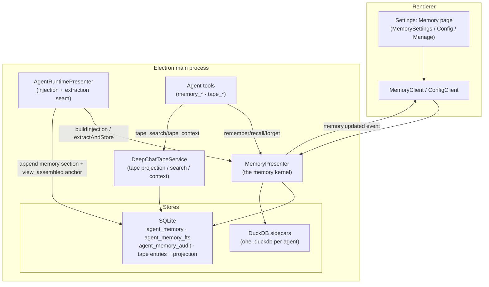
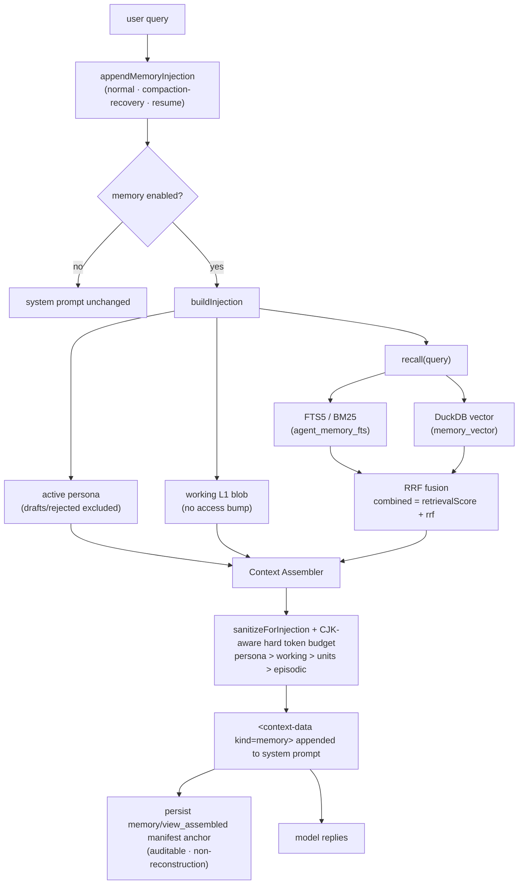
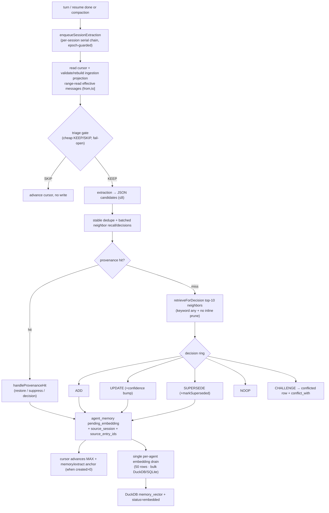
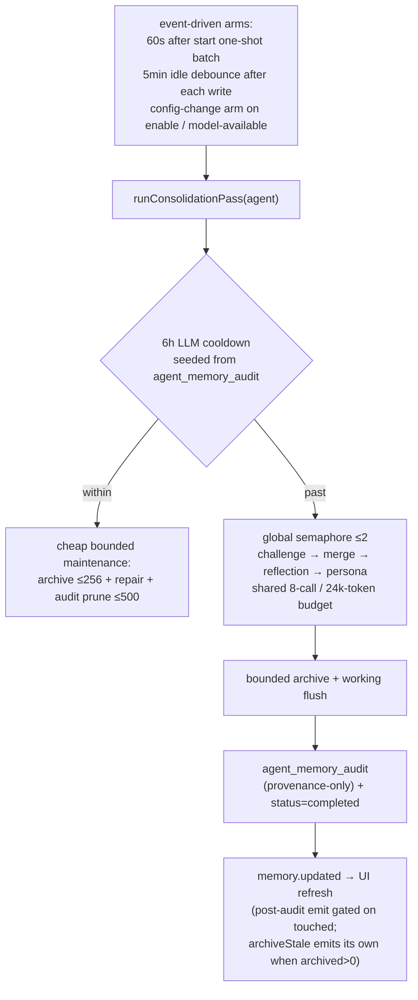
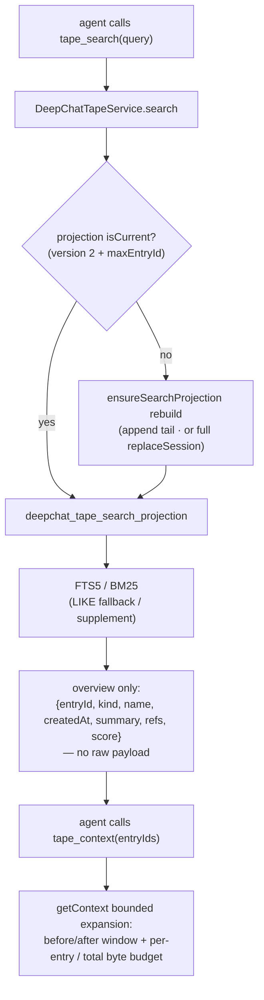

# Agent Memory System — Architecture & Design

## 1. Overview

DeepChat's current memory implementation is a per-agent long-term memory layer built around the tape. It
derives durable memory from the effective tape, keeps lineage back to source entries, and treats the raw tape
as the evidence source of truth. `agent_memory` is the synthesized cache used for recall, update, forgetting,
and audit.

Each agent owns its own memory rows, audit rows, config, and DuckDB vector sidecar. The implementation adds no
new infrastructure and reuses SQLite, DuckDB, the existing embedding manager, the tape effective view, and the
scoring helpers. `Crystal` and `Episodic` session-summary layers remain reserved placeholders, not active read
or write paths.

---

## 2. Design principles

These hold across every module and are the system's core invariants.

1. **Sidecar, one-directional.** Memory consumes the tape effective view and writes only `memory/*` and
   `persona/*` tape anchors that are **non-reconstruction**: they never move the summary cursor, never
   participate in context rebuild, and never write back the original facts.
2. **Never block the turn.** Recall is fail-open: any error returns the original system prompt unchanged.
   Extraction is fail-safe: a failure leaves the extraction cursor unadvanced so the span is retried, and
   never throws into the conversation.
3. **Fail-open where losing data is the risk; fail-closed where writing wrong/stale data is the risk.**
   - Fail-open: triage failure → extract anyway; decision-model failure → degrade to `ADD`; neighbor
     recall failure → proceed with no neighbors; transient embedding-service failure → re-mark
     `pending_embedding` for retry; vector-write/dimension failures may mark rows `error`, but the
     embedding drain periodically requeues a bounded batch after cooldown and the Health panel exposes a
     per-agent reindex entry.
   - Fail-closed: a vector sidecar whose embedding identity (provider/model/dim) cannot be verified is
     disabled and recall serves FTS only — it never silently returns vectors from the wrong model.
4. **Never hard-delete on the durable path.** Contradiction and staleness use supersede chains and
   soft archival. Only an explicit user UI delete/clear or agent-deletion cleanup hard-deletes.
5. **Hot path adds zero synchronous LLM calls.** Extraction, embedding, reflection, persona evolution,
   merging, and decay all run off the hot path; the only model call near a turn is the optional triage
   gate, and even that runs inside the background extraction chain, not in the send path.
6. **Expensive work is offline.** Consolidation/merge/reflection/persona run on a self-scheduled
   sleep-time pass gated by a restart-durable cooldown and an LLM budget.
7. **Auditable, content-free observability.** Maintenance and user audit rows record *provenance
   metadata only* (ids/action/model, with an optional `session_id` — never raw text) in an audit table;
   injection manifests are persisted as tape anchors.
8. **Message-boundary extraction.** CJK-aware chunks cap estimated tokens and Unicode code points;
   triage and extraction see the same chunk, and the cursor advances only after the last fragment of a
   message succeeds.
9. **Authoritative, epoch-gated reads.** Retrieval re-reads the FTS/vector union after provider awaits;
   a concurrent domain mutation invalidates the entire injection before prompt append or accounting.
10. **Revisioned aggregate writes.** `decision_revision` protects UPDATE/SUPERSEDE/CHALLENGE with one
    bounded fresh retry; unresolved conflict participants cannot be independently mutated.
11. **Bounded external lifecycles.** Provider work passes RateLimit admission and purpose deadlines;
    vector operations use manager-owned leases, and disposal has one five-second drain deadline.
12. **Destructive generations are separate from read epochs.** Ordinary semantic mutations advance the
    per-agent read epoch; clear, agent deletion, and dispose invalidate a destructive operation generation
    and abort stale provider continuations before they can write rows, cursors, audits, events, or vectors.
13. **Scale is contractually bounded.** Recall chooses either indexed FTS or one LIKE fallback; extraction
    batches candidate recall/decisions; embedding persists in bulk; maintenance has row/call/token/concurrency
    budgets; startup, vector-store residency, management pages, content, and operational audit history all
    have explicit caps.

---

## 3. System overview



**Ownership rules**

- The renderer settings UI talks to the kernel only through typed IPC (`MemoryClient` for management,
  `ConfigClient` for config).
- `AgentRuntimePresenter` owns the *seam*: it decides when to inject and when to extract, and it owns the
  per-session extraction queue and the monotonic cursor. It does not own memory logic.
- `MemoryPresenter` is the single public memory facade. Internal services own write decisions,
  recall, scheduling, lifecycle, persona, conflicts, embeddings, and DuckDB orchestration; external
  callers still reach those capabilities only through the facade.
- `DeepChatTapeService` owns the searchable tape projection (the log-as-memory read model).

---

## 4. Module layout

| Layer | File | Responsibility |
| --- | --- | --- |
| Kernel | `src/main/presenter/memoryPresenter/index.ts` | `MemoryPresenter` facade — public method compatibility, service wiring, narrow port binding, `dispose()` and deleted-agent cleanup orchestration |
| Kernel | `memoryPresenter/context.ts` | `MemoryRuntimeContext` — read epochs, destructive operation generations, disposed state, validation/guard helpers, audit/events, and model resolution |
| Kernel | `memoryPresenter/runtimeConstants.ts` | Internal runtime scheduling, lifecycle, working-memory, and warmup constants |
| Kernel | `memoryPresenter/types.ts` | Repository/vector DTOs, enum types, and the retrieval/scoring/decay tunable constants |
| Kernel | `memoryPresenter/ports.ts` | Root-owned cross-layer ports such as `VectorStoreRetrievalPort` and `WorkingMemoryReadPort` |
| Kernel | `memoryPresenter/injection.ts` | Lightweight public sub-entry for injection helpers/types without loading the facade composition root |
| Services | `memoryPresenter/services/rowMutations.ts` | Shared stateful row mutation leaf helpers for insert/update/supersede/conflict/provenance/confidence primitives |
| Services | `memoryPresenter/services/retrievalService.ts` | Hybrid recall/search/injection orchestration, keyword query, query embedding gate, soft timeout, RRF fusion, access recording |
| Services | `memoryPresenter/services/writeCoordinator.ts` | Sync writes, extraction writes, user/tool writes, decision ring application, audit, and background trigger ports |
| Services | `memoryPresenter/services/maintenanceService.ts` | Startup/prewarm/consolidation timers, merge/challenge/reflection/persona maintenance, decay/archive passes |
| Services | `memoryPresenter/services/workingMemoryService.ts` | Working-memory blob read/build/refresh/delete, correctness-only dirty/flush finalization, cold-start refresh coalescing, and legacy working-provenance resolution |
| Services | `memoryPresenter/services/reflectionService.ts` | Reflection thresholding, insight insertion, watermarks, and embedding trigger port |
| Services | `memoryPresenter/services/personaService.ts` | Persona draft/evolution/approval/rejection/rollback/anchor flows and per-agent persona lock |
| Services | `memoryPresenter/services/conflictService.ts` | Conflict aggregate guard, listing/resolution, integrity repair, and maintenance scheduling through narrow ports |
| Services | `memoryPresenter/services/managementService.ts` | List/get/lifecycle/health/delete/clear/status delegation and management-facing row projection |
| Infra | `memoryPresenter/infra/providerGateway.ts` | Agent-aware RateLimit admission, purpose deadlines, destructive abort, and bounded unsettled provider work |
| Infra | `memoryPresenter/infra/vectorStoreManager.ts` | DuckDB sidecar infrastructure: scoped generation leases, readiness certificates, recoverable reset, lease-safe LRU/TTL eviction, and parallel close/drain orchestration |
| Infra | `src/main/lib/asyncSemaphore.ts` | Fair process-wide admission for heavy per-agent maintenance |
| Infra | `memoryPresenter/infra/embeddingPipeline.ts` | Pending embedding drain, reindex/backfill, embedding/vector warmups, dimension cooldowns, and `isReindexing` |
| Infra | `memoryPresenter/infra/memoryVectorStore.ts` | `MemoryVectorStore` — per-agent DuckDB sidecar (HNSW/cosine, identity gate, transactional upsert, disk reclaim) |
| Core | `memoryPresenter/core/candidates.ts` | Pure memory candidate normalization |
| Core | `memoryPresenter/core/decision.ts` | The Mem0-style decision ring prompt + tolerant parser (`ADD/UPDATE/SUPERSEDE/NOOP/CHALLENGE`) |
| Core | `memoryPresenter/core/batchDecision.ts` | Pure 4-candidate/12k-token decision partitioner and indexed batch-result parser |
| Core | `memoryPresenter/core/maintenanceBudget.ts` | Shared per-pass call/token accounting with fixed challenge/merge/reflection/persona quotas |
| Core | `memoryPresenter/core/extraction.ts` | Triage + extraction prompts and parsers; reflection/persona prompts; persona small-step (Levenshtein) guard |
| Core | `memoryPresenter/core/injectionPort.ts` | `sanitizeForInjection` + the token-budgeted Context Assembler + the injection manifest |
| Core | `memoryPresenter/core/lifecycle.ts` | Lifecycle diagnostics and archive/freshness thresholds |
| Core | `memoryPresenter/core/recallKeyword.ts` | Pure keyword candidate extraction and selection for recall |
| Core | `memoryPresenter/core/scoring.ts` | Recall `retrievalScore`, `decayScore`, RRF `fuse()`, provenance keys |
| Shared | `shared/types/agent-memory.ts` | `AgentMemoryCategory`, `AGENT_MEMORY_CATEGORIES`, and deterministic category importance floors |
| Storage | `sqlitePresenter/tables/agentMemory.ts` | `agent_memory` table + `agent_memory_fts` FTS5 + keyword search |
| Storage | `sqlitePresenter/tables/agentMemoryAudit.ts` | `agent_memory_audit` content-free maintenance ledger |
| Storage | `sqlitePresenter/tables/deepchatTapeSearchProjection.ts` | `deepchat_tape_search_projection` (+ meta + FTS) evidence projection |
| Storage | `sqlitePresenter/tables/deepchatMemoryIngestionProjection.ts` | Versioned effective-message range projection used only by memory extraction |
| Runtime seam | `agentRuntimePresenter/index.ts` | `appendMemoryInjection`, `enqueueSessionExtraction`, span builder, cursor, memory anchors |
| Runtime | `agentRuntimePresenter/tapeService.ts` | `search()` / `getContext()` / `ensureSearchProjection()` |
| Tools | `toolPresenter/agentTools/agentMemoryTools.ts` | `memory_remember` / `memory_recall` / `memory_forget` |
| Tools | `toolPresenter/agentTools/agentTapeTools.ts` | `tape_info` / `tape_search` / `tape_context` / `tape_anchors` / `tape_handoff` |
| Skills | `resources/skills/memory-management/SKILL.md` | Discoverable guidance for recall/remember discipline and Memory vs Skill vs Scheduled Task routing |
| Contracts | `shared/contracts/routes/memory.routes.ts` | All `memory.*` IPC routes + DTO schemas |
| Contracts | `shared/contracts/events/memory.events.ts` | `memory.updated` event + reason enum |
| Renderer | `renderer/settings/components/Memory*.vue`, `renderer/api/MemoryClient.ts` | The settings IA (page, config tab, manage tab) |

Directory boundaries enforce dependency direction and are checked by `scripts/architecture-guard.mjs`:
`core/` must not import `context`, `services`, `infra`, `runtimeConstants`, or facade entrypoints;
`infra/` may import `core`, root `types`, `ports`, `context`, and `runtimeConstants`, but not
`services` or facade entrypoints; `services/` may import `core` and root runtime contracts
(`types`, `ports`, `context`, `runtimeConstants`), but not infra concrete modules. Business calls
between services stay facade-wired through narrow function ports. `services/rowMutations.ts` is the
only service-layer import exception because it is a shared stateful row mutation leaf. `index.ts` is
the only composition root that may import every internal layer; all other root files are lightweight
entrypoints/contracts and may not import `services`, `infra`, or the facade entrypoint.

---

## 5. Data model and storage responsibilities

Memory is split across six stores. Each has one job; none is authoritative for more than its job.

| Store | Holds | Rebuildable? |
| --- | --- | --- |
| SQLite `agent_memory` | Authoritative memory rows: content, kind, optional agentic category, status, importance, confidence, decay, lineage (`source_entry_ids`), supersede chain, persona state, conflict link | No — source of truth for synthesized memory |
| SQLite `agent_memory_fts` | Keyword recall (BM25), external-content mirror of `agent_memory` | Yes — rebuilt idempotently; degrades to `LIKE` |
| SQLite `agent_memory_audit` | Maintenance/user provenance ledger (ids/action/model; `scheduler`/`user` actors + optional `session_id`; drives the cooldown) | No — but content-free |
| SQLite `deepchat_tape_search_projection` | Searchable evidence projection of the effective tape (summary + refs + FTS) | Yes — rebuilt from raw tape entries |
| SQLite `deepchat_memory_ingestion_projection` | Effective final messages keyed by session/message with order, lineage entry, and tool-use bit for bounded extraction ranges | Yes — rebuilt from raw tape entries |
| DuckDB sidecar (one `.duckdb` per agent) | `memory_vector` (HNSW/cosine) + `embedding_meta` (provider/model/dim identity) | Yes — re-embedded from `agent_memory` |

The raw tape (`deepchat_tape_entries`) remains the ultimate evidence source of truth and also stores the
`memory/extract` and `memory/view_assembled` audit anchors (both non-reconstruction).

### 6.1 `agent_memory` columns

`id`, `agent_id`, `user_scope`, `kind`, `category`, `content`, `importance`, `status`, `embedding_id`,
`embedding_dim`, `embedding_model`, `source_session`, `provenance_key`, `is_anchor`, `superseded_by`,
`created_at`, `last_accessed`, `access_count`, `decay_score`, `source_entry_ids`, `confidence`,
`last_consolidated_at`, `conflict_state`, `conflict_with`, `persona_state`, `decision_revision`.

A unique partial index on `(agent_id, provenance_key)` enforces idempotent dedup.
New provenance keys are `v2:<kind>:<sha256>` over
`agentId + NUL + kind + NUL + NFC(trim/collapseWhitespace(content))`; case is preserved. Legacy v1
lookups require a normalized-content equality check before transactional lazy re-keying.

### 6.2 Enums

| Enum | Members | Notes |
| --- | --- | --- |
| `AgentMemoryKind` | `episodic`, `semantic`, `reflection`, `persona`, `working` | `working` is an internal single-blob session-open cache (never recalled/embedded/archived). `crystal` is reserved (no read/write path). |
| `AgentMemoryCategory` | `user_preference`, `project_fact`, `task_outcome`, `heuristic`, `anti_pattern` | Optional agentic write contract. `task_outcome` normalizes to `episodic`; the other categories normalize to `semantic`. `reflection`/`persona`/`working` rows always carry `NULL`. |
| `AgentMemoryStatus` | `pending_embedding`, `embedded`, `error`, `fts_only`, `archived`, `conflicted` | `fts_only` = recallable by keyword but not vector (no embedding config / transient). `archived` = soft-deleted. `conflicted` = a `CHALLENGE` row. |
| `AgentMemoryPersonaState` | `draft`, `active`, `superseded`, `rejected` | Only meaningful for `kind='persona'`; `NULL` for everything else. Legacy persona rows are read as active while not superseded. |
| `AgentMemoryConflictState` | `challenged` | Marks the *target* of an open challenge. |

### 6.3 Lineage contract

`source_entry_ids` stores **tape `entry_id` integers** (a JSON array), scoped by `source_session`. It is
dropped when there is no source session, and never stores message ids. It is collected in the same pass
that builds the extraction span (a message contributing no text appears in neither the span nor the
lineage).

---

## 6. The read path

Recall runs before each send and adds a read-only memory section to the system prompt. All three runtime
entry points — normal send, context-pressure compaction recovery, and resume — funnel through one
`appendMemoryInjection` seam so injection is identical across paths; a disabled agent short-circuits and
the system prompt is returned byte-for-byte unchanged.



**`buildInjection` details**

- Captures the per-agent read epoch, then resolves recalled units with access recording disabled. After all
  provider/vector awaits, retrieval performs one agent-scoped `listByIds` authoritative re-read of the
  FTS/vector union and replaces stale snapshots with the latest rows.
- Re-checks the original epoch, synchronously flushes any correctness-only working dirty state, captures the
  post-flush epoch, and only then reads the **active** persona and working blob. Draft/rejected persona is
  never injected and working reads do not bump `access_count`.
- Performs one final enabled/managed/disposed/epoch gate and returns immediately without another await. Any
  concurrent semantic mutation fails the whole injection closed; runtime separately re-checks enablement
  before prompt append, access accounting, and the `memory/view_assembled` anchor.
- Produces a `MemoryInjectionPayload` (selfModel + working + memories + `tokenBudget`) and a manifest
  (selected/dropped/queryHash). The runtime appends the section and persists a `memory/view_assembled`
  anchor.

**Sanitization (`sanitizeForInjection`).** Persona and recalled bodies are neutralized before injection by
inserting a zero-width character into instruction-like markers: line-leading `#`, code fences (```` ``` ````),
role prefixes (`system:`/`assistant:`/`user:`), and literal `<context-data` tags. The whole block is wrapped
in a read-only `<context-data kind="memory">` container preceded by a `READONLY_NOTICE` telling the model to
treat it strictly as data. This is the persistent prompt-injection mitigation.

**Context Assembler (token budget).** Admission priority is `persona > working > recalled units > episodic`,
but priority only decides order — the resolved budget (default **1200** tokens; configured values are clamped
down to a max of **8000**, and a value below **64** or malformed falls back to the 1200 default) is a hard
ceiling every section counts against. `estimateTokens` is CJK-aware (CJK/Kana/Hangul characters counted
at density **1.5**, other characters at `1/4`) so Chinese sections are not over-admitted. Persona and working
are placed first with a floor reservation so neither starves the other; recalled memories are admitted
whole-line (never half a sentence); episodic summaries sit last so they are cut first. The assembler is the
final boundary and never trusts an upstream size cap.

---

## 7. The write path

Extraction is triggered after a turn/resume completes or on compaction, serialized per session, and never
on the hot path. It builds its span from the **effective** tape view (after retract/replace/tool-dedup),
not from raw messages. The span carries only user-visible text: a user entry contributes its message text and
an assistant entry contributes only its `content` blocks — assistant reasoning (`reasoning_content` /
`reasoning` blocks) is deliberately excluded so internal chain-of-thought never becomes a durable memory. The
raw tape still records reasoning in full; only the extraction input drops it (a message contributing no
visible text appears in neither the span nor the lineage).

Fallback extraction is task-aware. The span builder computes `hadToolUse` and `visibleTextChars` in the same
effective-view pass that collects text and lineage. `hadToolUse` is derived by matching effective `tool_call`
rows' `payload.messageId` against the selected message window; raw tape rows are not filtered by `orderSeq`.
A fallback span is admitted only when it has visible text and either used a tool, reaches the long-span
backstop (`delta >= 6`), or is a short but substantive text span (`delta >= 2` and at least 160 visible
characters). Empty visible-text spans return before extraction and do **not** advance the memory cursor.
Compaction-triggered extraction keeps its old behavior.



**Chunking and triage.** The effective window is packed on message boundaries into CJK-aware chunks capped
at approximately **4,000 estimated tokens** and **12,000 Unicode code points**. An oversized message is split
with an iterator-based grapheme/code-point-safe linear scan; its cursor boundary is committed only after the
last fragment succeeds. One queue task processes at most four chunks and enqueues the immutable remainder on
the same session chain. Triage and extraction receive the exact same complete chunk—there is no prompt-side
tail slice. `parseTriageDecision` skips only on an explicit `SKIP` without `KEEP`; a thrown triage call remains
fail-open. A successful SKIP consumes only that chunk's committable message boundary.

**Extraction.** For each complete chunk the model returns at most **8** raw candidates (enforced both in the
prompt and as a hard parse cap), each `{category, content, importance}`. Parsing is tolerant
**per entry** — a malformed individual entry or empty content is skipped, raw `category`/legacy `kind` are
preserved, malformed importance is left for normalization, and each span keeps at most one `task_outcome`.
A **top-level** parse failure (empty response, no JSON array, invalid JSON, or a non-array), however, is
reported as a discriminated `MemoryCandidateParseResult` (`{ ok: false, reason }`) rather than silently
degraded to `[]`, so the caller can retry the span instead of consuming it; a successful parse returns
`{ ok: true, candidates }` (an empty array is a valid success).

Before recall or another provider call, normalized candidates are stably deduplicated by
`(kind, provenance-v2-normalized content)` and automatic content is capped at **2,000 characters**. An
oversized item becomes a content-free `candidate-too-large` audit outcome rather than being truncated.
Candidate neighbor retrieval performs one bounded keyword query per item, one batch query-embedding call,
one vector lease for all vector queries, and one authoritative `listByIds`; each item keeps at most three
neighbors.

**Candidate normalization.** Every write entry point (`coordinateWrite`, `directAddMemory`, and
`writeMemoriesSync`) normalizes candidates before provenance-key generation or storage. A valid category
takes precedence over legacy `kind`: `task_outcome` becomes `episodic`, all other valid categories become
`semantic`; a missing category may keep a valid legacy `episodic`/`semantic` kind with `category=NULL`;
an invalid category becomes `semantic` + `NULL`. Importance is clamped/defaulted and then raised to
`CATEGORY_IMPORTANCE_FLOOR[category]` when a category is present. `reflection`, `persona`, and `working` rows
are never allowed to carry a category.

**The extraction model is not a hardcoded "small" model.** Two resolvers exist. `resolveExtractionModel` uses
the agent's configured `memoryExtractionModel` when set; the extraction/triage/decision path falls back to the
**active chat model**. The offline passes use a separate `resolveConsolidationModel` whose fallback is the
agent's **default model** (`resolveAgentDefaultModel`), not the active chat model — consolidation, reflection,
and persona run on the scheduler with no active chat session, so the active chat model is structurally
unavailable to them. The cost saving comes from the triage gate avoiding the larger extraction call, plus the
*option* to point extraction at a cheaper model.

**Decision ring (`coordinateWrite`).** Candidates are applied serially in original order, but model work is
batched: at most four candidates per prompt, three 400-character neighbor excerpts each, 12,000 estimated
input tokens, and two initial decision calls. The partitioner drops lowest-priority excerpts before using a
safe initial `ADD` budget fallback; it never truncates candidate content or opens a third initial batch.
Each candidate then follows this state machine:

1. Trim; empty → no-op. Teardown guard → no-op.
2. Compute the provenance key and check for an existing row. A pure scheduler-archived row is restored to
   `pending_embedding`; a user/runtime-forgotten row is suppressed; an archived superseded conflict loser is
   suppressed; an active duplicate returns `noop(duplicate)`. A non-archived superseded row does not revive
   by provenance alone when a model path is available — its live chain head is fed into the decision ring.
3. Otherwise use its three-item batch-retrieved neighbor set. This keeps FTS-only agents capable of semantic
   write decisions without requiring vectors. On the first attempt, a missing/invalid result or provider
   failure degrades only that candidate to `ADD`. Revision/liveness conflicts are collected in original
   order; only the first four receive one fresh provenance/recall pass and one shared retry decision call,
   reusing their first query embeddings. During retry only an explicit valid `ADD` may insert; another
   conflict, provider failure, missing result, or parse failure returns `noop(concurrent-update)`.
4. Apply: `ADD` inserts with the candidate category. `UPDATE` uses one conditional SQL statement plus the
   confidence update in one transaction, atomically checking agent/id/revision/liveness/conflict while
   replacing content/category/provenance, resetting embedding metadata, and incrementing
   `decision_revision`. `SUPERSEDE` and `CHALLENGE` atomically combine successor/challenger insert with their
   conditional target transition. `NOOP` does nothing.

Each successful candidate semantic commit immediately advances the read epoch and marks working memory dirty
before the next await. Batch success, failure, disable, and dispose share one finalization path for working
flush, embedding scheduling, and events. A partial batch keeps its cursor unadvanced; provenance/revision CAS
makes replay converge without losing the side effects of already committed rows.

The write outcome is a discriminated union `MemoryWriteOutcome` (`created` / `updated` / `superseded` /
`noop` / `challenged`). The same coordinator backs both extraction and the agent-facing `memory_remember`
tool and the user-facing `memory.add` route (when an extraction model is configured; otherwise the user-add
path is a pure dedupe-add).

**Two-phase persistence.** Phase 1 is a synchronous SQLite insert as `pending_embedding`. Phase 2 is one
per-agent `{dirty,running}` drain loop over at most 50 rows: one batched `getEmbeddings`, one authoritative
`listByIds`, one DuckDB transaction containing a bulk delete and multi-values insert, and at most one
revision-aware SQLite success update plus one error update. Content/config/clear races therefore cannot mark
an old vector ready. A whole-provider failure leaves rows pending without per-row no-op writes; malformed
individual vectors enter the error batch. Cooldown-bounded retry and manual per-agent reindex remain available.

The effective-message ingestion projection is maintained at the lowest Tape append boundary, so every
message/tool/anchor/event append advances or invalidates the session watermark. Reads compare projection
version and session max entry ID; a mismatch rebuilds transactionally through the single
`buildEffectiveTapeView` implementation. Rebuild failure uses that full view for the current extraction and
does not falsely advance the cursor. The steady path materializes only the requested `(orderSeq, messageId)`
range while preserving the final message entry ID as lineage.

**Cursor.** `memory_cursor_order_seq` (on `deepchat_sessions`) is written `SET = MAX(existing, floor(x), 0)`,
so a late/stale extraction can never roll it back. It advances only when `extractAndStore` returns `ok: true`
— i.e. the model output parsed into a (possibly empty) candidate array; a transient LLM error or a top-level
parse failure returns `ok: false` and leaves the cursor for retry, so a span is never consumed by an output
the model could not understand. A `memory/extract` anchor is written only when at least one row was created.

---

## 8. Retrieval and scoring

`retrieve()` resolves the per-agent retrieval config, fetches `topK*2` candidates from each path, fuses them,
and trims to `topK`. `searchMemories()` is the only caller allowed to pass a search-only `topKOverride`
(default 50, route max 100); agent-facing recall and prompt injection continue to use the configured
retrieval `topK` and still record access only for recall/injection hits.

- **Keyword path.** `agent_memory_fts` (FTS5, BM25-ranked) with the tokenizer chosen at runtime — `trigram`
  for CJK/substring matching, else `unicode61`. Query terms are selected deterministically by kind
  (code/path → CJK → ASCII), Unicode code-point length, and original position, with a cap of eight. When the
  tokenizer is trigram and every selected term is at least three code points, the path runs BM25 and one
  importance/recency supplement using the exact same MATCH. Otherwise it runs exactly one bounded per-agent
  LIKE query. FTS and LIKE never run together, and no corpus-frequency stats/cache is consulted. FTS v3
  contains only recallable rows. Authoritative writes mark the derived generation dirty, then maintain the
  mirror inside a nested savepoint; failure rolls back only the savepoint and forces one bounded LIKE until
  filtered rebuild. Persona, working, archived, conflicted, and superseded rows remain outside the index.
- **Vector path.** Only when an embedding model is configured. The query is embedded, DuckDB returns nearest
  neighbors by cosine distance, distances are converted to similarity and filtered by `similarityThreshold`,
  and the same row-class exclusions as the keyword path (persona, working, archived, conflicted, superseded)
  are applied to the matches. A readiness certificate binds agent, provider/model, dimension, config
  generation, and logical-store
  generation. A missing certificate makes that turn **FTS-only** and schedules non-destructive warmup; ordinary
  recall never performs a stale-existence scan. SQLite authoritative revalidation additionally requires vector
  rows to remain `embedded` with the current fingerprint/dimension, so edited pending rows cannot surface via
  old sidecar vectors. Rows are never deleted merely because readiness is absent.
  Query embeddings are tracked per `agentId::embeddingFingerprint` group and then by full normalized query:
  identical concurrent queries share one provider call, two distinct fresh queries may run concurrently, and
  a third distinct query degrades that turn to FTS-only. The 800 ms soft timeout and 30 s stale replacement
  window still apply per caller. Vector matches rejected by the SQLite liveness filter are queued for
  fire-and-forget deletion from the current vector store so dead vectors stop occupying candidate slots.

**RRF fusion (`fuse`).** Each path contributes `1/(rrfK + rank + 1)` per item, accumulated when a memory
appears in both lists. The final order is:

```text
combined = retrievalScore + RRF
```

`retrievalScore` (which carries the real vector similarity, vs. an FTS baseline of `0.3` for keyword-only
hits) is the dominant term, so a strong vector hit is never overtaken by a weak keyword-only hit. RRF is only
an additive boost that lifts dual-path evidence above equally-scored single-path hits. Sorting is by
`combined`, tie-broken by `retrievalScore`.

**`retrievalScore` (recall ranking).**

```text
recency        = 0.5 ^ (age / halfLifeForKind)        # semantic 14d · episodic 30d · reflection 60d
base           = w.sim·similarity + w.rec·recency + w.imp·importance
confidenceFactor = max(0, 1 + 0.5·(confidence − 0.7))  # default confidence 0.7
floor          = 0.15 · importance
retrievalScore = max(base · confidenceFactor, floor)   # important-but-decayed memories keep a floor
```

Defaults: `topK=6`, `rrfK=60`, `similarityThreshold=0.2`, weights `{similarity 0.6, recency 0.25,
importance 0.15}`. Malformed config clamps to defaults (`topK ≤ 100`, `rrfK ≤ 1000`).

**`decayScore` (forgetting, separate from recall).**

```text
anchor       = last_accessed ?? created_at
decayScore   = 0.5 ^ ( (now − anchor) / (30d · (1 + clamp01(importance))) )
```

Important memories stretch their half-life, so they survive longer before becoming archive-eligible. Recall
and forgetting are deliberately two different scores: a memory can rank low for recall yet still be retained.
`category` is not a second scoring axis: it is ignored by retrieval, decay, RRF, and rerank logic. Its only
ranking/retention effect is indirect, through the deterministic importance floor applied at write time.
Archive eligibility uses the same half-life formula but converts the threshold into an age boundary inside
the bounded archive query. Ordinary maintenance therefore does not rewrite materialized decay scores across
the full Agent corpus.

---

## 9. Consolidation, forgetting, and offline scheduling

Memory schedules its **own** maintenance — it does not rely on the repo-wide scheduled-tasks service.



**Event-driven arms, one pass.** A per-agent **5-minute idle debounce** is armed on every mutating write.
After app start, a one-shot 60-second startup timer lists agents with active memories, filters them through
`shouldArmMaintenance` (safe id · managed agent · memory enabled), sorts them, and schedules deterministic
5-second-staggered idle timers. Maintenance-relevant DeepChat config writes also arm eligible agents:
`memoryEnabled`, `memoryExtractionModel`, `assistantModel`, and `defaultModelPreset` trigger the arm because
they affect enablement or consolidation model resolution. Custom-agent changes arm that agent, while builtin
changes fan out to active inheritors with the same deterministic stagger. Renderer update saves send diff-only
config patches, so unchanged model keys do not reach this field-presence gate. Every arm funnels into
`runConsolidationPass`, which then enforces the cooldown.

**Restart-durable cooldown.** The LLM-backed work runs at most once per **6 hours** per agent. The watermark
is seeded from the audit table (`getLatestCompletedEventAt('memory/maintenance_llm')`) when the in-memory
value is absent, so the cooldown survives restarts. Within the cooldown only cheap local upkeep runs (no LLM,
no audit row). A missing-model pass is recorded `skipped` and does **not** advance the cooldown (it retries
next trigger).

**Heavy maintenance budget.** At most two Agents execute heavy maintenance concurrently through a fair
process-wide semaphore; the complete same-Agent pass remains singleflight. Each admitted pass runs
challenge → merge → reflection → persona under one shared budget of **8 calls / 24k estimated input tokens**,
with non-borrowable per-step call quotas **4 / 2 / 1 / 1**. Reservation happens before gateway admission, so
provider failures cannot create an unbounded retry loop. Cheap repair/archive/audit cleanup does not occupy a
heavy slot.

**`mergeNearDuplicates` (budgeted).** Scans only active `embedded` non-persona/non-working rows that match
the current embedding fingerprint/dimension. It uses the row's stored DuckDB vector via
`queryByMemoryId()` rather than re-embedding row content through the provider; the store method reads the
source vector by id and reuses the existing parameterized vector query path, then filters the source id out
of the results. The pass advances an in-memory `{ createdAt, id }` compound cursor so large same-timestamp
windows are not skipped. Each pass is bounded by **64 stored-vector neighbor scans** and its two-call share
of the pass budget (remainder deferred). For each
row it picks the first current, live neighbor with similarity ≥ **0.85** and runs the same decision prompt;
only `UPDATE`/`SUPERSEDE` may fold the pair. The pass snapshots both revisions before the LLM await and applies
the survivor content/embedding reset plus the retired row's supersede transition in one transaction guarded
by both revisions and liveness. A stale participant rolls the whole merge back without an LLM retry. If the
merged provenance owner is the secondary participant, the fold may converge into that row; an unrelated
third owner causes a safe skip plus consolidation stamp instead of a stale three-row fold. Importance and
confidence only ever rise.

**Non-destructive archival (`archiveStale`).** A row is soft-deleted only when **all** of: `decayScore <
0.05`, age `> 90 days`, still active, and not an unresolved conflict participant. Access count remains a
diagnostic but is not an eligibility veto. One set-based pass archives at most **256** rows; decay eligibility
is expressed from the access/creation age rather than requiring an Agent-wide score refresh. Anchors, persona,
and working rows are exempt. A challenged target remains lifecycle-active and recallable;
`conflict_state` protects it from archive and generic single-row mutation until aggregate resolution/repair.
`restoreMemory` reverses it for normal memories. There is no hard delete on this path. Maintenance also runs
a cheap repair that normalizes any legacy persona/working row back to `status='fts_only'` while preserving
embedding refs until a bounded dead-vector sweep deletes the corresponding DuckDB vectors from a successfully
opened current sidecar. The sweep runs only when the current vector store is already warm/ready, filters refs
by both current embedding fingerprint and current ready dimension before applying its batch limit, re-checks
row lifecycle plus dim/model before vector delete, and clears SQLite refs only if the row is still prunable
with the same dim/model after deletion. Old-fingerprint or old-dimension refs remain as traceable metadata
residue; maintenance does not cold-open those sidecars or let them occupy the current cleanup batch.
Only rows actually inspected by bounded maintenance are stamped. Reflection/persona consume one aggregate
plus indexed top-N query instead of loading the full Agent corpus. Working-memory mutations use a 100 ms
trailing debounce; injection synchronously flushes a dirty blob between the initial and final read-epoch
gates. Status counts remain a single aggregate query.

---

## 10. Cognitive layers

The store is layered rather than a flat bag of facts.

- **Units** — `episodic` and `semantic` atomic memories from extraction.
- **Reflection** — `maybeReflect` distills high-level insights (`kind='reflection'`) from recent atomic
  memories. It is the load-bearing change that removes silent persona drift: reflection now runs **only from
  the offline pass**, gated on accumulated importance (≥ `5.0`) since the last reflection, with ≥ 3 source
  memories and up to 20 inputs. Reflections decay slowest (60-day half-life).
- **Working memory (L1)** — a single `kind='working'` blob per agent (≤ **400 tokens**), refreshed off the
  hot path, read at session open without an access bump, and excluded from recall / FTS / embedding /
  consolidation. It is injected as its own section ahead of recalled memories.
- **Context Assembler** — see §6; priority `persona > working > units > episodic` under a hard CJK-aware
  budget, emitting a selected/dropped manifest.

`Episodic` session-summary and `Crystal` layers are intentionally deferred (placeholders only).

---

## 11. Guarded persona evolution

Automatic self-model evolution is an **opt-in, default-off, approvable** experiment — it must never drift
silently or inject unapproved text.

- **Two gates.** Requires both `memoryEnabled` and `personaEvolutionEnabled` (independent, default off). When
  off, reflection still runs but no persona draft is produced.
- **Draft → approval.** `maybeEvolvePersona` (offline only, under a per-agent persona lock) produces at most
  one outstanding `persona_state='draft'`, gated on ≥ 3 memories and accumulated importance ≥ `5.0`. A draft
  is **never injected**. The user approves / rejects / rolls back / anchors via IPC routes.
- **Small-step constraint.** A draft whose normalized Levenshtein change ratio vs. the active self-model
  exceeds `0.6` is flagged `needsReview` and kept out of any auto-approval path.
- **Real `is_anchor` guard.** Once a version is anchored, `rollbackPersona` refuses to overwrite it; rollback
  only re-activates historical (superseded) versions. This settles the previously-inert `is_anchor` field.

---

## 12. Execution-memory query

`agent_memory` is a synthesis cache; the **raw tape is the evidence source of truth**. The execution log is
made directly queryable to the agent via a searchable projection plus two tools.



- **Projection.** `deepchat_tape_search_projection` denormalizes the effective tape into searchable rows:
  `search_text`, a per-entry `summary` (≤ 1200 chars), and structured `refs` (filePaths, commands,
  errorCodes, exitCode, ids). It carries its own content version (`PROJECTION_VERSION = 2`) and a
  per-session watermark; `isCurrent` short-circuits when the version and `maxEntryId` match, otherwise it
  rebuilds — incrementally (append the new tail) when prior entries are an exact prefix, else a full replace.
  An independent FTS watermark lets the FTS index lag and self-heal lazily at query time.
- **`tape_search`** returns an **overview with no payload** (forcing `tape_context` for actual content),
  BM25-ranked with a `LIKE` fallback/supplement.
- **`tape_context`** expands specific entry ids with a bounded window (before/after default 2, clamp ≤ 20),
  an entry cap (default 50), and byte budgets (per-entry default 2048 / max 8192; total default 16384 / max
  65536), UTF-8-safe truncated. Tape tools are DeepChat-agent-only and `tape_context` is advertised only when
  the tool-runtime port exposes `getTapeContext` (wired to `AgentSessionPresenter`, not the memory kernel; in
  practice always present).
- The whole projection/search layer is fail-open: any error degrades to a coarser search over the effective
  tape rather than throwing (the one exception is an unparseable time boundary, which is reported).

---

## 13. Lifecycle and correctness

This is where the "stabilization" and "kernel hardening" work concentrates.

- **Scoped vector leases.** Query/query-by-id/upsert/delete/reconcile run only inside manager-owned callbacks
  carrying a per-agent store generation. Close/reset/delete/dispose stop new admission and drain active
  leases before touching the native store. A failed reset marks `requiresReset`; later leases retry reset
  under the per-agent lock and fail open to FTS for that request if recovery still fails. Permanent retire and
  dispose remain closed. Persona operations use a separate per-agent lock. Open stores have a soft cap of
  **8** and an idle TTL of **15 minutes**; a 60-second unref sweep and post-release convergence evict only
  lease-free LRU entries. All-busy stores may temporarily exceed the cap without violating lease safety.
- **Vector identity gate.** On opening an existing sidecar, `embedding_meta` (provider/model/dim) is compared
  against the current request. A mismatch or a legacy sidecar with no identity → the store is marked unusable
  and recall serves FTS only, with an explicit warning. A model/dimension switch closes the old instance and
  recreates the file. The dimension is baked into the DuckDB column type, so a dimension change requires a
  full file reset (`destroyFile` + recreate), not an in-place migration.
- **Warmup bounds.** Startup prewarms only the eight most recently active Agents. Embedding connection warmup
  is deduplicated by provider/model for the process lifetime; a failure is retried only after five minutes.
- **Transactional vector upsert.** `upsert` wraps delete-then-insert in `BEGIN/COMMIT` with `ROLLBACK` on
  error, so there is no "deleted-but-not-inserted" hole.
- **Archive / forget / restore lifecycle.** Agent-facing `forgetMemory` is a soft archive: it marks normal
  rows `archived`, writes a content-free `memory/forget` runtime audit event even when the row was already
  archived, and leaves recall correctness to status filters plus SQLite re-checks while dead-vector pruning
  removes obsolete sidecar entries over time. It only requires a managed agent, so users can forget while
  memory is disabled. `restoreMemory` re-marks a normal archived row `pending_embedding` and re-embeds it,
  and remains gated by `canWriteAgentMemory` (managed agent · memory enabled · not disposed). Generic
  archive/forget/restore refuse `persona` and `working` rows; persona lifecycle is controlled by
  persona-specific routes and working rows are kernel-owned. Permanent UI delete (`deleteMemory`) hard-deletes
  the row and best-effort deletes its vector; if the sidecar is not already open, the manager may open the
  current embedding store inside the per-agent vector lock using the known warm/current dimension.
- **Conflict aggregate integrity.** Generic edit/archive/forget/delete/restore reject both challengers and
  targets referenced by unresolved challengers. `CHALLENGE` is a single SQLite transaction, and an idempotent
  startup/maintenance repair restores missing target state, archives invalid challengers, clears orphan
  challenged state, and removes stray `conflict_with` links. The participant lookup uses the
  `(agent_id, conflict_with, status, superseded_by)` index.
- **Read epoch vs. destructive generation.** Every semantic SQLite commit advances the agent read epoch;
  operational access/decay/embedding/audit writes do not. Clear invalidates the destructive operation
  generation before row deletion even for an empty store; agent deletion does so before its first await.
  Those paths also abort the agent's provider work, so late completions cannot recreate cleared data.
- **Embedding-drain config guard.** A background embedding drain captures the embedding identity it started
  with; before writing vectors, and before a reindex reset, it re-checks the agent's current `memoryEmbedding`
  fingerprint and discards the batch if the config changed mid-flight, so a stale drain can never write
  vectors from a superseded model into a freshly reset sidecar.
- **Provenance and revival.** New keys are `v2:<kind>:<sha256>` over agent/kind and NFC-normalized content
  while preserving case. Lookup is v2 then legacy v1; a v1 hit must pass normalized content equality before
  a transactional lazy re-key, otherwise it is treated as a hash collision. Working memory additionally uses
  its historical fixed-seed v1 resolver and removes a redundant legacy internal row when v2 already exists,
  without bumping `decision_revision`. Provenance hits are split into classification and execution. Pure
  scheduler-archived rows may be restored; rows with a user archive or runtime forget audit are suppressed
  with `suppressed-user-forget`; archived rows that are also superseded are treated as conflict losers and
  suppressed with `suppressed-conflict-loser`; active duplicates stay no-op. Non-archived superseded hits are
  conservative without a model path and otherwise go through the decision ring. Only a decision-backed
  `SUPERSEDE` collision can revive that old row and retire its former head. `applyContentUpdate` keeps a
  row's `provenance_key` aligned with its new content; if the new key is owned by a suppressed row, the
  update keeps the original row unchanged rather than reviving the suppressed owner.
- **Vector cleanup and generation writeback.** Vector deletion has three layers: direct delete opens the
  current sidecar when possible; inline prune treats missing SQLite rows as prunable while retaining
  lifecycle/model/dimension guards; and warmup runs a one-shot keyset reconciliation. Embedding-ready status,
  warm readiness, and reconcile watermarks are accepted only for the same lease generation, so late native
  completions become no-ops.
- **Close-safe teardown (`dispose`).** A `disposed` flag is set first so any already-fired timer's pass
  becomes a no-op; `canWriteAgentMemory` / `canReadAgentMemory` both include `!disposed` and are re-checked
  after every `await`. Dispose globally invalidates/aborts provider work, stops task and lease admission, and
  gives all provider/tasks/leases one absolute five-second drain deadline. Store drains run per agent in
  parallel, so one stuck native operation does not prevent other idle stores from closing; after the deadline
  only stores with an active native operation may remain open. Fire-and-forget extraction is fenced before
  every side effect and cannot outlive disposal semantically.
- **Agent-deletion cleanup.** Deleting a DeepChat agent atomically clears `agent_memory` +
  `agent_memory_audit` in one SQLite transaction, then best-effort destroys that agent's DuckDB sidecar file.
- **Disk reclaim.** A per-row hard delete does not shrink the DuckDB file; only a whole-store reset
  (`clearMemories` / agent delete) calls `destroyFile` to actually reclaim (there is no `VACUUM`), so the file
  grows between resets.

---

## 14. Contracts

### 15.1 Agent-facing tools

| Server | Tool | Behavior |
| --- | --- | --- |
| `agent-memory` | `memory_remember` | Persist a durable fact/event with optional category; routes through the decision ring (`coordinateWrite`). |
| `agent-memory` | `memory_recall` | Recall relevant memories for a query (ranking/limit are kernel-side). |
| `agent-memory` | `memory_forget` | **Archive** (soft delete) a memory by id so it is no longer recalled. |
| `agent-tape` | `tape_info` / `tape_anchors` / `tape_handoff` | Tape introspection and subagent handoff. |
| `agent-tape` | `tape_search` | Overview-only search of the tape projection (no payload). |
| `agent-tape` | `tape_context` | Bounded evidence expansion of specific entry ids. |

Tool results are success-enveloped even for "soft" outcomes (memory disabled, `noop`, not-found) — callers
inspect `result.ok`, not `isError`. Hard infra failures throw.

### 15.2 IPC routes (`memory.*`)

`memory.page`, deprecated `memory.list`, `memory.getStatus`, `memory.search`, `memory.add`, `memory.delete`, `memory.clear`,
`memory.restore`, `memory.getSourceSpan`, `memory.listConflicts`, `memory.resolveConflict`,
`memory.listPersonaVersions`, `memory.rollbackPersona`, `memory.listPersonaDrafts`,
`memory.approvePersonaDraft`, `memory.rejectPersonaDraft`, `memory.setPersonaAnchor`,
`memory.listAuditEvents`, `memory.listViewManifests`, `memory.reindex`.

- `memory.search` is read-only: it uses a search-only depth override (default 50, route max 100) so the
  Memory Manager can return more than the agent's recall `topK`, excludes persona/working rows at the SQL
  search layer before applying result limits, and it does not bump `access_count`.
- `memory.page` is the management list contract. It uses `(created_at DESC, id DESC)` keyset pagination,
  defaults/caps at 100 rows, and returns an opaque base64url v1 cursor only when another page exists. Invalid
  cursors are route errors, never implicit first-page requests. After cursor validation, non-DeepChat Agents
  receive an empty page without reaching the memory presenter. `memory.list` remains wire-compatible for one
  deprecation window and has no production renderer caller.
- `memory.add` accepts optional `category`, runs the decision ring, and writes a `memory/add` user audit row.
- `memory.reindex` is a fire-and-forget per-agent rebuild entry for managed, memory-enabled DeepChat agents.
  It returns `{ started }`, where `started=false` means the guard rejected the request or a reindex was already
  in flight.
- `memory.getSourceSpan` resolves a memory's `source_entry_ids` to readable role/content via the effective
  tape view (powers the lineage UI).
- `MemoryItemSchema` carries `category`, `sourceEntryIds`, `conflictWith`, `personaState`, `isAnchor`,
  `needsReview`; the status enum includes `conflicted`/`archived`/`fts_only`.

### 15.3 Events

`memory.updated` is the only event. Its `reason` is one of `extract`, `delete`, `clear`, `persona-evolve`,
`persona-draft`, `persona-approve`, `persona-reject`, `persona-rollback`, `reindex`. The payload carries
`{agentId, reason, version}` and **never** any memory content.

### 15.4 Audit ledger (`agent_memory_audit`)

Background maintenance and writes record `memory/maintenance_llm`, `memory/reflect`, `persona/evolve`,
`memory/challenge_resolved`, `memory/add`, and runtime `memory/forget` — with `actorType`
(`scheduler`, `user`, or `runtime`), an optional `session_id`, a terminal
`status` (`completed`/`skipped`/`failed`), and `inputRefs`/`outputRefs` that contain only ids, action
strings, counts, ratios, and booleans. No raw memory text or persona content is ever stored.
Operational event types (`memory/maintenance_llm`, `memory/reflect`, `memory/repair`,
`memory/conflict_repair`, `memory/extract`) are retained to the newest 10,000 rows per Agent and pruned at
most 500 per cheap pass. User lifecycle events, every `persona/*` event, unknown types, and malformed/legacy
causal rows are permanent and never selected by this cleanup.

Manual/user-authored content is capped at **12,000 characters** and automatic/model-merged memory at
**2,000 characters**, at both route/tool and domain boundaries. Existing oversized rows remain readable and
recallable; the limit applies only when submitting new content.

---

## 15. Settings surface

Memory is a first-class, top-level settings section, configured strictly per-agent.

- **IA.** A top-level `settings-memory` page (`/memory`, group `knowledge`) with an in-page agent picker
  (default builtin `deepchat`) and bidirectional `?agentId=` URL sync. Two tabs: **Config** and **Manage**.
- **Config tab** exposes config the kernel already supported but the UI didn't: `memoryEmbedding`,
  `memoryExtractionModel`, `memoryInjectionTokenBudget`, `memoryRetrieval` (`topK`/`rrfK`/
  `similarityThreshold`/`weights`), and `personaEvolutionEnabled`. Its DEFAULTS and LIMITS mirror the kernel
  constants exactly (topK 6 / rrfK 60 / threshold 0.2 / budget 1200; ranges topK 1–100, rrfK 1–1000, budget
  64–8000).
- **Manage tab** reuses `MemoryManagerPanel` (Memories / Persona / Activity) and is the only surface that
  uses `MemoryClient`. The Memories view loads keyset pages of at most 100 rows, appends with ID dedupe, and
  resets to page one on Agent/event generation changes; its category/text filters intentionally cover only
  loaded rows. Memory rows show a category badge and the Memories list has a local category filter;
  `NULL` / missing categories are displayed and filtered as `uncategorized`. The manual add form exposes
  `kind` and importance but not category.
- **Inheritance.** Per-agent config inherits the builtin `deepchat` root then applies its own overrides
  (`override ?? base ?? default`). Clearing an override writes an **explicit `null`** (so an inherited value
  is never ossified onto a child agent); untouched booleans are omitted from the patch. The agent editor
  keeps only an "enable memory" toggle + a deep-link to this page.

---

## 16. Schema and migrations

A single global schema version is shared across all SQLite tables (the migration runner takes the max of
every table's latest version). The current global maximum is **41**.

| Table | Change | Migration |
| --- | --- | --- |
| `agent_memory` | v32 backfills `embedding_model` + `source_entry_ids`; v33 adds `confidence` + `last_consolidated_at` + `conflict_state`; v34 adds `persona_state`; v35 adds `conflict_with`; v37 adds nullable `category`; v41 adds `decision_revision INTEGER NOT NULL DEFAULT 1`. `getCreateTableSQL` is authoritative (new DB == migrated old DB), and startup catalog repair coexists with migration validation. The conflict-target lookup index is reconciled idempotently for existing DBs without consuming v42. **Purely additive.** | Yes (`getMigrationSQL`) |
| `agent_memory_fts` | FTS5 v3 external-content virtual table containing recallable rows only; deterministic Agent scope token and savepoint-isolated explicit mirror maintenance; tokenizer probed at runtime | No — built idempotently |
| `agent_memory_audit` | New table at v36: maintenance/user provenance ledger (`scheduler`/`user` actors + optional `session_id`), ids/metadata only | Yes (whole table) |
| `deepchat_tape_search_projection` (+ meta + FTS meta) | Searchable projection of the effective tape + FTS5 (content `PROJECTION_VERSION=2`) | No — version-exempt, rebuilt idempotently from raw tape |
| `deepchat_memory_ingestion_projection` (+ meta) | Effective final-message range projection for extraction (`PROJECTION_VERSION=1`) | No — version-exempt, rebuilt idempotently from raw tape |
| `deepchat_sessions` | `memory_cursor_order_seq` now written monotonically (`MAX(...)`) | — |
| DuckDB (per agent) | `memory_vector` (HNSW/cosine, `M=16`, `ef_construction=200`) + `embedding_meta` (identity; mismatch → fail-closed to FTS) | No — built at runtime |

Migration statement errors for additive idempotent ops (duplicate `ADD COLUMN`, index already exists) are
selectively ignored, so the v32 backfill is safe against DBs that already have the columns.

---

## 17. End-to-end flow

```text
enable memory (top-level Memory page / agent toggle)
→ appendMemoryInjection (unified across normal / compaction-recovery / resume)
→ buildInjection: active persona (drafts excluded) + working L1 (no bump) + recall
→ recall = FTS5/BM25 ∪ DuckDB vector → RRF fusion (retrievalScore dominant; FTS-only + bg reindex on dim change)
→ Context Assembler: sanitize + CJK-aware hard token budget (persona > working > units > episodic)
→ <context-data kind="memory"> appended; persist memory/view_assembled manifest anchor
→ model replies
→ turn/resume/compaction → enqueueSessionExtraction (per-session serial, epoch-guarded)
→ cursor + validated/rebuilt ingestion projection range + message-aligned CJK-aware chunks + exact lineage
→ fallback admission (visible text + tool/backstop/substantive text) or compaction
→ same complete chunk through triage → extraction → stable dedupe/2k cap → batched neighbor recall/decision
  (≤4 candidates/call, ≤3 neighbors, ≤2 initial calls, revision CAS + one ≤4-candidate retry)
→ SQLite pending_embedding → cursor advances MAX + memory/extract anchor
→ background single per-agent embedding drain (50 rows · bulk DuckDB/SQLite) → DuckDB
→ [offline] self-scheduled sleep-time pass (6h cooldown, global concurrency 2): challenge → merge
   → reflection → persona under shared 8-call/24k budget + bounded archive/repair/audit/working upkeep
→ agent_memory_audit (provenance-only) + memory.updated event
```

---

## 18. Testing

Coverage mirrors source under `test/main/**` (and `test/renderer/**` for UI), pinning each invariant:

- Injection sanitization; per-session serial extraction lock; monotonic cursor; insert error
  classification.
- Message-aligned ASCII/CJK/emoji chunking, oversized-message replay, exact lineage, partial-batch
  finalization, read-epoch fail-closed behavior, and clear/delete destructive generations.
- Vector upsert transaction + identity guard (fail-closed to FTS); reindex on dimension change; bounded
  `error` retry; scoped lease/reset recovery; generation-checked ready/reconcile writeback.
- Decision ring (five branches + bounded CAS retry); provenance v2/v1 compatibility; stale maintenance merge
  rollback; conflict aggregate guard/repair; category propagation and reflection/persona/working guards.
- Dual-score forgetting / four-condition archival; offline consolidation (cooldown / budget /
  restart-durable / idle debounce); reflection recall; working blob; guarded persona (default-off / draft /
  anchor / eval gate).
- Lineage DTO + source span; tape projection FTS/BM25 + `tape_context`; atomic agent-deletion cleanup.
- Settings surface (override clear / inheritance / clamp; category badge/filter); retrieval eval (hit@3 / MRR /
  nDCG).
- The independent `test:main:memory-perf` suite covers 1k/10k/50k recall, 10k/100k Tape, 100 shared-model
  Agents, a 101-row embedding drain in 50-row chunks, and eight decision candidates. CI hard-gates statement/materialization/
  provider/resource caps and same-process relative medians; median/p95 absolute wall-clock values are reports.

The independent `memory-native-validation` CI job installs the Node 24 ABI artifact through the native dependency's
own install lifecycle, runs an open/read/write/reopen/close smoke, and sets
`DEEPCHAT_REQUIRE_NATIVE_SQLITE=1`. Missing bindings, FTS initialization, fresh schema, v37/v38/v40→v41
migration, reopen, migration validation, or the memory performance suite fail rather than skip. The focused Native suite runs only in this
disposable CI dependency tree; local development keeps the Electron ABI binding installed.

---

## 19. Known limitations and risks

- **Triage SKIP is permanent per successful chunk.** A wrongly-SKIPped durable chunk is consumed and not
  re-extracted; mitigated by conservative fail-open triage (KEEP unless an explicit SKIP). Unprocessed later
  chunks and incomplete oversized-message fragments remain behind the cursor.
- **Category prose can drift.** The category enum/floors have one shared source of truth, but the automatic
  extraction prompt and the `memory-management` skill intentionally carry separate prose for different
  audiences.
- **Manual add category is hidden.** `memory.add` supports category, but the Manage-tab manual add form only
  exposes `kind` and importance; user-added rows default to uncategorized unless another caller supplies
  category.
- **Memory-management skill is opt-in.** The bundled skill is discoverable and has no `allowedTools`, but it
  is not auto-pinned into every conversation to avoid permanent prompt cost.
- **DuckDB disk reclaim.** Per-memory hard delete and dead-vector pruning remove vector rows but do not shrink
  the DuckDB file; only a whole-store reset reclaims disk space (no `VACUUM`), so the file can still grow
  between resets. Archived/superseded vectors are correctness-safe because recall re-checks SQLite, but they
  are not quality-neutral: if left in the HNSW result window they crowd out live candidates. Direct delete,
  inline prune, and one-shot warm-store orphan reconciliation remove current-sidecar dead vectors over time.
  Management search disables inline prune so read-only search does not write DuckDB.
- **FTS5 native dependency.** Ordinary non-native test runs may still use their configured fallback, but the
  dedicated native CI gate requires a working binding and treats FTS/migration skips as failures.
- **Vector query threshold.** `MemoryVectorStore.query` does not apply a distance cutoff itself; the
  `similarityThreshold` is enforced presenter-side after distance→similarity conversion.

---

## 20. Appendix — tunable constants

| Constant | Value | Gates |
| --- | --- | --- |
| `DEFAULT_RETRIEVAL.topK` | 6 | recalled candidates returned |
| `DEFAULT_RRF_K` | 60 | RRF rank constant |
| `DEFAULT_SIMILARITY_THRESHOLD` | 0.2 | vector recall cutoff |
| retrieval weights | `{sim 0.6, rec 0.25, imp 0.15}` | `retrievalScore` base |
| `DEFAULT_INJECTION_TOKEN_BUDGET` | 1200 (max-clamp 8000; <64 or invalid → 1200) | Context Assembler hard ceiling |
| CJK token density | 1.5 (others `1/4`) | `estimateTokens` |
| recall half-lives | semantic 14d · episodic 30d · reflection 60d | `recencyScore` |
| `DEFAULT_CONFIDENCE` / boost | 0.7 / 0.5 | recall confidence factor |
| `IMPORTANCE_FLOOR_COEF` | 0.15 | recall floor |
| `FTS_SIMILARITY_BASELINE` | 0.3 | keyword-only hit similarity |
| `FORGET_HALF_LIFE_MS` | 30d (× `1 + importance`) | `decayScore` |
| `CATEGORY_IMPORTANCE_FLOOR` | user_preference 0.5 · project_fact 0.6 · task_outcome 0.55 · heuristic 0.5 · anti_pattern 0.6 | write-time category floor |
| archive thresholds / batch | decay < 0.05 · age > 90d / 256 | `archiveStale` |
| decision batches | 4 candidates · 3 neighbors · 12k tokens · 2 initial calls · ≤4 retries in one call | extraction decision work |
| `MAX_CANDIDATES` | 8 | extraction candidates per chunk |
| extraction chunk | ~4000 estimated tokens / 12000 Unicode code points / 4 chunks per queue task | message-aligned input shared by triage and extraction |
| `MEMORY_FALLBACK_MIN_DELTA` | 6 | min orderSeq delta before fallback extraction |
| `MEMORY_MIN_AGENTIC_TEXT_CHARS` | 160 | short non-tool fallback text threshold |
| `CONSOLIDATION_IDLE_MS` | 5min | idle debounce after a write |
| `MAINTENANCE_START_DELAY_MS` / `STARTUP_ARM_STAGGER_MS` | 60s / 5s | one-shot startup batch arm for active enabled agents |
| `CONSOLIDATION_COOLDOWN_MS` | 6h | LLM-backed pass cooldown (restart-durable) |
| maintenance calls / tokens / concurrency | 8 / 24000 / 2 Agents | shared pass budget; step quotas challenge 4 · merge 2 · reflection 1 · persona 1 |
| `CONSOLIDATION_MERGE_SIMILARITY` | 0.85 | near-duplicate merge threshold |
| `CONSOLIDATION_MAX_NEIGHBOR_SCANS` | 64 | stored-vector neighbor scans per consolidation pass |
| `VECTOR_PRUNE_BATCH_LIMIT` | 256 | prunable archived/superseded/internal-kind vector refs per maintenance pass |
| `ERROR_RETRY_COOLDOWN_MS` / batch | 10min / 50 | bounded automatic retry for rows stuck in embedding `error` |
| `ORPHAN_RECONCILE_BATCH` | 512 | keyset page size for warm vector orphan reconciliation |
| vector stores / idle TTL / sweep | soft cap 8 / 15min / 60s | lease-safe LRU convergence |
| startup prewarm / embedding warm retry | 8 Agents / 5min | provider:model success is process-lifetime deduplicated |
| management page / audit prune | 100 rows / keep 10000, delete 500 | bounded management and operational history |
| memory content | manual 12000 chars / automatic 2000 chars | submission-time limits; existing rows unchanged |
| `RECALL_QUERY_EMBEDDING_TIMEOUT_MS` / stale / max concurrent | 800ms / 30s / 2 | foreground query-embedding soft timeout and per-agent+model cap |
| provider deadlines | query 800ms · dimension 15s · embedding 30s · text 60s | RateLimit admission included in the absolute deadline |
| unsettled provider cap | 2 per agent/provider/model/purpose · 64 global | released only when the underlying promise settles |
| `MEMORY_SEARCH_DEFAULT_LIMIT` | 50 | default management search depth |
| `WORKING_BLOB_TOKEN_LIMIT` | 400 | working-memory blob size |
| persona thresholds | ≥ 3 memories · importance ≥ 5.0 · changeRatio > 0.6 → needsReview | guarded persona evolution |
| reflection thresholds | ≥ 3 memories · importance ≥ 5.0 · reflection importance 0.8 | offline reflection |
| HNSW | `M=16`, `ef_construction=200`, cosine | DuckDB vector index |
