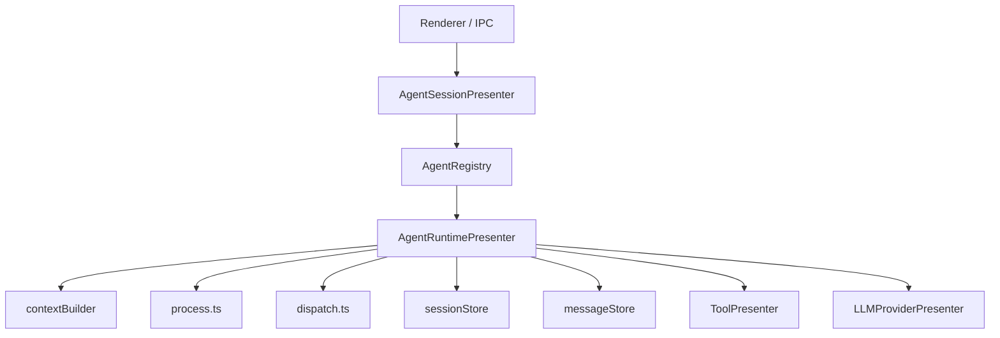

# Agent 系统架构详解

本文档描述 retirement 后仍然有效的 agent system。旧 `AgentPresenter` 细节不再作为仓库内
长期文档保留；需要对照时用 `git log` / `git show` 查看历史提交。

DeepChat Agent 与 ACP Agent 的当前代码路径对比见
[deepchat-vs-acp-agents/](./deepchat-vs-acp-agents/)。

## Agent 类型

DeepChat 支持两种 agent 执行架构:

### DeepChat Agent
- **原生 TypeScript** agent 运行时
- **Tape-based** 完整对话历史持久化 (受 [tape.systems](https://tape.systems/) 启发)
- **直接 LLM 集成** 通过 LLMProviderPresenter
- **完整调试能力** 支持重放、审计、分叉
- **适用场景**: 需要深度集成、上下文控制、审计追溯

### ACP Agent
- **协议化** agent 系统,遵循 [ACP 官方规范](https://modelcontextprotocol.io/acp)
- **进程隔离** 外部 agent 进程通过 JSON-RPC 通信
- **语言无关** 任何实现 ACP 协议的 agent
- **灵活性优先** agent 自主管理状态和工具
- **适用场景**: 多语言支持、第三方集成、进程隔离需求

**详细对比** 请参见 [deepchat-vs-acp-agents/spec.md](./deepchat-vs-acp-agents/spec.md)。

## 当前运行时所有权



主原则：

- renderer 只面向 `agentSessionPresenter`
- `agentSessionPresenter` 只做 session orchestration，不执行聊天 loop
- `agentRuntimePresenter` 独占聊天 runtime

## 模块布局

### `agentSessionPresenter/`

```text
agentSessionPresenter/
├── index.ts
├── agentRegistry.ts
├── sessionManager.ts
├── messageManager.ts
└── legacyImportService.ts
```

职责：

- 注册和解析 agent implementation
- 创建、删除、激活、分叉会话
- 绑定窗口与 session
- 暴露 renderer IPC 方法
- 保留 legacy import 流程

### `agentRuntimePresenter/`

```text
agentRuntimePresenter/
├── index.ts
├── process.ts
├── dispatch.ts
├── contextBuilder.ts
├── sessionStore.ts
├── messageStore.ts
├── pendingInputStore.ts
├── pendingInputCoordinator.ts
├── compactionService.ts
├── echo.ts
└── toolOutputGuard.ts
```

职责：

- 初始化 session runtime 状态
- 处理 `processMessage()` / `respondToolInteraction()`
- 执行 stream loop 与 tool loop
- 持久化消息和运行时状态
- 做 context compaction、tool output guard、实时 echo

## 关键职责拆分

| 层 | 主文件 | 责任 |
| --- | --- | --- |
| Session orchestration | `src/main/presenter/agentSessionPresenter/index.ts` | session 生命周期与 IPC |
| Agent runtime | `src/main/presenter/agentRuntimePresenter/index.ts` | run state、取消、恢复、模型/权限切换 |
| Stream loop | `src/main/presenter/agentRuntimePresenter/process.ts` | 调用 provider、累计 blocks、驱动 tool loop |
| Tool dispatch | `src/main/presenter/agentRuntimePresenter/dispatch.ts` | 调用 `ToolPresenter`、暂停交互、生成 tool 结果 |
| Context build | `src/main/presenter/agentRuntimePresenter/contextBuilder.ts` | 历史裁剪、resume context、token budget |
| Persistence | `src/main/presenter/agentRuntimePresenter/messageStore.ts` | 消息持久化、分页读取、结构化内容重组与故障恢复 |
| Compaction | `src/main/presenter/agentRuntimePresenter/compactionService.ts` | 手动/自动上下文压缩与压缩状态消息 |
| Pending input | `src/main/presenter/agentRuntimePresenter/pendingInputStore.ts` | queued input、steer、重排与恢复 |

## 持久化热路径

`DeepChatMessageStore` 现在采用“头表 + 结构化子表”的主链路模型：

- `deepchat_messages` 作为消息头表
- `deepchat_user_messages` / `files` / `links` 存 user 热字段
- `deepchat_assistant_blocks` 存 assistant blocks
- `deepchat_search_documents` / `_fts` 存历史搜索索引

关键语义：

- streaming 期间只增量更新 `deepchat_assistant_blocks`
- 最终进入 `sent/error` 时才写回稳定的 `deepchat_messages.content`
- 读路径优先从结构化表重组 `ChatMessageRecord.content`，缺行时再回退旧 JSON
- `sessions.restore` 默认只恢复最近一页消息，历史继续通过 `sessions.listMessagesPage` 翻页
- `deepchat_search_documents` / `_fts` 提供历史搜索索引，FTS 不可用时回退 `LIKE`

## 运行时能力

- Session generation settings 随 session 创建和更新持久化，覆盖 system prompt、temperature、
  topP、max tokens、reasoning effort、verbosity 等设置。
- Message trace 独立落库，供消息工具栏查看运行时 trace。
- Subagent 会话以 `sessionKind='subagent'` 进入同一套 session/message store，父会话通过
  tape merge/discard 吸收或丢弃子会话结果。
- 本地录音转写、TTS、image generation、video generation 都复用 provider/model capability 判定，
  不再绕开 provider runtime。

## 兼容边界

这轮 retirement 后，以下内容仍保留但不属于活跃 runtime：

- `LegacyChatImportService`
- legacy import hook / status
- 旧 `conversations/messages` 表
- `SessionPresenter` 的导出、thread list、旧数据查询能力

以下能力已经从活代码里退休：

- `AgentPresenter` runtime 主入口
- `startStreamCompletion()` 旧流式接口
- 通过 `presenter.agentPresenter` / `presenter.sessionPresenter` 暴露的 renderer 入口

## 调试入口

如果要追一条真实消息链路，推荐顺序：

1. `src/main/presenter/agentSessionPresenter/index.ts`
2. `src/main/presenter/agentRuntimePresenter/index.ts`
3. `src/main/presenter/agentRuntimePresenter/process.ts`
4. `src/main/presenter/agentRuntimePresenter/dispatch.ts`
5. `src/main/presenter/toolPresenter/index.ts`

## 历史说明

若你看到旧设计文档、旧 PR 或旧规格里仍提到以下概念，它们都已经退休：

- `AgentPresenter`
- `agentLoopHandler`
- `streamGenerationHandler`
- `permissionHandler`
- `startStreamCompletion`

需要对照旧实现时，从历史提交中查看旧源码快照，不再把已经删除的历史设计当作活跃导航入口。
