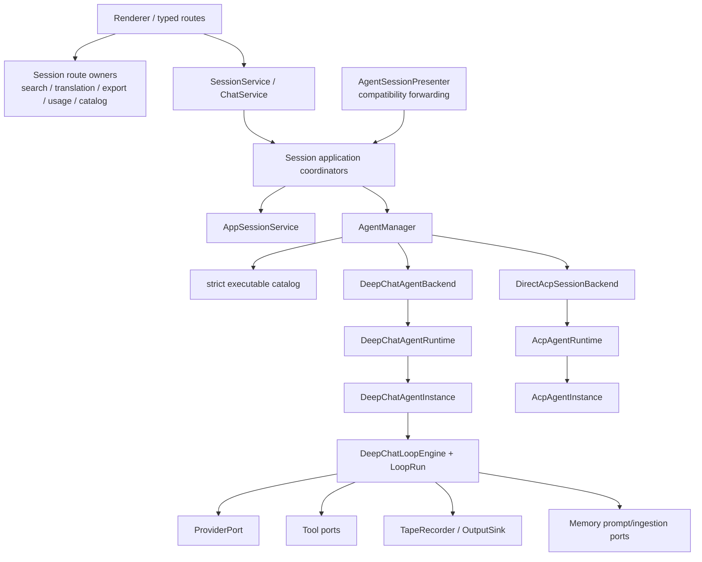

# Agent 系统架构详解

本文描述当前实现。迁移决策、兼容矩阵与最终验证记录见
[Agent System Layered Runtime](./agent-system-layered-runtime/README.md)。更早的 presenter-split
提案已经被取代，历史内容通过 Git 记录查询。

DeepChat 与 ACP 的执行路径对比见
[deepchat-vs-acp-agents/](./deepchat-vs-acp-agents/)。

## Agent 类型与路由

DeepChat 支持两个 executable descriptor kind：

- `kind='deepchat'`：in-process `DeepChatAgentRuntime` / `DeepChatAgentInstance`，由 DeepChat-only
  `DeepChatLoopEngine` 驱动 provider/tool rounds。
- `kind='acp'`：direct `AcpAgentRuntime` / `AcpAgentInstance`，通过 ACP SDK 与外部进程自己的 loop 通信。

内部使用 `DeepChatAgentDescriptor | AcpAgentDescriptor` discriminated union。ACP descriptor 再按
`source='manual' | 'registry'` 区分 required launch/registry data。`type` / `agentType` 只存在于 storage、
route DTO 和 renderer compatibility boundary；internal manager/backend 不做 alias fallback。

agent kind 与 DeepChat provider selection 正交：

```text
kind=deepchat + ordinary provider -> DeepChat LoopEngine -> ordinary provider
kind=deepchat + providerId=acp    -> DeepChat LoopEngine -> AcpProvider compatibility adapter
kind=acp                          -> direct ACP backend -> external ACP protocol loop
```

## 当前所有权



所有权原则：

- `AgentManager` 是薄 control plane，只做 catalog/app-session lookup、alias normalization、kind switch 和
  required facet selection。
- `SessionLifecycleCoordinator`、`SessionTurnCoordinator`、`SessionAgentAssignmentCoordinator` 和
  `SessionProjectionCoordinator` 分别拥有 core session application invariants；typed Session/Chat、Remote
  和 Cron 通过 consumer-owned narrow ports 调用它们。
- `AgentSessionPresenter` 仅保留 compatibility public surface；core session methods 只转发到
  composition-owned coordinators，不拥有 application policy、state 或 session-boundary capabilities。
- typed session routes 直接组合 `SessionHistorySearch`、`SessionTranslation`、
  `AgentSessionExportService`、`UsageStatsService`、RTK runtime service 与 available-agent catalog policy；
  lifecycle hooks 直接调用 startup migration/maintenance owner。
- `AgentRuntimePresenter` 保留 DeepChat state/delegate façade，初始化 `DeepChatAgentRuntime`，并接线现有
  message/Tape/prompt/provider/tool/permission adapters。它不再实现 unified agent interface，也不构造
  `AcpAgentRuntime`。
- composition root 负责 backend wiring 和 `AcpAgentRuntime` construction；runtime/instance 实现分别位于
  `agent/deepchat` 与 `agent/acp`，并且只构造一组 session application coordinators。

## 目录与职责

```text
src/main/agent/
├── manager/
│   ├── agentManager.ts             # explicit descriptor.kind router
│   ├── sessionHandles.ts           # common + required kind facets
│   ├── deepChatAgentBackend.ts     # typed DeepChat runtime/delegate adapter
│   └── directAcpAgentBackend.ts    # direct ACP adapter
├── shared/
│   ├── agentDescriptors.ts         # canonical discriminated descriptors
│   ├── agentCatalogCodec.ts        # tolerant catalog / strict executable decode
│   ├── agentCompatibilityMapper.ts # legacy route DTO boundary
│   └── appSessionService.ts        # new_sessions application shell
├── deepchat/
│   ├── instance/                   # per-session state owner
│   ├── loop/                       # LoopRun, engine and ports
│   ├── memory/                     # runtime coordinator + two Memory seams
│   ├── pending/                    # durable pending input coordination
│   └── resources/                  # DeepChat resource helpers
└── acp/
    ├── instance/                   # direct runtime/instance
    ├── client/                     # shared ACP client/runtime owner
    ├── runtime/                    # process/session/protocol/persistence/mapping
    ├── launch/                     # executable launch setup
    └── catalog/                    # registry/migration
```

## AgentManager 合同

`AgentManager.resolveSessionHandle(sessionId)`：

1. 从 `AppSessionService` 读取当前 `new_sessions.agent_id`；
2. canonicalize ACP alias；
3. strict resolve executable descriptor；
4. 按 `descriptor.kind` 选择 typed backend；
5. 返回 `DeepChatSessionHandle | DirectAcpSessionHandle`。

共同 handle 只包含双方已有的 lifecycle、send/cancel/snapshot/close、pending、settings 和 tool interaction。
transfer target、subagent、generation control 和 ACP mode/config/commands/workdir 都是 required
kind-specific facet。不存在 optional-method reflection，也不存在 agent handle/backend
`legacy | direct runtimeKind`。

session delete 是 descriptor-independent cleanup：manager 不 hydrate、不读取 catalog，分别清理两个
backend cache/durable binding；Lifecycle deletion transaction 再按 shared state、permission、skills、app
row 的既有顺序清理。

## DeepChat instance 与 lifecycle

`DeepChatAgentRuntime` lazy hydrate，一个 session 只缓存一个 `DeepChatAgentInstance`。instance 拥有：

- identity、project、effective generation settings、runtime status；
- pre-stream abort 与 active generation reference；
- pending/steer drain state、ordered pending interactions；
- runtime-activated skills、tool/prompt snapshots、compaction in-flight projection；
- stable Memory session handle。

turn-local state 位于 `LoopRun`：run id、abort signal、per-attempt request sequence、outer provider-round
count、round messages、stream state 和 overflow/recovery flags。LoopEngine 不保存跨 session mutable map。

固定 round lifecycle：

```text
input/context preparation
  -> register LoopRun
  -> enter provider round
  -> provider attempt: context gate -> ViewManifest -> rate gate -> stream
  -> update output projection
  -> execute typed tool batch
  -> message commit -> TapeRecorder tool facts
  -> continue or settle
  -> terminal projection / pending drain / Memory observer
```

只有 pre-check permission、question、post-call permission 和 post-success skill draft 能生成 ordered pause
outcome。pause 会 settle 当前 run；中间 response 保持 paused，最后一项后从持久 context 创建 fresh resume
run。Hooks notification 是 detached、non-blocking observer。

## ACP direct runtime

`AcpAgentRuntime` 按 app session cache/hydrate `AcpAgentInstance`，验证 descriptor/config/workdir identity，
并在 shutdown/close/process-exit 时 fence/evict。instance 使用 consolidated ACP client/session/process/runtime
模块处理 session new/load/resume、prompt、cancel、mode/config/commands 和 protocol permission。

direct ACP 通过 `AcpCompatibilityProjectionAdapter`、request trace adapter 和现有 pending/rate/hook ports
写入相同 structured message、Tape、renderer event、trace pipeline，因此 restore/search/export 仍使用
DeepChat app projection；`acp_turns` 只是 protocol metadata。

## Tape、Memory 与持久化

- `DeepChatMessageStore` 使用 message header + structured child tables，legacy JSON 仅是 read fallback。
- Tape 保存 semantic facts/anchors/ViewManifest；trace 保存 opt-in raw request diagnostics。
- `TapeRecorder.appendToolFact` 在 persisted round callback 中按 terminal call/result 写入，保持 provenance、
  monotonic order、idempotency 和 pending exclusion。
- causal observation pure-read join Tape/ViewManifest、message terminal status 和 trace；renderer event history
  未持久化时明确返回 unavailable。
- `MemoryRuntimeCoordinator` 是 runtime queue/epoch/cooldown/access/cursor owner，并实现 awaited
  `MemoryPromptContributor` 与 background `MemoryIngestionObserver`；`MemoryPresenter` 继续拥有 Memory data、
  retrieval、write、vector、maintenance。

## 兼容边界

仍保留：

- `AgentSessionPresenter` compatibility façade 和 `AgentRuntimePresenter` state/delegate façade；
- `AcpProvider` 的 DeepChat + ACP-provider compatibility；
- `startupMigrations/LegacyChatImportService`、旧 conversations/messages、`SessionPresenter`
  export/thread/data compatibility；current agent-session export 由 `AgentSessionExportService` 拥有；
- 现有 route/event/DTO/schema/table。

已经退休并由 guard 阻止回流：

- fake `AgentRegistry`；
- unified optional implementation interface；
- reflection-based legacy backend；
- `src/main/lib/agentRuntime`；
- agent handle/backend legacy/direct runtime-kind branch。

## 调试入口

按问题选择入口：

1. kind/session routing：`src/main/agent/manager/agentManager.ts`
2. core session application behavior：`src/main/presenter/sessionApplication/`
3. compatibility forwarding：`src/main/presenter/agentSessionPresenter/index.ts`
4. session search/translation：`src/main/routes/sessions/`
5. current session export：`src/main/presenter/exporter/agentSessionExporter.ts`
6. usage/startup/catalog：`src/main/presenter/{usageStatsService.ts,startupMigrations/}` 与
   `src/main/agent/shared/availableAgentCatalog.ts`
7. DeepChat session state：`src/main/agent/deepchat/instance/`
8. provider/tool round：`src/main/agent/deepchat/loop/`，再看 retained presenter adapters
9. direct ACP：`src/main/agent/acp/instance/` 与 `src/main/agent/acp/runtime/`
10. tool source/dispatch：`src/main/presenter/toolPresenter/`
11. Tape/message projection：`src/main/presenter/agentRuntimePresenter/{tapeService,messageStore}.ts`
12. Memory runtime seam：`src/main/agent/deepchat/memory/memoryRuntimeCoordinator.ts`
