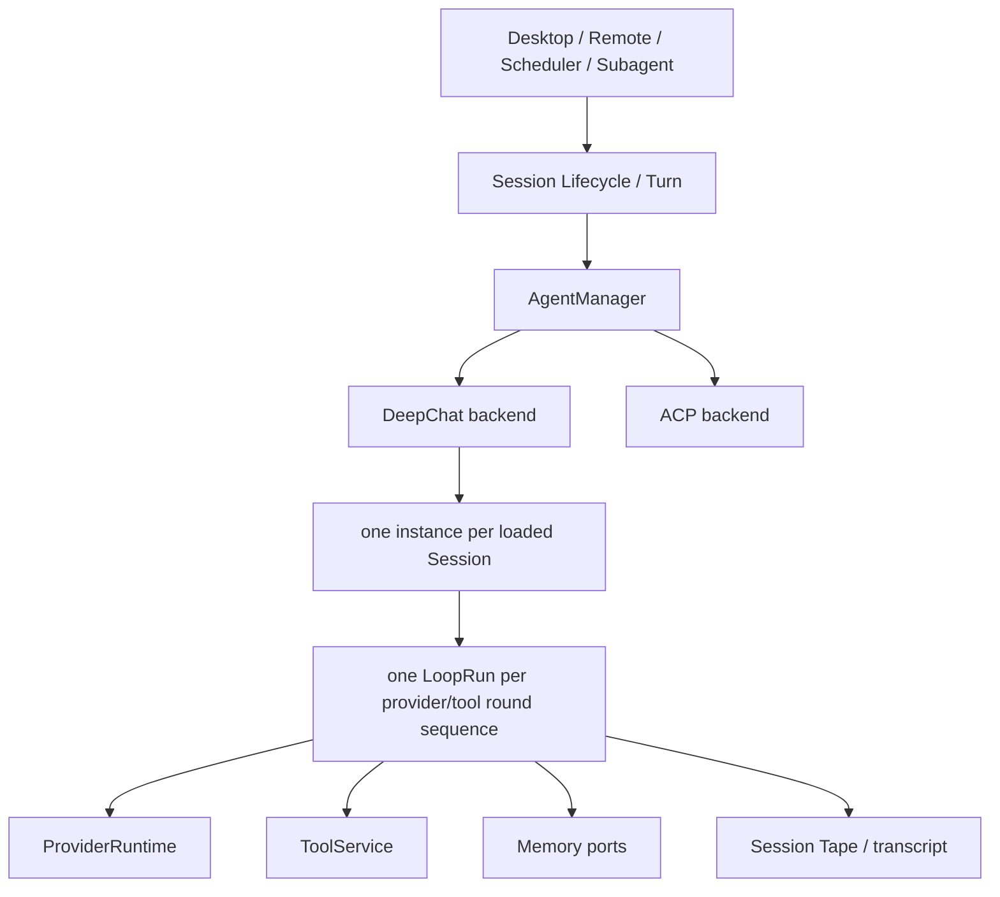

# Agent 系统

本文描述 `2026-07-22` 的当前合同。历史迁移方案、Presenter 拆分过程和已完成的分阶段
SDD 已删除；需要时从 Git 历史查询。

## 两种 Agent backend

`AgentManager` 只按 canonical `AgentDescriptor.kind` 选择 backend：

```text
kind=deepchat -> DeepChatAgentRuntime -> DeepChatAgentInstance -> DeepChatLoopEngine
kind=acp      -> AcpAgentRuntime      -> AcpAgentInstance      -> ACP process/protocol
```

`kind=deepchat + providerId=acp` 是兼容组合：它仍运行 DeepChat loop，只把 ACP 作为 provider。
Direct ACP 不进入 `DeepChatLoopEngine`，也不通过 DeepChat ToolService 执行外部 agent 自己的 loop。

内部 descriptor 使用 discriminated union。旧 `type` / `agentType` 只允许在 storage、route DTO 和
renderer compatibility adapter 出现；manager/backend 不做反射式 fallback。

## Agent 身份、默认选择与配置

所有 Agent 平级。`builtin`、默认选择和父子关系是不同概念：

- `deepchat` 是 `source=builtin` 的受保护第一方 Agent，保持启用、不可删除并允许重置；
- 默认 Agent 只表示入口未显式选择时使用哪个 Agent；硬编码 `deepchat` 只能用于这一兼容默认；
- 系统不存在主 Agent、父 Agent、`inheritsFrom` 或隐式模板关系；
- 每个 DeepChat Agent 只从自己的持久化配置和确定性的代码默认值解析 effective config；
- 应用级默认模型和自动压缩设置属于 app settings，不以 built-in Agent 配置充当别名；
- 修改 built-in Agent 不得触发其他 Agent 的配置、Memory 或 Skill fan-out。

升级迁移会先按旧规则（包括 built-in 配置和原有 fail-closed fallback）物化每个可读 manual
Agent 的 effective config，再启用独立解析；无法读取的配置也会尽量保留其旧 effective 值并记录
恢复证据。迁移完成后的独立 resolver 不再从 built-in Agent 静默补值，损坏配置在该阶段保持
fail-closed。

## 生命周期和所有权



- Session 拥有长期身份、settings、transcript、Tape 和 pending input。
- DeepChat Agent 拥有自己的配置和物理 Skill root；Session 只保存 Agent assignment 和所选 Skill 名称。
- 已载入 Session 在一个 backend 中最多有一个 instance。
- 每次执行创建独立 Run，Run 拥有取消信号、provider round、request sequence 和临时输出。
- Window、Remote endpoint 和 Cron run 只保存各自 binding，不拥有 Agent instance。
- 只读 list/query 不 hydrate backend；执行、完整 restore 或明确 backend 设置操作才允许 hydrate。

## DeepChat 执行合同

主要实现位于：

```text
src/main/agent/deepchat/
├── instance/   # per-session runtime state
├── loop/       # LoopRun, input/context coordination and ports
├── runtime/    # provider/tool loop, interaction, compaction and projection
├── memory/     # prompt contribution and terminal ingestion
└── resources/  # system prompt resources
```

必须保持的合同：

- runtime 只通过构造时注入的窄接口访问 Provider、Tool、Memory 和 Session data；不得反向读取 App、
  Desktop、Remote、Scheduler 或 route registry。
- `providerRoundCount` 统计 outer round；`requestSeq` 统计真实 provider attempt。retry 不伪造新 round。
- send input 在 Session 边界正规化为 canonical request；resume 不重新解释旧 route DTO。
- permission mode 属于 Session assignment/settings；一次 Run 使用开始时的闭合快照，deferred tool
  execution 仍需重新检查当前安全边界。
- Run 的 effective Skills 是 Session 持久化选择与当前 Agent 有效、启用 Skill catalog 的交集；不得
  回退到 built-in Agent catalog。
- paused interaction 按顺序结算；最后一项完成后创建新的 resume Run，不复用已经 settle 的 Run。
- no-progress tool loop 由 `noProgressToolLoopGuard.ts` 终止；usage 由 runtime accumulator 跨 round
  累加。
- provider terminal reason 必须无损正规化；普通 `stop` 只有在确实解析出 tool call 时才能变为
  `tool_use`。

## ACP 执行合同

ACP 代码集中在 `src/main/agent/acp/`：

- `catalog/`：registry、migration 和 settings；
- `launch/`：安装与 launch spec；
- `client/`：connection 和 protocol session owner；
- `runtime/`：capability、process、session、filesystem、terminal、permission 和 persistence；
- `instance/`：per-session ACP state；
- `compatibility/`：允许保留的外部格式 adapter。

ACP capability 必须来自 initialize result，未声明能力失败关闭。filesystem 和 terminal 请求受
workspace/path guard 约束。取消、process exit、permission resolver 和 session persistence 都由 ACP
runtime 自己处理，不借用 DeepChat loop 状态。

## Subagent

Subagent 可用性只由当前 Agent delegation policy、正规化 slot 和 `sessionKind` 决定：

- 只有 regular DeepChat parent 且存在有效 slot 时才暴露 `subagent_orchestrator`；
- Subagent child 不能再次创建 Subagent；
- admission 后的 run 使用已固定的 task/slot snapshot，真正调用前仍重新检查 host policy；
- child 使用独立 Session、workspace authorization、Tool mapping、Memory namespace、permission state
  和目标 Agent Skill catalog；不继承 parent Agent 的 Skill 文件或 mutable cache；
- 完成后父 Session 记录 child Tape 的 frozen-head link，不复制 child entries。

每个 Subagent run 有独立 deadline；默认 `300000ms`，允许 `1000-1800000ms`。一个 parent 最多同时
拥有三个 nonterminal run。deadline 或手动取消会标记未完成 task、请求 child cancellation，并记录
timeout/deadline/reason；run 的终止不能无限等待被阻塞的 child cleanup。Child handoff 固定包含
`Result`、`Evidence`、`Changed Files`、`Validation`、`Unresolved`，调用方的 `expectedOutput` 只能追加
指导，不能替换基本合同。

## 删除与 transfer

删除不依赖当前 agent descriptor 是否仍有效：先清理两个 backend 的 cache/durable binding，再清
Session data、permission、Skill selection、manual Agent 私有 Skill root 和 app-session row。删除 source
Agent 不影响已经导入到其他 Agent 的快照副本。ACP 与 DeepChat transfer 必须先验证目标、提交 ownership
并按目标 Agent catalog 重新过滤 Session Skill selection，再关闭旧 backend；失败时保留原 assignment。

DeepChat Agent 删除与 Session create、detached create、Subagent create、transfer、fork 共享按 Agent ID
的 lifecycle gate。删除先阻止新的 assignment，再等待已进入的 assignment 完成，最后重新检查持久化
Session 引用；不得留下指向已删除 Agent row 的 Session。

## 防回归

`scripts/agent-cleanup-guard.mjs` 阻止旧 Agent/Session Presenter 路径和 import 回流。配置物化和独立
解析、Agent Skill root 隔离、Session/catalog 交集、Backend、Subagent 与 Tape 的行为约束由对应的
unit/integration tests 验证，不再维护全仓库启发式 architecture guard。

`pnpm run test:agent:eval` 提供离线 deterministic Agent 行为基线，使用 scripted provider/tool 直接
覆盖 production loop。场景包括 direct completion、多轮 tool、tool failure、permission pause、cancel、
pending yield、round guard、no-progress、empty output 和 context/provider errors；断言 persisted run
metadata、usage/cache fields、provider/tool budgets，不调用真实 provider，也不写仓库 artifact。

关键入口：

1. `src/main/agent/manager/agentManager.ts`
2. `src/main/session/turn.ts`
3. `src/main/agent/deepchat/instance/`
4. `src/main/agent/deepchat/loop/`
5. `src/main/agent/deepchat/runtime/`
6. `src/main/agent/acp/instance/`
7. `src/main/agent/acp/runtime/`
8. `test/main/agent/`
