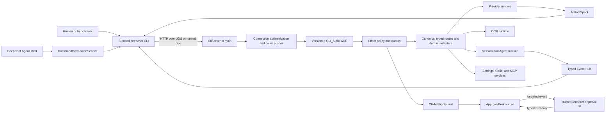

# Local Control Plane and Bundled CLI V1

Status: accepted; implementation in progress

## Decision

DeepChat main is the sole owner of the local control plane. A bundled Node CLI connects to the
running desktop application over HTTP semantics carried by a Unix domain socket on POSIX and a
named pipe on Windows. The CLI is a thin transport, formatting, and local file-I/O client. It does
not load providers, credentials, Skills, MCP servers, OCR runtimes, Agent runtimes, or application
databases.

The public API is a versioned `CLI_SURFACE` allowlist that references DeepChat's canonical typed
route contracts. It is not a generic tunnel to the internal route registry. Raw model invocation,
media generation, offline OCR, and full detached Agent execution are separate capabilities with
separate policy and lifecycle semantics.

Sensitive mutations use one main-owned approval state machine. The reusable state-machine core is
extracted from `ToolPermissionBroker`; the existing tool flow remains behind a tool-specific
adapter, while CLI mutations use `CliMutationGuard`. A CLI request may wait for a renderer decision,
but it can never approve itself or receive a replayable approval credential.

The entire V1 is delivered on one feature branch through reviewable implementation commits. This
document intentionally describes dependency-ordered stages rather than repository integration
units.

## Evidence Baseline

This design is grounded in the current DeepChat tree and the separately inspected Alma 0.0.930
application. Statements about Alma apply only to that inspected version.

| Existing DeepChat component | Reused fact |
| --- | --- |
| `src/main/routes/routeRegistry.ts` | Main already owns a typed route registry and dispatcher. |
| `src/shared/contracts/routes.ts` | Route contracts are the canonical schema source. |
| `src/main/provider/index.ts` | `coreStream` plus standalone transcription, image, and video paths already exist. |
| `src/main/provider/providers/voiceAIProvider.ts` | Speech exists only as a stream-side implementation detail and needs a standalone contract. |
| `src/main/session/lifecycle.ts` | `createDetachedSession` creates a durable session without binding a renderer or starting a turn. |
| `src/main/app/composition.ts` | General events currently broadcast to every window and require targeted delivery for CLI requests. |
| `src/main/tool/permission/toolPermissionBroker.ts` | Canonical hashing, timeout, pending state, approval, and one-shot consumption already exist. |
| `src/main/tool/index.ts` | MCP and Agent pre-checks, including live delegation, already use the tool broker. |
| `src/main/tool/permission/commandPermissionService.ts` | Command approval is signature-based; `deepchat` must not become globally safe, and output redirection is currently missing from critical shell syntax. |
| `src/main/ocr/ocrRuntimeService.ts` | Image, batch, and document extraction are implemented; only an explicit public extraction contract is missing. |
| `src/main/ocr/ocrArtifactStore.ts` | Cache clearing removes derived cache rows only and rejects clearing while work is active. |

Alma contributes useful product shape: a desktop-owned local service, a bundled command, and Agent
instructions that teach the command surface. Its inspected implementation is not adopted as a
protocol, schema, permission, or lifecycle foundation.

## Goals

- Ship `deepchat` with the desktop application and make it usable by humans, scripts, benchmark
  harnesses, and explicitly scoped DeepChat Agents.
- Expose text, image, speech, transcription, video, OCR, and full Agent execution without moving
  credentials or runtime ownership out of main.
- Expose a curated settings, provider/model, Skill, and MCP management plane with effects,
  caller-specific policy, audit, and renderer-only approval.
- Provide deterministic JSON and JSONL output, stable exit codes, cancellation, timing, usage, and
  artifact metadata suitable for external benchmarks.
- Reuse current route contracts, provider/session/OCR services, and permission machinery without a
  second schema catalog or a second approval state machine.
- Preserve renderer behavior and compatibility while introducing an explicit caller model.

## Non-Goals

- TCP, HTTP loopback, remote access, CORS, or a network-listening daemon.
- A generic route-registry proxy or access to every internal route.
- CLI-side approval resolution or a `confirmed` request field.
- Raw MCP tool invocation, Browser/Computer Use, a TUI, or an interactive chat shell.
- Arbitrary settings, database, credential, filesystem, or application-secret reads.
- A persistent input-artifact lifecycle or arbitrary main-process input paths.
- Server-side OCR batch/layout/boxes/model management.
- A general cost-budget engine or an in-app benchmark framework.
- An ACP server. ACP remains a possible V2 transport over the same domain services.

## Architectural Invariants

1. Main is the only authority that resolves provider configuration, reads credentials, performs
   upstream calls, mutates settings, installs Skills, manages MCP, runs OCR, and runs Agents.
2. Caller identity is constructed from the trusted transport. No request parameter can select or
   upgrade its caller, scopes, connection, conversation, or approval state.
3. `CLI_SURFACE` is deny-by-default and independent from the internal route catalog.
4. Every exposed operation has an effect, caller set, scope predicate, rate/quota rule, audit rule,
   transport shape, and output bound.
5. Approval resolution is renderer-only. The local socket exposes pending status, never resolve.
6. An approval is bound to the normalized method, arguments hash, main-generated execution identity,
   scope, expiry, and original live request. It is consumed once and is never serializable as a
   capability token.
7. Binary output is represented by an owned, expiring artifact. Main never writes a caller-supplied
   output path.
8. Uploads are bounded independently of `Content-Length`; chunked bodies cannot bypass the limit.
9. Raw model invocation has no tools, memory, Skills, or session side effects. Full Agent execution
   always uses the session runtime.
10. Agent callers cannot recursively start an Agent run.

## Runtime Topology



`CliServer`, `ArtifactSpool`, and the CLI process are lifecycle clients of the existing main
composition. The server starts only after its route dependencies are ready. Shutdown first stops
accepting connections, aborts in-flight non-detached requests, closes event subscribers, cancels CLI
approval scopes, and removes the descriptor/socket; mutable services and databases close afterward.

## Transport and Discovery

### Endpoint

- POSIX: an application-owned Unix domain socket below the DeepChat user-data directory. If that
  would exceed the platform socket-path limit, main uses a deterministic per-user, per-profile
  private runtime directory and keeps discovery in user data. After bind, socket type, ownership,
  and `0600` mode are verified.
- Windows: a per-start random named-pipe name. The descriptor is protected with an owner-only ACL;
  the random endpoint and bearer token provide defense in depth where Node does not expose a
  portable pipe-DACL API.
- TCP fallback is forbidden. Failure to create the local endpoint disables CLI availability and is
  reported by the desktop application; it never falls back to a port.

The endpoint path/name is generated by main. Cleanup only touches the exact computed path after an
`lstat`/type check. It never deletes an environment-expanded, caller-provided, or broad path.

### Descriptor

Main atomically replaces a descriptor with this public shape:

```ts
type LocalControlDescriptorV1 = {
  protocolVersion: 1
  surfaceVersion: 1
  appVersion: string
  endpoint: { kind: 'unix'; path: string } | { kind: 'pipe'; name: string }
  pid: number
  token: string
  startedAt: number
}
```

The descriptor is `0600` on POSIX and owner-only on Windows. The token has at least 256 bits of
entropy, rotates on every main start, is compared in constant time, is never logged, and is removed
with the descriptor on clean shutdown. The CLI rejects malformed descriptors, unsupported versions,
impossible PIDs, non-local endpoint kinds, and overlong paths before connecting. A stale descriptor
is diagnostic information, not authority to launch or kill a process.

The human descriptor token authenticates same-user local automation; it is not a defense against
arbitrary malware running as the same OS user. Agent invocation receives a short-lived scoped token
through the Agent runtime and must not rely on the descriptor token. The CLI must never fall back to
the human descriptor when an Agent-token environment is present but invalid or expired.

The bearer token proves possession, not whether a same-UID process is semantically a human or an
Agent. A process that can read and deliberately replay the human descriptor can present as a human
caller. V1 therefore treats the Agent token as least-privilege capability routing, not process
attestation: sensitive operations still require renderer approval for a human token, `deepchat`
remains behind the shell gate, and the descriptor limitation is explicit. Stronger same-UID
separation would require an Agent sandbox or platform peer/process attestation and is not claimed by
this protocol.

### HTTP Shapes

- `POST /v1/rpc`: bounded JSON request and JSON response for unary methods.
- `POST /v1/stream`: bounded JSON request and `application/x-ndjson` response for streamed methods.
- `POST /v1/upload`: a strict typed-envelope header plus a bounded binary body for methods with byte
  input.
- `GET /v1/artifacts/:id`: ownership-checked binary output download.
- `GET /v1/events`: ownership-checked NDJSON event subscription with request/run filters.

All endpoints require `Authorization: Bearer`. RPC envelopes carry a caller-generated request ID,
method, and params. Responses carry the same ID and either typed result metadata or a stable error
object. HTTP status communicates transport/authentication failure; CLI exit codes communicate the
domain outcome. Proxy environment variables are ignored for local transport.

`Content-Length` is rejected when missing for fixed JSON bodies, invalid, conflicting, or above the
route limit. Upload metadata is the normal RPC envelope encoded as canonical base64url in a singular,
4 KiB-bounded `X-DeepChat-Upload-Request` header. This lets main authenticate and validate version,
surface, caller, scopes, and typed metadata before accepting the large body. The body is raw
`application/octet-stream`; uploads with or without `Content-Length` enforce a cumulative route byte
limit while reading. Bodies spill to a private `0700` directory above a route-specific memory
threshold. Upload bytes always stream into a private temporary file, so there is no multipart
extraction pass or base64 expansion. Abort, parse error, timeout, limit failure, and shutdown all
remove partial files. The public protocol does not expose those temporary paths.

## Contract Ownership and Surface

`CLI_SURFACE_V1` is a readonly registry whose entries reference the same `RouteContract` objects used
by renderer IPC. A surface entry adds only transport and policy metadata:

```ts
type CliSurfaceEntry = {
  contract: RouteContract<string, ZodType, ZodType>
  effect:
    | CliEffect
    | { possible: readonly CliEffect[]; resolve(input: unknown): CliEffect }
  callers: readonly CliPrincipal[]
  requiredScopes: readonly CliScope[]
  transport: 'rpc' | 'stream' | 'upload'
  approval: 'never' | 'policy'
  limits: CliRouteLimits
}
```

Existing canonical contracts are reused when their input/output is safe. A genuinely new behavior or
redacted public view gets one new canonical shared contract and main handler; it is not described a
second time in a CLI-only schema. In particular, provider public DTOs exclude secrets, opaque auth
state, raw environment variables, and credential material.

Public method names describe their domain (`models.invoke`, `providers.listPublic`,
`sessions.runDetached`). The `cli.*` namespace is reserved for behavior that exists only to operate
or diagnose the bundled CLI.

### V1 Capability Matrix

`H` means an authenticated human CLI connection. `A` means a short-lived Agent connection with the
listed scope. “Policy” means the renderer-only effect policy may be required; it never means a CLI
confirmation flag.

| Capability | Public methods / command family | Effect | Callers | Approval | Output |
| --- | --- | --- | --- | --- | --- |
| 1. Raw text model | `models.listPublic`, `models.getCapabilities`, `models.invoke`; `deepchat model …` | read / compute | H, scoped A | never | JSON or token/usage JSONL |
| 2. Image generation | `images.generate`; `deepchat image generate` | compute | H, scoped A | never | progress JSONL + image artifacts |
| 3. Audio | `speech.generate`, `audio.transcribeUpload`, `audio.transcribeArtifact`; `deepchat audio speak\|transcribe` | compute | H; scoped A uses artifacts only | never | audio artifact or bounded text |
| 4. Video generation | `videos.generate`; `deepchat video generate` | compute | H, scoped A | never | progress JSONL + video artifact |
| 5. Offline OCR | `ocr.getRuntimeStatus`, `ocr.extractUpload`, `ocr.extractArtifact`, `ocr.clearCache`; `deepchat ocr …` | read / compute / local-maintenance | H; scoped A uses owned inputs and cannot clear | never | bounded text/metrics JSON |
| 6. Full Agent run | `sessions.runDetached`; `deepchat agent run` | compute | H only | never | durable run ID + targeted JSONL |
| 7. Settings | `settings.getPublic`, `settings.updatePublic`; `deepchat settings …` | read or key-derived mutation | H; scoped A for allowlisted keys | policy by effect | redacted JSON |
| 8. Provider/model administration | `providers.listPublic`, `providers.testPublicConnection`, `providers.addPublic`, `providers.updatePublic`, `providers.remove`, `providers.setCredential`, `models.listRuntime`, `models.setStatus`, `models.getPublicConfig`, `models.setPublicConfig`, `models.resetConfig`; `deepchat provider …`, `deepchat model config …` | read / execution-config / credential / destructive | H; A is read-only | policy for mutations | redacted JSON |
| 9. Skills | `skills.listPublic`, `skills.setPublicStatus`, `skills.installPublicUrl`, `skills.installUpload`, `skills.uninstallPublic`; `deepchat skill …` | read / execution-config / supply-chain / destructive | H; scoped A may request allowlisted mutations | policy for mutations | JSON |
| 10. MCP | `mcp.listPublic`, `mcp.addPublic`, `mcp.updatePublic`, `mcp.removePublic`, `mcp.setPublicStatus`, `mcp.startPublic`, `mcp.stopPublic`; `deepchat mcp …` | read / execution-config / security-config / supply-chain / credential / destructive | H; scoped A may request allowlisted non-credential mutations | policy for mutations | redacted JSON/events |
| 11. Runs, events, artifacts | `runs.get`, `runs.cancel`, `events.subscribe`, `artifacts.describe`, `artifacts.read`, `artifacts.delete`; `deepchat run …` | read / local-maintenance | H owns all; A may inspect/pass owned IDs but cannot read bytes, delete, or cancel unrelated work | never | JSONL or binary artifact for H; metadata for A |
| 12. CLI diagnostics | `cli.status`, `cli.version`, `cli.capabilities`, `cli.doctor`; top-level commands | read | H, A | never | stable JSON/text |
| 13. Benchmark automation | client-side stable modes over compute methods; `--json`, `--jsonl`, stdin, timeout, cancel | inherited | H, scoped A | inherited | reproducible result envelope |
| 14. Agent-scoped CLI use | internal `agentCli.issueScopedToken` plus bundled Skill instructions | security-config (internal) | trusted main runtime issues; A consumes | not exposed on socket | short-lived in-memory authority |

Surface names and contracts are frozen by `surfaceVersion`. Additive entries require an advertised
capability and surface-version change policy; removal or semantic incompatibility requires a new
surface major. App and protocol versions are reported independently.

Provider creation and updates accept only allowlisted adapter fields and credential-free HTTP(S)
base URLs. V1 `providers.setCredential` handles API keys only, read from bounded stdin; OAuth flows
and structured AWS/Vertex credentials remain on their existing typed renderer flows instead of
accepting a generic credential object. Public model-config contracts reject unknown fields and omit
main-owned identity fields even though the legacy renderer contract remains intentionally loose.

## Caller Model and Route Migration

The current optional renderer fields become a discriminated caller:

```ts
type RendererRouteCaller = {
  kind: 'renderer'
  webContentsId: number
  windowId: number | null
}

type CliRouteCaller = {
  kind: 'cli'
  connectionId: string
  principal: 'human' | 'agent'
  scopes: readonly CliScope[]
  conversationId?: string
  expiresAt?: number
}

type InternalRouteCaller = {
  kind: 'internal'
  component: 'scheduler' | 'migration' | 'agent-cli'
}

type RouteContext = { caller: RouteCaller }
```

Renderer-only handlers assert `caller.kind === 'renderer'` before accessing window identity. Public
headless handlers either accept CLI/internal callers or delegate to a domain service that has no
desktop dependency. There are no sentinel window IDs.

The migration touches these ten integration files:

1. `src/main/routes/routeRegistry.ts`: define `RouteCaller` and wrapped `RouteContext`.
2. `src/main/routes/index.ts`: build renderer callers and make startup tracking renderer-aware.
3. `src/main/app/composition.ts`: construct internal/CLI callers and keep main-window checks explicit.
4. `src/main/app/routes.ts`: require renderer identity for window/session ownership behavior.
5. `src/main/desktop/routes.ts`: reject non-renderer callers at the desktop boundary.
6. `src/main/mcp/routes.ts`: adapt renderer callers to the existing MCP App ownership context while
   allowing only separately selected headless MCP administration methods.
7. `src/main/session/sessionService.ts`: separate renderer-bound create/activate operations from
   detached headless creation.
8. `src/main/session/routes.ts`: use caller narrowing for submission cancellation and UI-bound work.
9. `src/main/provider/routes.ts`: target renderer-specific OAuth/debug events only to renderer
   callers.
10. `src/main/notifications/routes.ts`: keep readiness and notification ownership renderer-only.

`McpAppRouteContext` in `appHost.ts` and `sandboxRegistry.ts` intentionally remains a domain-owned
renderer context. `mcp/routes.ts` is its adapter, avoiding CLI concepts inside the MCP App sandbox.

## Effect Policy

Authorization is `approvalPolicy(effect, caller, operation)`, not `isWrite`.

| Effect | Human CLI | Agent CLI | Examples |
| --- | --- | --- | --- |
| `read` | allow | allow with scope | status, redacted lists |
| `compute` | allow with rate limits | allow with scope and quota | model/media/OCR |
| `local-maintenance` | allow and audit | deny | OCR cache clear, owned artifact delete |
| `preference-write` | allow and audit | renderer approval when allowlisted | language or UI-safe defaults |
| `security-config` | renderer approval | renderer approval only when explicitly allowlisted | MCP enablement, proxy/security policy |
| `execution-config` | renderer approval | deny | default provider/model, executable configuration |
| `supply-chain` | renderer approval | renderer approval only when explicitly allowlisted | Skill/MCP installation |
| `credential` | renderer approval | deny | provider or MCP secret update |
| `destructive` | renderer approval | deny | provider/Skill/MCP removal |

Per-invocation provider/model selection is compute input, not an execution-config mutation. Benchmark
harnesses must use those per-call fields rather than changing global defaults.

Every policy decision is audited with timestamp, caller kind, connection/conversation scope,
operation, effect, outcome, request ID, and redacted argument hash. Tokens, secrets, raw prompts,
uploaded bytes, and full generated output are not audit fields.

## ApprovalBroker

The generic core owns only state-machine mechanics:

```ts
interface ApprovalBroker {
  create(input: ApprovalBinding, options: ApprovalOptions): ApprovalSnapshot
  wait(requestId: string, signal?: AbortSignal): Promise<ApprovalDecision>
  resolve(input: ApprovalResolution): boolean
  consumeApproved(match: ApprovalMatch): boolean
  cancelScope(scopeKey: string): void
  clear(): void
  subscribe(listener: (event: ApprovalEvent) => void): () => void
}
```

`ApprovalBinding` contains a main-generated request/execution identity, scope key, operation, effect,
canonical argument hash, redacted display data, and expiry. Canonicalization preserves the current
depth, key-count, byte, finite-number, JSON-only, and cycle limits. Display data is supplied
separately so credential values cannot leak through an argument preview.

Two adapters preserve distinct domain semantics:

- `ToolPermissionBroker` retains model pre-check followed by approved one-shot execution, current
  MCP App waiting behavior, tool naming, permission modes, and conversation cancellation.
- `CliMutationGuard` creates a unique non-deduplicated approval for the current authenticated request,
  publishes it to a trusted renderer target, and awaits the decision while the HTTP request stays
  open. Approval resumes that exact server-side continuation. Socket abort, timeout, shutdown, or
  scope cancellation denies it and makes later resolution fail.

CLI approvals do not deduplicate identical concurrent calls: otherwise one click could resume
multiple mutations. The core may retain tool-domain deduplication through an explicit adapter key.

Renderer resolves through a new canonical `approvals.resolve` typed IPC route. The handler rejects
all non-renderer callers and validates the request's renderer target/scope. `/v1/approvals/*/resolve`
does not exist. Existing `chat.respondToolInteraction` behavior remains a tool adapter and is not
forged for CLI requests.

## Model and Media Execution

### Raw model invocation

`models.invoke` resolves a provider/model through main and calls the existing provider `coreStream`
foundation with:

- a real system-role message when supplied;
- user/assistant messages from a bounded typed request;
- `tools: []` and no tool loop;
- no session, memory retrieval, Skills, attachments, or Agent orchestration;
- per-invocation generation settings without mutating defaults.

The server always produces the canonical stream. Human-readable and non-stream JSON CLI modes buffer
that stream in the CLI; main does not maintain a second non-stream execution path. Events include
text/reasoning deltas as permitted, usage, finish reason, resolved provider/model identity, TTFT,
latency, and redacted resolved settings.

### Media and speech

Image and video generation reuse existing standalone provider capabilities and write binary results
to `ArtifactSpool`. Speech gets a formal `generateSpeechStandalone` provider-runtime capability with
a typed audio result. Its implementation may collect the current VoiceAI stream internally, but the
public contract must not depend on audio currently appearing in an image-named stream event.

Transcription accepts a human upload or an owned Agent artifact. Base64 remains an internal renderer
compatibility shape, not the preferred CLI transport.

### Cost and concurrency

V1 uses bounded request sizes, per-connection concurrency, per-method rate limits, Agent call counts,
and media/OCR byte quotas. It does not introduce a currency budget engine. Interactive renderer work
has priority; CLI/OCR/benchmark work enters background capacity and cannot starve chat.

## Offline OCR

OCR is an independent V1 domain, not a model alias. `ocr.extractUpload` is human-only and consumes a
bounded uploaded image/PDF. `ocr.extractArtifact` accepts only a DeepChat-owned attachment/artifact or
a main-issued file grant. If file grants are not delivered with Agent integration, standalone Agent
OCR remains unavailable rather than accepting a path.

Explicit OCR is independent of the chat setting that automatically routes non-vision attachments.
Text is normalized and token/character bounded, returned directly, and never enters `ArtifactSpool`.
Detection boxes, confidence/layout output, server-side batch, and runtime model management are out of
scope.

`ocr.clearCache` is `local-maintenance`: human CLI is allowed without main-owned approval, Agent CLI
is denied, extraction-in-progress rejection remains intact, and the operation is audited. The cache
contains derived data only; clearing does not touch original files, attachment snapshots, runtime
assets, settings, or credentials.

### OCR benchmark semantics

Results distinguish:

- `cache-hit`;
- `cache-miss-warm-runtime`;
- `cold-runtime`;
- `offline-availability`.

They report at least `runtimeStateBefore`, `runtimeWasReady`, cache state, input bytes/type, pages
where applicable, duration, output characters/tokens, engine identity, app/protocol/surface version,
and availability.
`clearCache()` first calls `getResources()`, which initializes the resource graph and cache backend
but does not spawn the OCR helper. A clear followed by extraction is a warm-runtime miss only when
the helper was already `ready`; a fresh or restarted application whose host is still `idle` produces
a cold-runtime miss. `busy`, `starting`, and `stopping` states reject clearing. Classification always
uses the actual pre-extraction host state. V1 does not expose `restart-runtime` merely to improve a
benchmark.

## File I/O Boundary

Human and Agent file flows are deliberately different:

- Human input: the CLI opens a path and uploads bounded bytes. Main receives bytes plus safe metadata,
  never an arbitrary source path.
- Agent input: only DeepChat-owned attachment/artifact IDs or a main-resolved file-grant ID are
  accepted. The main process canonicalizes and validates a grant; the CLI cannot mint one.
- Human output: the CLI downloads an owned artifact and writes `--out` with no-overwrite semantics by
  default. Replacement requires explicit `--overwrite`.
- Agent output: main returns artifact IDs and metadata only. Artifact byte download, stdout byte
  export, deletion, and `--out` are rejected for Agent callers; IDs may be passed to another scoped
  operation.

Bounded upload bodies control main-process resources and keep transport authority narrow; they do not
prove where the CLI process obtained bytes. Today `cat` is already a safe shell command, so this is
not presented as closing the first possible Agent read path.

The current shell risk parser also omits `>` and `>>`: a command beginning with safe `cat` can redirect
output without leaving the whitelist. Therefore the existing system already has a silent write path,
and the earlier claim that only `cp`/`mv` could write was incorrect. Before any Agent CLI surface is
enabled, redirection (including descriptor duplication and here-document/here-string variants) must
be tokenized conservatively and must force command approval. The CLI split still prevents main from
becoming an additional arbitrary-path writer, provides auditable provenance, and remains compatible
with a future tighter shell sandbox.

## ArtifactSpool

The spool is output-only and intentionally smaller than a general asset store:

- random unguessable IDs and exclusive file creation in an application-private directory;
- in-memory ownership metadata bound to request, connection/principal, media type, size, hash,
  creation, expiry, and suggested filename;
- per-artifact, per-request, per-connection, and aggregate byte/count limits;
- streaming writes with hash/size accounting and atomic publication;
- ownership checks on describe/read/delete and no path exposure;
- TTL cleanup, request-failure cleanup for unpublished output, startup cleanup after crashes, and
  shutdown cleanup; published artifacts survive their creating HTTP connection because download uses
  a separate request;
- bounded streaming download with backpressure.

Input uploads use a separate private temporary-body utility and never become spool artifacts unless a
domain operation deliberately produces a new output artifact.

## Typed Event Hub and Detached Runs

The Event Hub envelope contains event name, schema version, sequence, timestamp, target, request/run
identity, and typed payload. Targets are explicit: renderer, CLI connection, request, run/session, or
trusted internal subscriber. CLI-originated prompt content, generation deltas, approvals, and run
events are never broadcast to all windows.

Each subscriber has a bounded queue. Slow clients receive a terminal overflow error and disconnect;
main does not accumulate unbounded events. Request streams preserve per-request order. Cross-request
global ordering is not promised.

Raw and media requests are cancelled when their connection/request aborts unless an operation
explicitly supports detachment. `sessions.runDetached` first creates a detached session through the
existing lifecycle, then starts the initial turn. It returns a durable run/session identity before
streaming. Disconnect does not destroy a detached run; status/messages can be recovered from session
state and event cursors. `runs.cancel` is idempotent and ownership checked.

## CLI Product Contract

The command grammar starts with exactly two capability tokens:

```text
deepchat <domain> <verb> [options]
```

Global output/timeout flags follow the domain and verb, or use environment variables. Forms such as
`deepchat --json image generate` are rejected. This is a security contract: the existing shell
permission signature takes the base command and next token, but takes a third token when the second
starts with `-`; prefix flags would fragment or mis-scope session approvals.

`deepchat` is never added to `SAFE_COMMANDS`. When an Agent invokes it through a shell, the controls
are:

1. `CommandPermissionService` shell gate;
2. authenticated token and scopes;
3. `CLI_SURFACE` caller policy;
4. effect policy and renderer approval;
5. rate, quota, ownership, and audit enforcement.

The first control is a hard dependency, not a decorative outer layer. Its parser must recognize
output/input redirection, file-descriptor redirection, command substitution, process substitution,
pipelines, separators, and newlines before Agent CLI is enabled. A safe base command must not override
critical compound-shell syntax.

Human-friendly output goes to stdout, diagnostics to stderr, and machine modes are stable:

- `--json` emits exactly one result envelope;
- `--jsonl` emits versioned events and one terminal result/error record;
- prompts and payloads may come from stdin without shell quoting;
- timeout sends cancellation before exiting;
- SIGINT cancels once, waits a bounded grace period, then exits;
- no ANSI/progress UI appears in machine modes.

Exit codes are stable: `0` success, `2` usage, `3` unavailable/version mismatch, `4`
authentication/authorization, `5` approval denied/timeout, `6` domain failure, `7` timeout/cancel,
and `8` internal/protocol failure.

The packaged CLI source lives in `src/cli`; main-side transport adapters live in `src/main/cli`.
The built standalone entry and launchers use the bundled Node runtime and ship outside `app.asar` as
application resources. After the local control server is listening, startup automatically and
idempotently places a small launcher in the platform's user command location; there is no settings
toggle. It never overwrites an unowned command or modified shell block, does not install an npm
package or copy credentials, and records enough ownership state for exact rollback during full data
reset. Upgrades replace app-owned resources while keeping the launcher stable.

Main owns the server lifetime. Desktop shutdown first stops accepting new work, aborts every pending
request and stream with a typed `unavailable` result when the connection remains writable, then
closes idle and active sockets within a bounded grace period. A thin CLI invocation has no daemon
mode and must exit after that terminal result or EOF; it must never outlive DeepChat waiting on a
stale local endpoint.

## Agent Token and Bundled Skill

An internal Agent meta-tool asks main to mint an in-memory token containing principal `agent`, a
conversation binding, allowed surface scopes, expiry, call/byte quotas, and a random identifier.
The token is passed to the CLI invocation environment and is never written to the descriptor or
transcript. Main revokes it when the session ends, permission caches clear, or the app stops.

Agent defaults allow bounded raw compute/media and owned-artifact operations. They deny
`sessions.runDetached`, credentials, destructive operations, arbitrary input paths, and output paths.
Management mutations are either denied or wait for renderer approval according to the matrix.

The bundled Skill documents command discovery, machine output, artifact handling, stdin, timeouts,
and the rule that the CLI cannot approve itself. It must not instruct an Agent to read the human
descriptor.

## Benchmark Contract

Benchmarks are external harnesses over stable CLI output. Terminal records include:

- requested and resolved provider/model;
- redacted generation settings and capability identity;
- input/output token or byte counts where available;
- usage, TTFT, end-to-end latency, finish reason, retries, and cancellation outcome;
- artifact MIME, size, hash, and ID without local paths;
- OCR cache/runtime classification;
- app, protocol, surface, CLI, and provider adapter versions.

Raw text, media, speech, and OCR are benchmarkable as soon as their surfaces land. Full Agent
benchmarks use detached runs and the Event Hub. The harness controls repetitions, datasets, scoring,
and cold application restarts.

## Compatibility and Failure Semantics

- Renderer IPC retains current route names and outputs unless a canonical new route is added.
- Existing tool approvals retain their request/consume behavior through the adapter.
- Existing `chat.respondToolInteraction` remains supported; CLI approval uses a new renderer route.
- Provider secrets never appear in new public provider DTOs, logs, errors, events, or audit records.
- Unsupported protocol/surface versions fail before method dispatch and print actionable version
  information.
- App shutdown, token expiry, descriptor rotation, database maintenance, queue saturation, body-limit
  failure, and renderer absence have typed terminal errors.
- A pending sensitive CLI mutation fails closed if no trusted renderer can present it.
- Retrying a mutation requires a new authenticated request and a new approval; request IDs are not
  idempotency keys unless a method explicitly declares an idempotency contract.

## Acceptance Criteria

- Packaged macOS, Windows, and Linux applications include a working `deepchat` launcher that connects
  only to the local endpoint and reports compatible version/capability data.
- Surface tests prove every exposed method is declared, registered, classified, bounded, and allowed
  only for its caller/scopes; internal routes are unreachable.
- Transport tests cover descriptor permissions/rotation, token comparison, stale endpoints, malformed
  HTTP, fixed and chunked body limits, spill cleanup, aborts, backpressure, shutdown ordering, and
  termination of active CLI streams when the desktop exits.
- Caller migration tests prove renderer-only routes reject CLI/internal callers without sentinel IDs.
- Approval tests cover binding, redaction, timeout, abort, scope cancellation, single consumption,
  concurrent identical CLI mutations, renderer-only resolution, and preserved tool behavior.
- Model/media/speech tests prove credentials remain in main, raw invoke has no tools/session/memory,
  stream order is stable, and binary results use owned artifacts.
- OCR tests cover upload/artifact caller split, output bounds, queue priority, explicit-setting
  independence, clear-cache policy, and all four benchmark classifications.
- Agent tests cover detached recovery/cancellation, targeted events, scoped-token expiry/revocation,
  recursion denial, arbitrary-path and artifact-byte denial, descriptor-token fallback denial, and
  quota enforcement.
- CLI tests cover two-token grammar, post-command flags, stdin, JSON/JSONL, exit codes, signal/timeout,
  no-overwrite/overwrite, and Agent rejection of `--out`.
- Command-permission tests prove redirection, process substitution, separators/newlines, and other
  compound syntax cannot inherit a safe base-command decision.
- Format, i18n validation, lint, typecheck, focused tests, full tests, production build, and
  current-platform packaged smoke pass where local prerequisites allow.

## Open Questions

None. Policy values above are the V1 baseline; future changes require an explicit surface/security
review rather than implicit widening.
