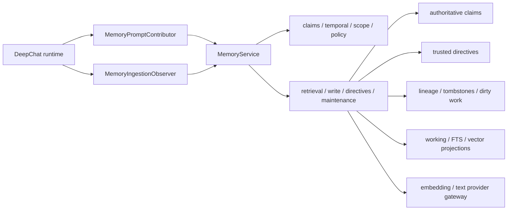

# Memory 系统

本文是 Agent Memory 的当前架构合同。已完成的 correctness、privacy、performance、state model 和
domain convergence SDD 已合并到这里。

Agent Memory 本身不使用 V1/V2/V3 作为产品或架构版本。文中的 `v1`、`v2` 仅表示 DuckDB
vector-store 文件格式。

## 所有权



- `src/main/memory/` 唯一负责长期记忆、检索、写入、persona、向量索引和后台维护。
- `src/main/agent/deepchat/memory/` 只负责每个 Session 的 prompt contribution、terminal ingestion、
  epoch、cursor 和 fence。
- Session 保存 Memory cursor/settings，不拥有 Memory row 或 vector store。
- App 负责 shutdown/database maintenance 时的全局 fence 和停止顺序，不解释 Memory 业务状态。
- Memory runtime 通过 `TapeRawEntryReader` 和 `TapeAnchorWriter` 读取执行事实、记录
  `memory/view_assembled` 与 `memory/extract` anchor；Memory routes 只通过 `TapeInspectionReader`
  获取 effective source span 和 manifest DTO，不接收 Tape table 或 raw Tape row。

## 数据与状态

`agent_memory` 中的原子 claim 是 remembered fact 的唯一权威来源。working row、FTS mirror、DuckDB
vector sidecar 和 renderer summary 都是可重建 projection，不能反向成为事实源。

| 数据 | 语义 | 生命周期 |
| --- | --- | --- |
| `agent_memory` | 原子 claim、事实置信度、时间有效性、来源、适用 scope | 权威 |
| `agent_memory_directive` | 经用户显式创建或批准的可执行指令 | 独立 trust plane |
| `agent_memory_derivation` | claim-to-claim 持久 lineage | 权威关系 |
| `agent_memory_tombstone` | 精确遗忘的 hash-only suppression identity | 随 Agent namespace 保留 |
| `agent_memory_dirty` | 增量 consolidation 的有界 work index | 可重建派生状态 |
| working / FTS / vector | 注入、关键词和相似度 projection | 可删除并重建 |
| audit | 运维可观测事件 | 有 retention，不承担 lineage |

Memory domain 使用明确的 lifecycle、embedding state、temporal metadata、scope 和 execution
identity，不能把多个状态重新压回一个含混枚举。所有写入带 Agent namespace；跨 Agent、跨 scope 或
stale epoch 的结果不得提交。

核心约束：

- working、episodic、semantic/persona 数据保留各自语义和去重规则；
- claim 的 `confidence` 只表示事实证据置信度；`temporal_confidence` 独立表示时间解析置信度，两者
  不得共用更新规则；
- temporal interval 使用 `[valid_from, valid_until)`；precision 和 IANA timezone 显式持久化；
- provenance key 使用 Agent、kind、scope 和 canonical content 构造；Agent scope 保留 legacy v2
  identity，legacy key 只在读取/迁移边界兼容；
- `agent_id` 是 storage/security owner；`agent|user|project|session` scope 只控制 owner 内的
  applicability，缺少窄 scope context 时不得放宽；
- 历史 `user_scope` 只作为兼容 shadow；迁移后的历史 row 保持 Agent scope，新的 User-scope write
  才同步 shadow；
- 同一配置 epoch 内的异步 extraction/embedding 才能提交，ABA 配置切换由 execution identity fence
  拒绝；
- provider/model/dimension identity 与 vector store metadata 必须一致，不一致进入 reindex/quarantine；
- renderer DTO、tool contract 和公开 status 由 route adapter 正规化，不泄漏内部 provider secret。
- 业务时间通过 `MemoryDomainClock` 注入；timeout、lease 和 performance measurement 继续使用各自的
  infrastructure clock。

## 读取路径

```text
turn preparation
  -> MemoryPromptContributor
  -> retrieval soft deadline
  -> owner + scope candidate filtering
  -> directive suppression
  -> temporal eligibility / scoring / deduplication
  -> one bounded contribution allocator
  -> separate memory and directive user-role contributions
  -> canonical send context
```

Memory contribution 必须等待到 soft deadline，成功时限制 token/字符大小并清理注入内容；失败或超时
允许当前消息继续。查询不能无限等待 native vector store 或 provider。Memory 只返回 contribution
文本、selection manifest 与成功持久化的 `memory/view_assembled` anchor ID；不能接收或重写 base
system prompt。

FTS 在 SQL `LIMIT` 前应用 Agent 和 scope predicate。Vector store 仍按 Agent namespace 查询，使用
有上限的 oversampling，并在 ranking 前通过 SQLite authoritative row 重新校验 owner、scope、
lifecycle、revision 和 embedding identity；不得依赖 vector candidate 本身做授权判断，也不得为了
填满 top-K 使用无界 refill loop。

current recall/injection 会排除高置信度的过期或尚未生效 state；低置信度时间解析 fail-open，但降低
权重并附带 qualification。Event 保留为历史 evidence；Plan 即使过期也只能表述为 previously
planned；Recurring 使用封闭 temporal kind 和已知 recurrence window。Decision retrieval 使用
evidence 视角，不能把时间过滤误当作物理删除。

Active `suppress_topic` directive 在 access accounting 前过滤 recall candidate。普通 memory、
persona 和 working projection 进入只读 `<context-data>` 容器，内容严格作为 data；Active directive
进入独立 typed contribution。抽取结果只能创建 draft directive，只有用户显式创建或 approve
操作能让 directive active。

一个纯 allocator 管理总 memory contribution budget：directive ceiling、persona/working
floor/ceiling、query-recall reservation，以及未使用份额的有界 borrowing。最终 assembler 仍执行
hard ceiling，并在 manifest 中记录 allocation。

普通 send 把 contribution 前置到当前 user message，原始用户指令保持在同一 message 的末端。resume
把 contribution 注入目标 assistant 所属 turn 的 user message；找不到 owner 时 fail-open 省略，不能在
partial assistant 后新增 user。tool/skill refresh 与 context pressure recovery 必须复用本 turn 已生成的
contribution，不能重复 retrieval、access accounting 或 anchor append。Memory、summary 与 handoff
state 都属于 untrusted conversation data，不得提升为 system role。

Vector store v2 使用 `<agentId>.v2.duckdb`、plain `FLOAT[]` table 和 exact scan，不在 hot path 加载
持久化 HNSW/VSS。v1 文件只通过隔离 reader 做一次性迁移，staging rename 是 publish commit point。
详细迁移窗口和后续 VSS removal 任务保留在
[memory-vector-store-v2](./memory-vector-store-v2/)。

## 写入路径

```text
terminal turn projection
  -> read bounded ingestion projection range
  -> rebuild from effective Tape or fall back when projection is stale/unavailable
  -> collect bounded text chunks
  -> extraction with domain-clock context
  -> normalize temporal claim + typed scope
  -> scoped provenance / tombstone / conflict checks
  -> claim + lineage + dirty-work transaction
  -> embedding pipeline / vector upsert
  -> advance cursor only after owned work settles
```

- terminal extraction 在后台运行，不延迟已完成回复；
- malformed temporal metadata 只让该 candidate 降级为 atemporal，不让整个 extraction batch 失败；
- 同 content 在不同 scope 可独立存在；update、supersede、conflict 和 merge 不得跨 scope；
- exact tombstone lookup 与 insert 位于同一 transaction，关闭 delete/re-extraction race；
- model-derived directive suggestion 只进入 draft，不得经 claim extraction 通道直接 active；
- cancellation signal 贯穿 text provider、embedding provider 和 vector query；
- write coordinator 对同一 Agent 的配置变化、重建和 maintenance 串行化；
- stale result、partial batch 和 provider cancellation 有明确 terminal outcome；
- vector store 异常进入 typed error/quarantine，不得把消息发送永久挂起。

## Tape 与 ingestion projection 边界

`DeepChatMemoryIngestionProjectionTable.readCurrentRange` 在一条只读 SQL 中同时观察 Tape head 和
projection head。这是明确的基础设施例外：拆成两次查询会让并发 append 产生 false-current 窗口。
除此之外 Memory 不得直接读取物理 Tape 表。

projection current 时只 materialize cursor 区间；head 不一致时，runtime 通过 `TapeRawEntryReader`
构建 effective Tape view 并重建 projection。projection 查询或重建失败时保留既有 Tape fallback 和
cursor commit 保护，不能因为拆层新增全历史 hot-path 查询，也不能在不完整 projection 上推进 cursor。

`TapeRawEntryReader` 只提供 `getBySession`。Memory management route 先验证 memory row 属于请求 Agent，
再用 `getEffectiveMessageSourceSpan` 读取 retraction/replacement 生效后的最小 message DTO；manifest
列表通过 `listMemoryViewManifestsByAgent` 在 storage query 中执行 Agent、Session、message 和 limit
过滤，route 不自行解析 `payload_json` 或 `meta_json`。架构守卫同时扫描 static import、dynamic
import、CommonJS require、type import 和 re-export，Memory route 不能绕过 inspection port 重新取得
raw reader、facade 或 domain helper。

## 遗忘、lineage 与增量维护

选择性删除先在同一 SQLite transaction 中为 canonical provenance 和 normalized content 写入
domain-separated SHA-256 tombstone，再删除 claim；tombstone 不保存明文。Vector 删除发生在 durable
transaction 之后。Exact replay 被压制，语义近似但来源独立的新事实不做 embedding-level tombstone
匹配。

Agent clear 会 tombstone 当时存在的 claim，并保留 tombstone，防止既有 Tape replay 重新填充。
Agent retirement 才删除整个 namespace 的 claim、directive、tombstone、lineage、dirty state 和
vector projection，使重新创建的 Agent identity 从干净状态开始。

Merge、reflection、supersede 和 manual edit 在 claim mutation 的同一 transaction 中写入 durable
derivation edge。Audit 可重复记录 ID 供观测，但 retention 清理不能破坏 lineage。

Committed episodic、semantic 和 reflection mutation 会 upsert `agent_memory_dirty` generation。
Maintenance 只处理有界 seed batch 和有界 same-scope vector neighbors；成功或 terminal/stale seed
才 settle，暂时失败的 generation 会轮转到未处理 work 之后，不能让固定失败前缀饿死队列。Persona
和 working projection 继续从 authoritative Agent-scope claims 重建。

## Privacy 与隔离

- 所有查询显式携带 Agent identity；不得依赖进程全局“当前 Agent”。
- User/Project/Session scope 不能跨 Agent 共享；runtime 默认只读取 Agent scope，加上当前显式
  context 匹配的窄 scope。
- private/secret-like 内容在写入、日志、metric 和 prompt contribution 前按 policy 过滤或脱敏。
- tombstone、audit refs 和 diagnostics 不得保存 forgotten plaintext。
- untrusted claim、projection 和 draft directive 不能进入 executable directive channel。
- Memory tool、renderer route 和 background task 使用同一 domain normalizer。
- 删除 Agent 时先 fence 新任务、等待/取消 owned work，再删除 row、vector file 和 metadata。

## Maintenance 和可观测性

Maintenance 使用有界 batch、deadline 和 ingestion fence。Database maintenance 顺序为：停止新任务、
fence Memory、drain accepted work、关闭 store/SQLite、执行操作、reopen、恢复后台任务。

Working projection 按 current state、stable preference/fact、recent event、plan/recurring 和 reflection
分节，使用稳定排序和 temporal annotation；排序用于 determinism、diff 和测试，不宣称带来
prompt-cache 收益。

metric 名称、retrieval evaluation 和 artifact upload 的未完成工作保留在
[memory-quality-gates-and-observability](./memory-quality-gates-and-observability/)。核心文档只记录长期
合同，不保存一次性 benchmark 数值。

## 关键入口

1. `src/main/memory/index.ts`
2. `src/main/memory/domain/`
3. `src/main/memory/core/`
4. `src/main/memory/services/`
5. `src/main/memory/infra/vectorStoreManager.ts`
6. `src/main/memory/infra/memoryVectorStore.ts`
7. `src/main/agent/deepchat/memory/memoryRuntimeCoordinator.ts`
8. `src/main/tape/ports/capabilities.ts`
9. `test/main/memory/`

Memory tests 必须防止旧 `src/main/presenter/memoryPresenter`、HNSW hot path、
无 Agent namespace/scope authoritative revalidation、directive 混入只读 memory container、明文
tombstone 和无 deadline provider call 回流。维护的 behavior fixture 覆盖 carry-forward、preference
/ directive adherence、temporal correctness 与 correction / forgetting 四轴。
