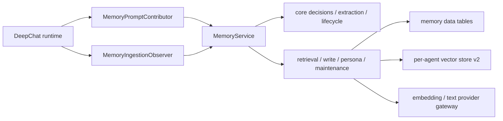

# Memory 系统

本文是 Agent Memory 的当前架构合同。已完成的 correctness、privacy、performance、state model 和
domain convergence SDD 已合并到这里。

## 所有权



- `src/main/memory/` 唯一负责长期记忆、检索、写入、persona、向量索引和后台维护。
- `src/main/agent/deepchat/memory/` 只负责每个 Session 的 prompt contribution、terminal ingestion、
  epoch、cursor 和 fence。
- Session 保存 Memory cursor/settings，不拥有 Memory row 或 vector store。
- App 负责 shutdown/database maintenance 时的全局 fence 和停止顺序，不解释 Memory 业务状态。

## 数据与状态

Memory domain 使用明确的 lifecycle、embedding state 和 execution identity，不能把多个状态重新压回
一个含混枚举。所有写入带 Agent namespace；跨 Agent、跨 Session 或 stale epoch 的结果不得提交。

核心约束：

- working、episodic、semantic/persona 数据保留各自语义和去重规则；
- provenance key 使用可验证的 canonical identity；legacy key 只在读取/迁移边界兼容；
- 同一配置 epoch 内的异步 extraction/embedding 才能提交，ABA 配置切换由 execution identity fence
  拒绝；
- provider/model/dimension identity 与 vector store metadata 必须一致，不一致进入 reindex/quarantine；
- renderer DTO、tool contract 和公开 status 由 route adapter 正规化，不泄漏内部 provider secret。

## 读取路径

```text
turn preparation
  -> MemoryPromptContributor
  -> retrieval soft deadline
  -> candidate scoring / filtering / deduplication
  -> bounded, sanitized prompt section
  -> canonical send context
```

Memory contribution 必须等待到 soft deadline，成功时限制 token/字符大小并清理注入内容；失败或超时
允许当前消息继续。查询不能无限等待 native vector store 或 provider。

Vector store v2 使用 `<agentId>.v2.duckdb`、plain `FLOAT[]` table 和 exact scan，不在 hot path 加载
持久化 HNSW/VSS。v1 文件只通过隔离 reader 做一次性迁移，staging rename 是 publish commit point。
详细迁移窗口和后续 VSS removal 任务保留在
[memory-vector-store-v2](./memory-vector-store-v2/)。

## 写入路径

```text
terminal turn projection
  -> collect bounded text chunks
  -> extraction / reflection
  -> normalize candidates
  -> conflict and provenance checks
  -> row transaction
  -> embedding pipeline / vector upsert
  -> advance cursor only after owned work settles
```

- terminal extraction 在后台运行，不延迟已完成回复；
- cancellation signal 贯穿 text provider、embedding provider 和 vector query；
- write coordinator 对同一 Agent 的配置变化、重建和 maintenance 串行化；
- stale result、partial batch 和 provider cancellation 有明确 terminal outcome；
- vector store 异常进入 typed error/quarantine，不得把消息发送永久挂起。

## Privacy 与隔离

- 所有查询显式携带 Agent identity；不得依赖进程全局“当前 Agent”。
- private/secret-like 内容在写入、日志、metric 和 prompt contribution 前按 policy 过滤或脱敏。
- Memory tool、renderer route 和 background task 使用同一 domain normalizer。
- 删除 Agent 时先 fence 新任务、等待/取消 owned work，再删除 row、vector file 和 metadata。

## Maintenance 和可观测性

Maintenance 使用有界 batch、deadline 和 ingestion fence。Database maintenance 顺序为：停止新任务、
fence Memory、drain accepted work、关闭 store/SQLite、执行操作、reopen、恢复后台任务。

metric 名称、retrieval evaluation 和 artifact upload 的未完成工作保留在
[memory-quality-gates-and-observability](./memory-quality-gates-and-observability/)。核心文档只记录长期
合同，不保存一次性 benchmark 数值。

## 关键入口

1. `src/main/memory/index.ts`
2. `src/main/memory/domain/`
3. `src/main/memory/core/`
4. `src/main/memory/services/`
5. `src/main/memory/infra/vectorStoreManager.ts`
6. `src/main/memory/infra/memoryVectorStore.ts`
7. `src/main/agent/deepchat/memory/memoryRuntimeCoordinator.ts`
8. `test/main/memory/`

Memory tests 必须防止旧 `src/main/presenter/memoryPresenter`、HNSW hot path、
无 Agent namespace 查询和无 deadline provider call 回流。
