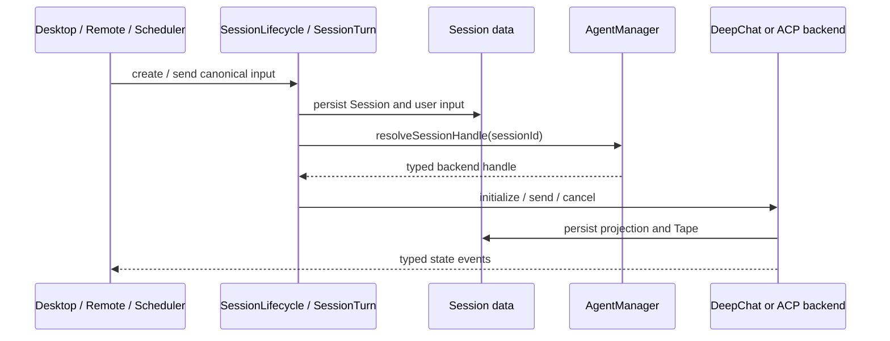

# Session 管理

Session 是可长期保存的产品对象；window、renderer、Remote endpoint、Agent instance 和单次 Run
都比它短命。

## 当前所有权

| 能力 | Owner |
| --- | --- |
| create、draft、close | `src/main/session/lifecycle.ts` |
| send、queue、stop、interaction response | `src/main/session/turn.ts` |
| Agent/model/project/transfer/subagent assignment | `src/main/session/assignment.ts` |
| list、restore、status、projection query | `src/main/session/query.ts` |
| full delete transaction | `src/main/session/deletion.ts` |
| transcript | `src/main/session/data/transcript.ts` |
| Tape public port / composition | `src/main/session/data/index.ts` |
| Tape domain / application / SQLite adapters | `src/main/tape/` |
| generation settings / Memory cursor | `src/main/session/data/settings.ts` |
| pending input | `src/main/session/data/pendingInputs.ts` |
| renderer binding | `src/main/desktop/sessionBinding.ts` |
| backend selection | `src/main/agent/manager/agentManager.ts` |

各入口只接收自己需要的 Session port。不存在聚合全部能力的 Session facade，也不允许 window
binding 进入持久化 Session 数据。

## 创建与发送



route 只做 schema 和 transport adapter。所有入口在进入 `SessionTurn` 前必须得到同一种 canonical
send input；Remote、Scheduler 和 renderer 不得各自维护不同的默认值或 permission 语义。

## Queue 与 Steer

Queue 和 Steer 共用 pending-input persistence，但产品语义不同：

```text
Queue: bottom draft lane -> claim -> user message -> assistant message
Steer: user message (Unread) -> claim (Read) -> new assistant message
```

- Queue 在 claim 前不是 transcript fact，可编辑、排序、删除；容量只计算 active Queue。
- Steer 接受时由 `SessionPendingInputs` 在一个 SQLite transaction 中同时写入 user message 和
  pending batch。快速连续 Steer 各有独立 user message，但复用当前 pending batch 的合并 payload。
- Steer claim 是不可回退的读取边界：同一 transaction 更新 batch、写入所有 linked message 的
  `readAt`，并预留新的 assistant message ID。claim 后不允许走 Queue 的 release/retry 语义。
- DeepChat 在现有安全 yield boundary 结束旧 assistant；ACP 使用 `pending_input` cancel cause
  结束旧 projection。两个 backend 都把后续输出写入 claim 预留的新 assistant message。
- renderer 只把 Queue 渲染在 `PendingInputLane`。Steer 通过 typed route result 和
  `sessions.messages.changed` 进入正常 message list；event 是 cache update，SQLite transcript
  仍是 source of truth。
- receipt 只由持久化 `readAt` 派生为 `Unread` 或 `Read`。`Read` 的短时显示和淡出属于 renderer，
  不产生延迟数据库写入。
- 冷启动是单独的终止边界：上个进程尚未 claim 的 Steer 会消费 pending row，并把 linked user
  message 内部终止为 `error`。renderer 不展示恢复专用 receipt 或按钮，仍保留普通消息工具栏；已经
  claim 的 Steer 保留 sent user fact，由中断的 assistant message 承载失败。

## 恢复与查询

- `sessions.restore` 返回最近一页，`sessions.listMessagesPage` 使用 keyset pagination 拉取旧历史。
- 普通 list/history/binding query 不 hydrate Agent instance。
- DeepChat harness 构造时会先 reconcile active pending inputs。历史 Queue row 保持 durable，并进入
  process-local restart hold；Session 打开、hydrate、消息查询和 pending-input list 都不会释放 hold
  或触发执行。用户通过 Queue lane 的 `Resume queue` 显式释放当前 Session 的 hold，之后继续沿用
  Steer-first 与 Queue FIFO drain 规则。手动恢复的 Queue head 在写入 user/assistant fact 并进入
  provider Run 前消费；此后的 provider error 只保留在 transcript，不会把同一条目放回 Queue。
- 重启前尚未 claim 的 Steer 不再自动 drain：reconciliation 消费对应 pending row，并把 linked
  pending user message 加入 transcript forced recovery，最终内部状态为 `error`，UI 不显示 receipt。
  用户通过普通消息工具栏 Retry 时走普通 turn，且不会释放同 Session 的历史 Queue hold。
- restart hold 仅由现有 active Queue ID 派生，不持久化、不改变 Queue 排序和容量，也不新增 schema；
  再次重启会从剩余 durable row 重建。pending-input list 是纯读。
- DeepChat harness 构造时在 pending-input 与 transcript recovery 之前分类 Execution Journal。存在
  dispatch-without-outcome、corruption 或缺失 terminal 的 Run 只输出结构化 parked 诊断，不依据该报告
  自动重放遗留 operation；分类先于 runtime graph 构建，Journal 读取失败会阻止 harness 构造。诊断最多
  输出 100 条清理过控制字符的明细，超出部分只输出分类汇总。v1 不新增持久化 Session parking 状态。
- Session status 不持久化：已载入时来自 backend snapshot，未载入为 `idle`。
- structured transcript 是当前 read model；legacy conversations/messages 仅用于一次性 import 和明确的
  export conversion。
- history search 优先使用 search document / FTS path，失败时回退受控 SQL search；坐标和 scroll
  归 renderer viewport owner，不写回 Session。

## Tape boundary

Session data composition 创建一个 `SessionTape`，对外继续暴露现有 `SessionTapePort`，并按每个 IPC
操作原有的条件和时序调用 `ensureSessionTapeReady`。`src/main/session/data/tape*.ts` 和旧 table path
只是显式冻结并标记 deprecated 的 compatibility re-export，不再拥有 Tape policy 或 persistence。

- transcript 只接收 `TapeMessageFactWriter`；message replace/retract 与对应 Tape fact 继续共享调用方
  SQLite transaction；
- settings/compaction 只接收 anchor reader/writer 与 lifecycle admin；summary 更新和 anchor append
  继续使用同一个 connection；
- loop runner 接收 Context Tape、provider attempt 与 strict Execution Journal writer；harness composition
  只接收 Journal recovery reader。Turn coordinator 与 ACP compatibility 只接收 reconciliation；Memory
  和 routes 分别接收自己的最小 Tape capability，不接收物理 table；
- transcript backfill 只可生成 legacy Context facts，不能创建 `execution/*`；Run、dispatch、outcome 与
  terminal facts 只能由 runtime 的 strict writer 在原生边界提交；
- Tape 的运行中修订通过 append 表达；物理 delete/reset 只由 Session lifecycle 触发。

`SessionTranscript` 和 `SessionSettingsStore` 不提供隐式 `new SessionTape(...)` fallback，必须由正常
composition 注入共享 connection 上的最小 capability。legacy import 作为 migration consumer 复用
`sessionData.tapeStore` 的 message fact writer，不再构造第二个 facade，避免隐藏的独立 writer 或事务
上下文。

`clearSessionMessages` 会创建新的 Tape incarnation：pending input 删除、transcript 删除和 Tape reset
位于同一个外层 SQLite transaction；Tape 内部的 entry、mutation projection、search/FTS projection
删除和新 bootstrap 作为 savepoint 嵌套。lifecycle、cleanup 或 bootstrap hard failure 会同时恢复上述
数据并完整保留旧 incarnation。mutation projection 沿用 fail-open：新 bootstrap 的 projection apply
失败时旧 projection row 已删除且 meta 标 stale。最终 Session delete 不创建新 incarnation，继续遵循
下面的 staged cleanup 顺序。

## Binding

`DesktopSessionBinding` 维护 `webContentsId -> sessionId`：

- activate 读取 projection 并绑定 renderer；
- deactivate、tab close 或 window destroy 只删除 Desktop binding；
- 关闭最后一个 window 不默认 cancel Turn、clear permission、evict runtime 或 delete Session；
- Remote 和 Scheduler 有自己的 binding/run identity，不能复用 Desktop 状态。

## Close、delete 和 transfer

`handle.close()` 停止并驱逐所选 backend runtime，但保留 app-session shell。Full delete 的顺序是：

```text
cleanup both backend caches without hydration
  -> remove ACP durable binding
  -> remove transcript / Tape lifecycle data / pending / settings
  -> clear permission and active Skill state
  -> delete app-session row
```

因此 missing、disabled 或 malformed agent row 不会阻止旧 Session 被删除。

Transfer 先验证 target descriptor 和 kind-specific setting，再提交 assignment，最后关闭旧 runtime。
失败不得留下半迁移 Session。删除 Agent 时使用相同的 descriptor-independent cleanup，不直接删除用户
Session 数据，除非用户执行明确的 Session 删除操作。

## Project 和目录

Session 只保存 `projectDir`。目录生命周期、默认目录、archive/remove/reorder 和文件是否存在由
`src/main/project/` 负责；Workspace 负责访问授权与文件能力。移除目录不会删除真实文件，相关 Session
按产品合同转为 no-project 或保留 ACP resume 所需 workdir。

## 防回归

- Agent 或 Session 不得依赖 Desktop、Remote、Scheduler、Routes 或 App。
- query 不得偷偷 launch ACP process 或 hydrate DeepChat instance。
- app-session row 必须在所有 owned data 清理完成后最后删除。
- `new_sessions.subagent_enabled` 只作为旧数据库兼容列，不能重新成为授权来源。
- 当前入口从 `src/main/session/routes.ts`、`sessionService.ts`、`chatService.ts` 追踪；不要恢复
  `SessionPresenter` 或 `AgentSessionPresenter`。
