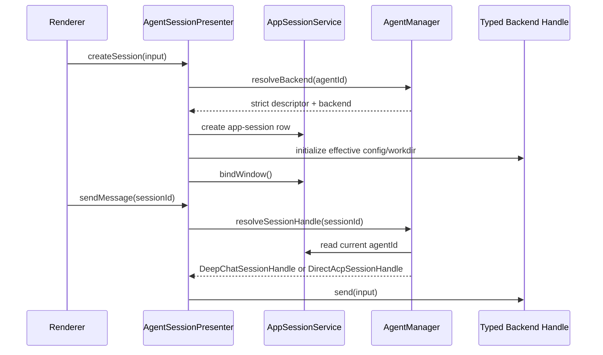

# 会话管理架构详解

当前会话管理分成四个明确边界：

- app-session shell：`AppSessionService` 管理 `new_sessions`、window binding 和 shared CRUD；
- agent execution routing：`AgentManager` 按 executable descriptor kind 返回 typed handle；
- route/application owners：typed session routes 直接组合 search、translation、export、usage、RTK 与 agent
  catalog owner；
- core session façade：`AgentSessionPresenter` 只保留 session lifecycle、turn、assignment 与 shared
  projection 编排。

`SessionPresenter` 是旧 conversations/messages 的 compatibility/data façade，不在当前 agent execution
链路中。

## 当前职责边界

| 组件 | 位置 | 当前职责 |
| --- | --- | --- |
| `AgentSessionPresenter` | `src/main/presenter/agentSessionPresenter/index.ts` | core session façade；CRUD、draft、title、turn、transfer/subagent 与 shared projection |
| Session route owners | `src/main/routes/sessions/` | history search、translation 与 typed route orchestration |
| Session export | `src/main/presenter/exporter/agentSessionExporter.ts` | current agent-session export mapping and format dispatch |
| Startup/maintenance owners | `src/main/presenter/startupMigrations/`, `usageStatsService.ts` | legacy import、session-data migrations、usage backfill/dashboard；RTK 由其 runtime service 自有 |
| `AppSessionService` | `src/main/agent/shared/appSessionService.ts` | `new_sessions` row、window binding、activate/list/filter/shared CRUD |
| `AgentManager` | `src/main/agent/manager/agentManager.ts` | session agent id -> strict descriptor -> explicit backend kind router |
| DeepChat backend | `src/main/agent/manager/deepChatAgentBackend.ts` | typed handle over `DeepChatAgentRuntime`/instance和 required DeepChat delegate port |
| direct ACP backend | `src/main/agent/manager/directAcpAgentBackend.ts` | typed handle over `AcpAgentRuntime`/instance和 ACP-specific controls |
| `DeepChatAgentInstance` | `src/main/agent/deepchat/instance/` | hydrated DeepChat session state、active run、pending/interactions/cache |
| `AcpAgentInstance` | `src/main/agent/acp/instance/` | direct ACP session/process/workdir/mode/config/command/permission state |
| `DeepChatSessionStore` | `src/main/presenter/agentRuntimePresenter/sessionStore.ts` | DeepChat persisted provider/model/settings/summary/Memory cursor |
| `DeepChatMessageStore` | `src/main/presenter/agentRuntimePresenter/messageStore.ts` | shared structured transcript projection、分页、search source |
| `SessionPresenter` | `src/main/presenter/sessionPresenter/index.ts` | legacy conversation/thread/export compatibility |

## 创建与发送



`new_sessions.session_kind` 只表示 `regular | subagent`。DeepChat/ACP routing 只来自当前
`new_sessions.agent_id` 对应的 strict `AgentDescriptor.kind`；unknown、disabled、malformed 或 cached identity
mismatch 失败关闭，不 fallback。

## Typed handle

共同 handle 保留双方真实共有的：

- initialize/isInitialized；
- send/cancel/snapshot/waitForFirstTurnReady/close；
- pending queue/steer；
- permission/generation settings/project；
- tool interaction response。

DeepChat compaction/model/context、ACP workdir/mode/config/commands、transfer target、subagent 和 generation
control 通过 required kind-specific facet 暴露。handle/backend 没有 optional-method reflection 或
legacy/direct runtime-kind branch。

## 恢复、列表与历史分页

- session list 使用 lightweight backend snapshot；direct ACP list 不为只读状态 hydrate/launch process。
- `sessions.restore` 返回最近一页消息，默认 `100` 条；`sessions.listMessagesPage` keyset 分页拉取旧历史。
- DeepChat structured message tables 和 direct ACP compatibility projection 共用同一 restore/search/export
  read model；`acp_turns` 只是远端 protocol metadata。
- `SessionHistorySearch` 使用 `deepchat_search_documents` / FTS5 提供 `sessions.searchHistory`，失败时
  回退 `LIKE`，并保留 legacy SQL fallback。

## 关闭、删除与 transfer

`handle.close()` 会执行所选 backend 的 runtime 与 projection cleanup，但保留 `new_sessions` app-session
shell。DeepChat 会关闭/驱逐 instance，并清理 pending、structured message、DeepChat session、Memory runtime
state 与 tool mapping；direct ACP 会清理 process/session runtime、durable remote binding 和 shared session
projection。close 因而不是“只释放内存”，也不等于 full app-session delete。

full delete 是 descriptor-independent cleanup：

```text
manager cleanup both backend caches without hydration
  -> direct ACP durable remote binding cleanup
  -> shared session/message/Tape state cleanup
  -> permission cleanup
  -> active skill cleanup
  -> delete app-session row
```

façade 最后调用 `AppSessionService.delete()` 才删除 `new_sessions` row；因此即使 backend close 已完成，app
session shell 仍存在，直到 full delete 明确提交。这允许 missing/disabled/malformed agent row 的旧 session
仍可删除。ACP -> DeepChat transfer 先完成 target validation和 ownership commit，再关闭旧 direct ACP
runtime；ACP target 在 mutation 前拒绝。DeepChat +
ACP-provider source 只清 compatibility binding，不被误判成 direct ACP。

## Subagent、remote 与 cron

- Subagent 与普通 session 共享 app/message schema，用 `sessionKind`、`parentSessionId`、`subagentMeta`
  区分；child backend 仍由 manager 选择，父 session 通过 Tape merge/discard 接收结果。
- Remote active-generation lookup/cancel 使用 `AgentManagerGenerationPort`，不扫描 presenter runtime maps。
- Cron 每次执行创建 detached app session，再通过 façade/manager handle send；Remote delivery 只是通知。

## `SessionPresenter` compatibility

只有这些场景进入 `src/main/presenter/sessionPresenter/`：

- 旧 conversations/messages 数据读取；
- legacy conversations/messages export；
- thread list 广播；
- tab/window close compatibility；
- exporter 的旧消息格式化。

当前 session create/send/cancel/tool interaction 从 `AgentSessionPresenter -> AgentManager -> typed backend`
开始追踪；DeepChat state/loop 看 `agent/deepchat`，direct ACP 看 `agent/acp/instance`。

旧聊天数据导入由 `presenter/startupMigrations/legacyChatImportService.ts` 拥有；当前 agent-session export
由 `presenter/exporter/agentSessionExporter.ts` 拥有。两者都不属于 `AgentSessionPresenter`。
