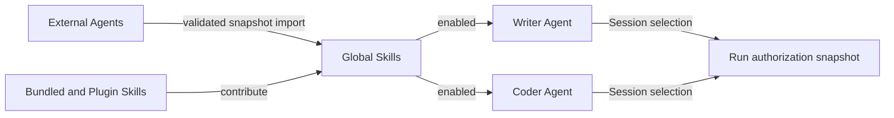
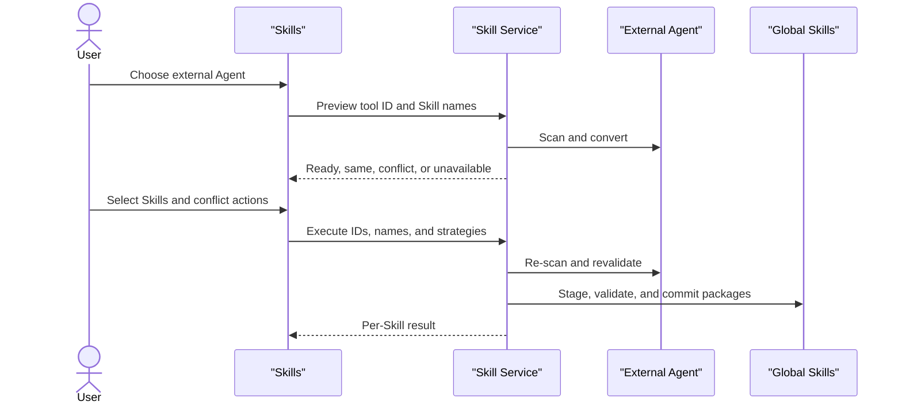

# Shared Skills

Status: implemented.

## Context

DeepChat previously stored mutable Skills per Agent:

```text
<skillsRoot>/                              # built-in DeepChat Agent
<skillsRoot>/.agent-scopes/<agentId>/      # manual DeepChat Agent
```

That model duplicated packages and made a filesystem location look like product ownership. A
symbolic link would remove duplicate bytes but would retain the wrong lifecycle and add
cross-platform link, watcher, realpath, and recovery problems.

The product needs one application-level set of Skills. Agents only decide which entries they can
use, and Sessions separately decide which enabled entries are active for a Run.

## Decision

DeepChat stores each mutable Skill package once under the global Skills root. A DeepChat Agent has
a logical binding to a Skill; no Agent-owned copy or generated link is created. Read-only bundled
and Plugin-owned Skills stay in their provider roots but appear in the same global list.

The renderer exposes only:

- `Skills` for the global list;
- `Enabled Agents` for Agents that can use the selected Skill; and
- Session activation for the separate per-conversation Run choice.



## Goals

- Keep one canonical mutable package for every globally unique Skill name.
- Let any number of DeepChat Agents use the same package through logical bindings.
- Show every Skill in one default list, independent of the selected Agent.
- Put Agent enablement inside the selected Skill preview.
- Keep only external Agent snapshot import in the primary Plugins interaction.
- Preserve per-Agent extension state, Session filtering, runtime authorization, Plugin ownership,
  and existing data.
- Exclude ACP Agents from DeepChat Skill bindings and migration decisions.

## Non-goals

- A separate global collection page, tab, or entity.
- An Agent assignment page, Agent picker, assigned/unassigned list states, or batch Apply step.
- Filesystem symlinks, junctions, aliases, or generated Agent directories.
- DeepChat-to-DeepChat copying; all DeepChat Agents already reference the same global set.
- Continuous synchronization or publishing into an external Agent.
- Automatic content merging or parent/child Agent inheritance.
- Deleting preserved legacy `.agent-scopes` data during initial migration.

## Product Model

The three runtime decisions remain distinct even though only the first two appear on the Skills
surface:

| Decision | Owner | Meaning | Product interaction |
| --- | --- | --- | --- |
| Skill exists | application | one canonical package is available globally | list, preview, import, edit, delete |
| Agent can use Skill | DeepChat Agent | one logical binding is enabled | add or remove Agent in Skill preview |
| Skill is active | Session | the next Run loads an enabled Skill | separate Session control |

Invariants:

- A global Skill can exist without any enabled Agent.
- Removing an Agent from a Skill never deletes package content or extension state.
- Deleting or editing shared content affects every enabled Agent.
- ACP and missing Agents never become binding targets.
- A Run authorizes only the concrete roots resolved from its Agent and active Skill names.
- A Run keeps the Skill names authorized at Run start even if an Agent binding changes while that
  Run is executing; later Runs use the updated binding.

## Ownership and Storage

### Packages

```text
<skillsRoot>/<skillName>/                  # canonical mutable package
<skillsRoot>/.agent-scopes/<agentId>/      # preserved migration evidence only
<skillsRoot>/.library-migration-v3/        # compatibility recovery journal
```

The recovery directory keeps its historical name so an interrupted development migration can
resume safely. Its journal is committed by atomic replacement before package renames, so a torn
write cannot become the next startup input. It is excluded from discovery and never appears in UI
or public contracts.

Bundled and Plugin Skills remain in provider-owned roots. Providers control their lifecycle and
mutability; global listing does not transfer ownership.

### Management state

Version 3 separates global package metadata from Agent bindings:

```ts
interface SharedSkillManagementItem {
  name: string
  canonicalPath: string
  source: SkillSource
}

interface AgentSkillBinding {
  assigned: boolean
  extension: SkillExtensionConfig
  runtimeBindingId?: string
}

interface SkillManagementState {
  version: 3
  skills: Record<string, SharedSkillManagementItem>
  agents: Record<string, { bindings: Record<string, AgentSkillBinding> }>
  sync?: SkillSyncDirectoryConfig
  migration?: SharedSkillMigrationState
}
```

`assigned` is an internal persistence and runtime term. Renderer copy exposes the same relation as
an Agent being enabled for a Skill. A version 3 development state that used the former `library`
field is decoded once for compatibility and saved back with `skills`.

A missing binding is disabled with a default extension. Removing an Agent writes
`assigned: false` and retains its extension. New bundled and Plugin contributions receive the
existing provider-default bindings; new mutable imports do not enable an Agent automatically.

## Catalog and Runtime Resolution

`SkillService` owns one physical catalog and derives an Agent catalog from bindings:

```text
AgentCatalog(agentId)
  = AvailableGlobalSkills intersect EnabledBindings(agentId)

EffectiveSessionSkills(sessionId)
  = PersistedSessionSelection intersect AgentCatalog(Session.agentId)
```

The derived Agent catalog is the authorization boundary for prompt assembly, Skill tools, allowed
tools, scripts, and filesystem roots. `skills.listAll` is a management view and never grants
runtime access.

Route and Discover apply the bounded progressive-disclosure contract to this derived Agent catalog,
never to the global management list. Activation resolves canonical package bytes once, records
effective content and an execution package in Tape, and binds `skill_view` and `skill_run` to that
request evidence. The per-binding `runtimeBindingId` versions secret-bearing environment values
without persisting them in Tape.

Each Run keeps the active names, content identity, and package authority resolved at Run start.
Canonical source packages are not duplicated per Agent; only the bounded request execution package
is materialized for verified script execution. Transfer, rebind, fork, and Subagent creation
recompute the destination Agent intersection.

One cache and watcher cover global metadata and content. Binding changes invalidate only affected
Agent views. The number of Agents is small enough to scan for reverse impact; no reverse index is
introduced.

Watcher delete events are cache invalidations, not authoritative user deletions. A delete applies
only when the event path exactly matches a cached manifest and the file is still absent. It removes
the cached catalog entry but preserves global provenance, Agent bindings, extension state, and
runtime binding identity so atomic editor replacement can restore the same Skill without changing
authorization. Watcher delivery never removes persisted Skill state; explicit deletion and startup
reconciliation own that lifecycle.

## Operations

### Enable and remove Agent

The preview sends one explicit Skill name, DeepChat Agent ID, and target boolean.

- Main verifies that the Agent exists and is a DeepChat Agent.
- Enabling rejects an unavailable Skill name.
- Removing retains extension configuration and filters persisted Session selections.
- Agent deletion removes only its bindings.
- The existing Agent lifecycle gate fences concurrent Agent deletion.

### Edit and delete Skill

Shared content actions show the current enabled Agent names. Deletion:

1. receives the enabled Agent IDs acknowledged by the confirmation surface;
2. re-resolves impact and rejects stale confirmation;
3. moves the package to a recoverable backup;
4. removes bindings and affected Session selections;
5. commits state and publishes the catalog event; and
6. removes the backup, restoring it if commit fails.

Provider-owned and bundled read-only Skills cannot be edited or deleted.

### Import from external Agent

External snapshot import is global. It does not ask for target Agents and does not enable Agents as
a side effect. The user enables Agents later from the imported Skill preview.



Conflict behavior:

- `ready`: add a new global Skill.
- `same`: keep the identical existing Skill without changing enabled Agents.
- `conflict + skip`: change nothing.
- `conflict + rename`: add the first available validated global name; this is the default.
- `conflict + overwrite`: replace shared content after acknowledging current enabled Agent impact.
- `unavailable`: disable selection and show a source validation reason.

Renderer input never supplies source paths or converted package bytes. Main re-scans and
recomputes conflicts at execution time. Partial failures are returned per Skill.

Local folder, ZIP, URL, Git, draft, public, and CLI entry points remain compatibility or runtime
capabilities, but they are not offered as parallel Add choices on the primary Skills page.

### Sync directory

Sync-directory backup remains application-level. A secondary `Sync directory` action replaces the
default list with the existing backup surface and provides `Back to Skills`; it is not a peer tab.
Only packages are imported or exported, never Agent bindings. While a directory, import, or export
write is pending, both the local Back action and route navigation remain blocked so the retained
surface can report the final result.

## Renderer Interaction

### Default

```text
Plugins / Skills
Manage all Skills. Open one to preview it and manage enabled Agents.

+------------------------------------------------------------------------------+
| Suggest Skill Drafts                                                   [off] |
| After a task, allow the Agent to suggest temporary reusable Skill drafts.    |
+------------------------------------------------------------------------------+

                       [Search Skills] [Sync directory] [Import from external Agent]
----------------------------------------------------------------------------------
┌────────────────────────────────────┐  ┌────────────────────────────────────┐
│ code-review                        │  │ browser-control                    │
│ Review a change before merging...  │  │ Control an interactive browser... │
└────────────────────────────────────┘  └────────────────────────────────────┘
```

The task-completion Skill Draft suggestion setting appears immediately below the page description
and above search and actions. The responsive grid uses two equal columns when space permits and one
column in constrained windows. Every card has the same fixed height and contains only the Skill name
plus a description clamped to two lines. Cards contain no icon, source label, Agent state, or
separate Preview affordance. The whole card is a semantic button with keyboard focus and opens the
Skill preview. This is the sole Skills management surface; the Settings window has no Skills
navigation item or route.

### Skill preview

```text
┌──────────────────────────────────────────────────────────────────────────────┐
│ code-review                                                        [Close] │
│ Review a change before merging                                             │
│                                                                            │
│ Enabled Agents                                             [+ Add Agent]   │
│ [DeepChat ×] [Writer ×]                                                    │
│                                                                            │
│ /.../skills/code-review/SKILL.md                       [Edit] [Delete]     │
│ ────────────────────────────────────────────────────────────────────────── │
│ # Code review                                                              │
│ ...                                                                        │
└──────────────────────────────────────────────────────────────────────────────┘
```

`Add Agent` lists only DeepChat Agents that are not already enabled. `×` removes that Agent from
the Skill. Each mutation commits immediately and exposes pending, error, keyboard, and accessible
label states through existing primitives.

Async preview mutations are scoped to the Skill that started them. A late response may refresh its
card in the global list but cannot replace a newer open preview. Background catalog removal asks the
preview to close through the same dirty-draft guard as a direct user close. External-import impact
copy resolves Agent IDs to current display names and falls back to an ID only when no matching
DeepChat Agent is available.

The Plugins-hub Skills route renders this same global surface. It does not infer a target from the
currently selected Agent or ACP state.

## Typed Interfaces

- `skills.listAll`: list every available global Skill and its enabled Agent IDs.
- `skills.listCatalog`: list only Skills enabled for one required `agentId`.
- `skills.setDisabled`: compatibility single-binding mutation used by the renderer client.
- `skills.setAssignments`: compatibility batch binding mutation for one Agent.
- `skills.delete`: delete one mutable global Skill after impact acknowledgement.
- `skills.listAgentImportSources`, `skills.previewAgentImport`, `skills.executeAgentImport`: global
  external snapshot import without target Agent IDs.

There is no DeepChat-to-DeepChat duplicate route: logical bindings already share the canonical
package. Catalog events expose only reasons emitted by the service. Persisted settings activity is
treated as historical input; navigation ignores route names that are no longer registered.

When the separate Settings window must continue onboarding on the main surface, it invokes a typed
window route. Main publishes a typed runtime resume event and focuses the main window. No
cross-window handoff relies on renderer `sessionStorage`.

Content routes may retain an `agentId` as lifecycle context, but containment and provider ownership
authorize global reads and mutations. Extension routes retain `agentId` because extension state
belongs to a binding.

## Concurrency, Failure, and Security

- One service mutation gate serializes package and binding writes.
- Package writes reuse staging, manifest validation, physical containment, backup, and atomic
  rename behavior.
- Failed package operations leave bindings unchanged; failed combined operations restore backups.
- Managed or imported package roots cannot be symbolic links.
- Imported relative paths are validated and cannot escape their package root.
- The entire configured Skills root is protected from general Agent filesystem writes.
- Only active concrete Skill roots are added to a Run filesystem allowlist.
- Closing a running import or dirty edit is guarded by existing settings leave protection.

## Migration and Compatibility

Migration from versions 1 and 2 is deterministic and restartable:

1. discover existing global and private DeepChat Agent packages;
2. deduplicate identical snapshots;
3. give different same-name variants validated global names;
4. stage and journal copies before canonical renames;
5. translate disabled state and extension data into bindings;
6. remap DeepChat Agent Session selections;
7. leave ACP and orphaned Sessions untouched; and
8. commit version 3 only after package commits succeed.

Legacy private roots remain evidence and are excluded from runtime discovery. Version 3 states
written with the former `library` property are read as `skills` to protect users who ran an earlier
development build. On startup, version 3 bindings whose IDs are not in the current DeepChat Agent
set are removed before the global catalog is exposed; ACP and orphaned IDs cannot leak into enabled
Agent impact.

## Acceptance Criteria

1. Mutable packages exist once under the global Skills root.
2. New DeepChat Agents do not receive private Skill roots or package copies.
3. The default Skills view places the task-completion Skill Draft suggestion setting above search
   and actions.
4. The default Skills view is one list containing every available Skill.
5. No visible assignment, assigned, or unassigned surface or copy remains.
6. Clicking any Skill opens its content preview.
7. The preview lists enabled DeepChat Agents and supports immediate add and remove actions.
8. ACP Agents never appear as targets and do not participate in migration validation.
9. The primary import action accepts external Agents only and imports globally without enabling an
   Agent.
10. Sync directory remains reachable as a secondary view without a top-level tab.
11. The Plugins-hub route renders the same global Skills view.
12. Agent catalogs, Session activation, prompt assembly, tools, scripts, and filesystem access use
    the enabled-Agent intersection rather than the global management list.
13. Route, Discover, Tape materialization, and request-bound script execution preserve that same
    Agent authorization boundary.
14. Shared edit and delete revalidate current enabled Agent impact.
15. Version 1 and 2 migration preserves packages, bindings, extensions, runtime environment
    revisions, and valid Session choices.
16. Version 3 `library` compatibility data is decoded without losing packages.
17. Plugin and bundled ownership and mutability remain enforced.

## Open Questions

None. Continuous synchronization, external publishing, content-addressed identity, or legacy-root
deletion require separate architecture goals.
