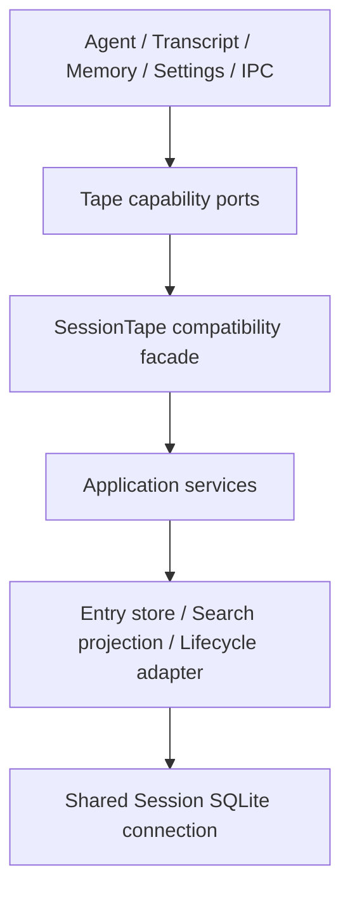

# Tape 系统

## 惰性的 Skill materialization fact

Tape 物理支持 `context` entry。`skill/materialized` 当前 schema 3 是完整 effective Skill content
及其有界 execution package 的保留 canonical fact：它绑定 Session 和 Tape incarnation、按内容寻址，
并且只能通过由 `SessionTape` 组合的窄 materialization reader/writer 访问。schema 2 的 scripts-only
payload 保持兼容读取；只存在于未合并开发分支的 schema 1 被显式拒绝。generic append 不能伪造该
保留 fact name；DeepChat materializer 只获得冻结的窄 capability adapter。复用会在同步事务内验证
canonical payload 全等和 hash。

`context` 不进入 effective view、transcript、Tape search/context tool、search/Memory projection 或
fork merge，Replay 导出即使显式请求普通 payload 也只暴露它的 hash/引用元数据。消息级和 Session
级上下文由 ViewManifest schema 6/hash 4 引用；schema 6 也兼容读取不含可执行权限的早期 runtime
view occurrence。带 runtime `skill_view` 可执行权限的上下文由 schema 7/hash 5 同时绑定 provider
可见的 `tool_result` 和 execution package。manifest 只保存引用与证明，不成为内容 sidecar；schemas
1–5 以及 schema 6 的既有 hash、Replay 结构和语义保持不变。

Tape 是 Session 同寿命的 append-only fact store，在同一个物理 entry 序列中承载三族语义隔离的事实：

- Context Tape 保存可回放消息事实、anchor、ViewManifest、provider attempt 和 Subagent lineage，
  服务 context assembly、recall、replay 与审计；
- Execution Journal 保存 Run、工具副作用和终态的原生边界事实，服务失败分类与崩溃后对账；
- Contract lineage 保存冻结的任务语义和验收裁决，服务 live delegation 的约束、交接、评价与审计。

message transcript 是活跃 message state 和 UI read model，也是当前 Context Tape message fact 的生产
来源；它不是 Execution Journal 的 authority。legacy transcript reconciliation 只可重建 Context Tape，
不得制造 `execution/*` 或 `contract/*` 事实。live-delegation row 和 mailbox 是 Contract fact 的在线
projection；Tape 保存历史事实，但不成为在线权限或编排状态的 authority。

## 所有权和分层

| 能力 | 当前 owner |
| --- | --- |
| entry/fact/ref、effective semantics、ViewManifest/replay 纯逻辑 | `src/main/tape/domain/` |
| 消费方能力和 storage ports | `src/main/tape/ports/` |
| Fact、Execution Journal、Contract、Reconciler、Recall、Lineage、View/Replay、Fork services | `src/main/tape/application/` |
| `SessionTape` 兼容 facade | `src/main/tape/application/sessionTape.ts` |
| append/read/query store | `src/main/tape/infrastructure/sqlite/tapeEntryStore.ts` |
| search projection | `src/main/tape/infrastructure/sqlite/tapeSearchProjectionStore.ts` |
| 物理 lifecycle delete | `src/main/tape/infrastructure/sqlite/tapeLifecycleAdapter.ts` |
| runtime assembly | `src/main/agent/deepchat/runtime/tapeViewAssembler.ts` |
| policy selection | `src/main/agent/deepchat/runtime/tapeViewPolicy.ts` |
| model-facing tools | `src/main/tool/agentTools/agentTapeTools.ts` |

Tape entry 只能 append。更正、压缩和 handoff 通过新 fact/anchor 表达，不原地改写旧 entry。
anchor 改变后续读取起点或重建状态，但不删除被覆盖的历史。



`src/main/session/data/tape*.ts` 和旧 table modules 只保留显式、冻结且标记 deprecated 的
compatibility re-export。新代码必须从 `src/main/tape/` 或能力 port 导入，不能把兼容路径重新当作
owner，也不能通过 canonical module 的新增导出隐式扩大旧路径合同。

## 能力端口和组合

| 消费方 | 允许依赖的 Tape 能力 |
| --- | --- |
| DeepChat loop runner | `DeepChatLoopTapePort`（manifest、Skill request/runtime-view authority、tool fact、provider attempt 与 Journal 的窄能力组合） |
| DeepChat Skill materializer | 冻结的 `SkillContextTapePort` adapter（incarnation、materialization、有效 user source 与 Run-manifest 能力） |
| DeepChat harness composition | `ExecutionJournalRecoveryReader` |
| Deferred tool executor | `ExecutionJournalWriter` |
| Live delegation repository | `ParentTaskContractWriter`、`TaskContractWriter`、`TaskEvaluationWriter` |
| Turn coordinator / ACP compatibility | `TapeReconciliationPort` |
| Transcript | `TapeMessageFactWriter` |
| Memory runtime | `TapeNonContextEntryReader`、`TapeAnchorWriter` |
| Settings / compaction | `TapeAnchorReader`、`TapeAnchorWriter`、`TapeLifecycleAdmin` |
| Memory routes | `TapeInspectionReader` |
| IPC / Session data | 现有 `SessionTapePort` |

`createSessionDataFromDatabase` 组合一个 `SessionTape`，把窄能力传给 transcript 和 settings，并在既有
IPC boundary 按原时序执行 `ensureSessionTapeReady`。facade 只做 service 组合和兼容转发，不承载新的
domain policy；外部方法的签名、同步/异步行为、异常和 fallback 语义保持稳定。

`TapeNonContextEntryReader` 只暴露 Memory runtime 实际需要的 `getBySession`。Memory routes 使用的
`TapeInspectionReader` 只返回 effective message source span 与 Memory ViewManifest DTO，不返回
`DeepChatTapeEntryRow`。完整的 manifest assembly source set 命名为
`TapeViewManifestAssemblySources`，domain lookup map 命名为 `TapeViewManifestLookupMaps`；两种历史
`TapeViewManifestSourceMaps` 形状只在各自原有 compatibility path 作为 type alias 保留。
`TapeAnchorReader` 只暴露 settings 实际使用的 latest reconstruction anchor；transcript/settings 必须
由 composition 注入 port，不允许在 consumer 内隐式构造 concrete facade。

## 存储与事务边界

- `TapeEntryStore` 只负责 append/read/query；物理删除由独立 lifecycle adapter 执行，只服务于
  Session lifecycle（包含 fork Session cleanup），不属于运行中 Tape 语义。
- Execution Journal 使用同一个 SQLite connection 上的同步 transaction。事务内完成 prerequisite、
  identity collision、payload equality 和 append 检查；同 identity 同 payload 返回既有 receipt，同
  identity 异 payload 报 corruption。它记录已越过外部副作用边界的事实，所以必须独立提交并拒绝加入
  调用方事务；strict commit 失败必须向调用方传播。
- `contract/*` namespace 由 strict Contract writer 独占，generic Tape append/query projection 不得伪造。
  Contract writer 校验 canonical payload、当前 Tape identity、因果引用和幂等冲突，并要求加入
  live-delegation 的宿主事务。每个 Contract fact 分别与它触发或证明的 runtime mutation 原子提交；不同
  lifecycle boundary 之间不共享一个长事务。
- transcript message mutation 与 replacement/retraction fact、summary compare-and-set 与 anchor append
  使用同一个 SQLite connection 和调用方 transaction，拆层不能拆开其原子边界。
- `clearMessages` 在同一外层 transaction 中删除 pending input、transcript projection 并 reset Tape；
  Tape generation transaction 作为 savepoint 嵌套，任一 hard failure 会同时恢复三类数据。
- `resetSessionTape` 在同一 transaction 内删除 entry、mutation projection、search/FTS projection 并
  创建新 bootstrap；lifecycle/cleanup/bootstrap 的 hard failure 会恢复旧 incarnation。既有 mutation
  projection append fail-open 策略仍可提交新 Tape，但旧 projection row 已删除且 meta 会标 stale。
- context projection 通过单条 `getByEntryIdsIfCurrent` SQL 校验 projection version、projection meta head
  与同步调用方提供的 current Tape head，并读取请求行；不 current 时从 effective Tape 重建
  summary/ref context。
- search projection 升为 version 3，一次性拒绝可能来自 pre-atomic reset、恰好复用相同 head 的 version
  2 row；current search 按需重建，linked read-only search 在重建前沿用 effective-Tape fallback。
- search projection 可以重建；projection 不可用或 coverage 不完整时回退 effective Tape search，fork
  cleanup 的 projection 删除失败仍不阻断主流程，但 discard receipt 会使后续 merge 和相同 fork ID
  的显式复用 fail closed。
- legacy chat import 的全表删除是 migration-only 例外，但消息 fact writer 复用 composition 已创建的
  `SessionTape` capability，不再另建 facade；Memory ingestion projection 为避免并发窗口，可以在一条
  只读 SQL 中同时比较 Tape head 和 projection head。除此之外消费方不得访问物理 Tape 表。
- reset 物理删除当前 Session Tape 后重新 bootstrap；本阶段没有 archive-on-reset，不能把 reset 解释成
  append-only 运行语义的一部分。

写入事务取决于事实所描述的边界，不按 namespace 机械统一：

| Fact/path | 失败策略 | 事务纪律 |
| --- | --- | --- |
| Context message/anchor | 沿既有交互 settlement policy | 与对应 transcript/projection mutation 同事务或按既有 fail-open 规则提交 |
| interactive `view/assembled` | fail-open，记录 bounded diagnostic | provider request 前独立 append |
| contract-bearing `view/assembled` | fail-closed | provider request 前独立、durable append |
| `execution/*` | fail-closed | 跨外部副作用边界独立提交，拒绝宿主事务 |
| parent `contract/task_frozen` | fail-closed | 与 delegation/turn 创建同一事务 |
| child `contract/task_frozen` inherited copy | fail-closed | 与 dispatch preparation projection 同一事务，先于 Handoff/provider dispatch |
| `contract/evaluated` | fail-closed | 与 terminal turn/delegation projection 和 mailbox event 同一事务 |

## Execution Journal

每个 loop 或 deferred tool execution 都创建新的 UUID `runId`。一次工具 operation 使用结构化身份：

```text
(runId, requestSeq, providerToolCallId)
```

`requestSeq` 复用 provider payload 的现有序号；provider tool call ID 只在该 Run/request namespace 内
解释，不能假定跨响应或跨 provider 全局唯一。v1 使用四类 immutable event：

| event | commit boundary |
| --- | --- |
| `execution/run_started` | Run 注册、provider 调用或 deferred tool 执行之前 |
| `execution/dispatch_committed` | 最后一条本地 policy/argument/abort/refusal gate 之后，真实副作用调用之前 |
| `execution/tool_outcome` | 已知 success/error outcome 之后，任何 transcript/context/UI result projection 之前 |
| `execution/run_terminal` | terminal transcript、status、hook 和 renderer projection 之前 |

Journal commit 使用 strict fail-closed contract；它不继承 Context Tape producer 的 warn-only/fail-open
策略。dispatch 只保存 canonical arguments hash 与已解析 target，不保存原始参数；terminal error 只保存
hash；tool outcome 保存有上限的 response text、hash 与可选 offload path。Journal events 默认从
effective Context Tape view 和 search 排除，只在显式 audit view 中可见。prepared response text 仍可能
包含敏感的用户或工具数据，必须继承 Session transcript 的数据库保护与保留策略，且不得进入恢复诊断日志。

T1/T2 不承诺任意外部系统的 exactly-once。它把本地可证明状态限定为：

- `not_dispatched`：Run 已开始，但没有 Journal 覆盖的工具调用越过 dispatch boundary；
- `completed`：每个 dispatch 都有 outcome；
- `indeterminate`：至少一个 dispatch 没有 outcome，外部效果无法仅凭本地事实证明；
- `corruption`：identity、causal prerequisite、payload、terminal ordering 或 fact shape 冲突。

DeepChat harness 构造时先读取原生 v1 Journal facts，随后构建 runtime graph，并在之后执行 pending-input
与 transcript recovery。
`indeterminate`、`corruption` 或缺少 terminal fact 的报告会输出结构化 `parked` 诊断，且不会依据该
报告自动重放遗留 operation；明细日志最多 100 条并清理控制字符，超出部分只记分类汇总；Journal
读取失败会阻止 harness 构造。v1 的 `parked` 是 recovery disposition，不是新的持久化 Session
状态。后续显式继续执行必须创建新 Run，不复用已结束或崩溃遗留的 Run identity。

## View 和 provenance

每次 provider request 使用一个明确的 effective view：

```text
Tape entries + anchors + linked child head
  -> selected policy and version
  -> TapeViewAssembler
  -> ordered provider messages
  -> ViewManifest
  -> provider request trace
```

`ViewManifest` 记录 policy、version、context builder、selection reason、included/excluded entry、
synthetic contribution、anchor、token budget provenance；contract-bearing DeepChat child 的 manifest
还记录该请求的 `ExecutionContract`。正常 chat、resume、tool loop 和 context pressure recovery 都必须
记录自己的 view；不得依赖无法复现的隐式 context builder 状态。summary、reconstruction 和 Memory
生成的 synthetic user contribution 只记录 source entry ID 与 content hash，不在 manifest 中复制原文。

Contract-bearing DeepChat child 使用 `cache_aware_context_v1` / `cache-aware-v1`、schema version 5 和
manifest hash version 3。普通 interactive chat 与 ACP compatibility 继续写 schema version 4，不构造或
执行 ExecutionContract；schema version 1-4 与其历史 hash 语义继续兼容读取且不得原地重写。
`legacy_context_v1` 与 `legacy-v1` builder 同样保留兼容路径。tool loop 和 context pressure 必须继承
初始 projection 的 synthetic provenance，不能退化为仅按 message role 猜测来源。

每个 schema-v5 manifest 内嵌一个与 provider payload 同时构造的 immutable `ExecutionContract`，包含：

- `ceilings`：稳定 tool target、effect、规范化 workdir binding 和 Subagent depth 上限；
- `dynamicControlSnapshot`：View 构造时的 permission、admission 和 cancellation 观测；
- `provenance`：结构化 prompt sections、provider/model、generation config、provider-visible tool
  definitions、内部 execution policy、assembler version 和可选 TaskContract ref 的 hash/identity。

同一个 contract value 绑定 request、loop run、tool batch、dispatch guard 和 manifest writer；不得用
Session-global latest-contract cache 代替。dispatch 以 typed meet 计算有效权限：集合取交集、数值上限取
`min`、effect 取偏序中更保守的一侧；workdir 则要求当前 Session 的规范化值与 frozen View 精确一致，
变化后必须构造新 View。`workspace` 字段在 V1 只表达 workdir identity/stale-View guard，不检查 tool
arguments，也不替代各工具的路径授权或 filesystem sandbox。permission、删除、撤权和 cancellation 继续
读取当前 runtime authority；frozen ceiling 只允许收缩，扩权必须等待新 View。
暂停 action 保存 request identity 与 contract hash，进程内继续使用原 value；重启后只可从该 binding 指向
且 hash 验证通过的唯一 schema-v5 manifest 恢复。contract-bearing child 的 binding 缺失、冲突或不可恢复
时 fail closed；legacy interactive action 保留兼容行为。

每份确定的 provider payload 只写一个 `view/assembled`，以 request sequence 标识；context recovery
改变 payload 并写新 manifest，transient retry 复用原 manifest。每个真正启动的 physical attempt 另
append 一个幂等 `provider/attempt_completed` event，provenance key 由 Session、message、requestSeq 和
physicalAttempt 组成，`source.seq` 继续等于 requestSeq。

Skill 渐进披露的目标合同由 `docs/architecture/skill-progressive-disclosure/` 定义。进入 provider 的
消息级或 Session 级完整 Skill 指令必须先成为 Session Tape 中内容寻址、物理 kind 为 `context` 的
materialization fact；Agent runtime 只能通过窄 writer/reader capability 写入和恢复。ViewManifest
schema 6/hash 4 记录消息级、Session 级和早期无可执行权限 runtime view 上下文的
run/request/incarnation binding、activation scope、source entry ref 与 projected hash；schema 7/hash 5
还把 runtime `skill_view` 的 exact tool-result fact 与执行物化 ref 绑定到同一 occurrence。不能用 hash
代替内容，也不能用“最新 manifest”恢复某次 Run。同一 Run 的 retry、context recovery、tool loop 和
进程内暂停续跑复用原 fact，禁止重读可变 Skill 文件；崩溃 Run 继续沿用现有 parked 语义，用户显式
发起的新 Run 才 fresh resolve 当前内容。materialization fact 默认从 transcript、effective view、
搜索、Memory、普通 renderer 和 fork merge 排除，避免历史行为指令通过召回或合并重新激活。

新 attempt event 使用 schema version 2，记录 logicalRound、physicalAttempt、request/attempt origin、
failure classification、retry decision、受限错误标识、终态、stop reason、最后一个 cumulative usage
snapshot、cache read/write token 与合法的命中比率；schema version 1 保持可读。它不保存 prompt、
header、secret、raw response 或 error stack。Tape append 失败不能反向把已启动的生成改成失败。

`DeepChatContextCoordinator.streamProviderAttempts` 在 retry 决策完成后写 attempt outcome。可重试的
error control event 在决定不重放前不得进入 message projection；首个语义输出提交后，即使后续出现
transient failure 也只能保留 partial output 并结束。message metadata 汇总该 logical round 所有
physical attempt 的最终 usage snapshot，Tape outcome 则始终保留 attempt-local usage，不能用 message
aggregate 反推单次请求。retry lifecycle observer 只写诊断日志，不写 Tape。

DeepChat message trace 通过 nullable identity 列兼容旧行和 ACP trace。同一 requestSeq 的 replay 选择
physicalAttempt 最大的 trace，再按 createdAt 和 ID 稳定排序；attempt-local trace callback 必须捕获
不可变 identity。

## Contract lineage 与评价

每个 live-delegation turn 在 parent Tape 冻结一个 `TaskContract`，内容由 `taskSchema`、`taskConfig`、
`taskDescription` 和 `taskHarness` 四部分组成。v1 harness 只验证 required Markdown level-two Handoff
sections 是否存在非空正文；它不判断任务是否完成、内容是否正确或 parent 是否接受，不支持自动 repair、
retry 或 override。follow-up 创建新 turn 和新 TaskContract，并引用同一 parent Session 的前一次
`evaluationRef`，不是复用旧 turn 或重放旧 Run；跨 Session predecessor ref 不能通过 canonical contract
校验。

parent 在创建 turn 的事务内 append `contract/task_frozen`，同时把同一 canonical contract 和完整 ref 写入
turn projection。child 在首次 provider dispatch 前把该 value strict append 到自己的 Tape，并以
`originRef` 记录 parent Session、Tape incarnation、entry 和 contract hash。这个 inherited copy 只表示
child 收到的最小任务状态，不复制 parent transcript，也不要求 child 热路径回读 parent Tape。parent 或
child Tape reset 后，runtime 可用 row 中 hash-verified canonical value 在新 incarnation append
`projection_recovery` fact 并替换 projection ref；完成前不得跨下一个 strict boundary。

每个 contract-bearing terminal settlement 必须生成一个 `contract/evaluated`。执行状态和 Handoff 格式
状态相互独立：

```text
executionStatus = completed | failed | cancelled | interrupted
evaluationKind  = handoff_format
formatStatus    = valid | invalid | indeterminate
```

`formatStatus=valid` 只证明固定 Handoff 结构满足要求，child 内容仍是不可信 evidence。一个生成成功但格式
无效的 child 仍是 `completed`，delegation 回到 `idle`，由 parent 显式 `follow_up` 决定是否继续。
settlement 在同一 SQLite transaction 中提交 Tape fact、turn/delegation projection 与 terminal mailbox
event，三者使用同一 canonical evaluation；Tape 是历史证据，row/event 是 parent 在线消费的 projection，
不构成双重 authority。

TaskContract、ExecutionContract 与 evaluation 都有独立 schema/hash/evaluator version 和 UTF-8 上限。
unknown legacy turn 不补造评价；contract-bearing turn 若无法原子写入评价则保持 recoverable，不得静默
terminal。ReplaySlice 只从事实和 manifests 派生；当前 schema-v5 View 已携带 per-View execution
contract，后续若扩展 task contract、attempts、evaluations 与 lineage ref，也不得成为新的事实源或在线
authority。

## Message projection 与 Context facts

- user/assistant/reasoning/tool terminal result 在 projection 完成后写入对应 Context Tape fact；
- provider/tool retry 不得重复提交 terminal fact；
- Context Tape 写失败按当前 settlement policy 记录/隔离，不能把已经完成的用户回复变成无限挂起；
- transcript reconciliation 可以回填 legacy Context facts，但 classifier 只读取原生 `execution/*` v1
  events，二者不得互相伪造；
- replay 从 manifest 和 facts 重建 provider-visible context，不从 renderer block 猜测执行语义。

## Model capability

模型只可调用：

- `tape_search`：在授权 view 内查找；
- `tape_context`：读取已找到 entry 周边上下文。

`tape_info`、`tape_anchors` 是 diagnostic；`tape_handoff` 是 runtime-only。五个名称全部 reserved，
MCP 不能 shadow，持久化 disabled-tool 配置也不能关闭 system capability。

## Fork 和 Subagent lineage

Subagent 使用独立 Session 和独立 Tape。完成后父 Session append 一个 link，固定 child Tape head：

- 查询时只读该 frozen head，不自动读取 child 后续 entry；
- child entries 不复制进父 Tape；
- 只有显式授权的直接 child 可以跨 Tape 读取；missing、recreated 或 incarnation 不匹配必须 fail
  closed；
- 非直接 child、未授权 Session 或递归 Subagent 不能通过 Tape tool 越权读取。

普通 fork merge 只把 fork head 相对基线的 delta 作为新 entry append 到父 Tape，并追加 merge receipt；
不得改写父 Tape 旧 entry，也不得把整份 fork 历史重复复制。discard 和重复 merge 保持既有审计、幂等及
best-effort projection cleanup 语义。discard cleanup 成功时与 receipt 一起提交；cleanup 失败时回滚本次
cleanup、仍 append receipt 并记录 warning。此时残留 fork 是永久惰性数据，本阶段没有自动或后台重试
路径；discard receipt 仍保证它不能再次 merge，也不能用相同 fork ID 显式复用。

## 回放和兼容

Replay 必须保持 entry order、role、tool call/result pairing、anchor cursor、policy version、builder
version 和 synthetic contribution provenance。未知旧 fact 可以按兼容规则跳过或映射，但不能静默改变
已知 fact 的含义。测试至少覆盖正常 chat、resume、tool interaction、compaction、context pressure、
Subagent frozen head、provider attempt outcome 和旧 manifest 读取。

stored manifest validation、legacy `hashVersion` normalization、entry-id collection 和 replay slice hash
属于 `src/main/tape/domain/replay.ts` 的纯逻辑；SQLite row parsing、message trace 和 terminal evidence
读取仍属于 `TapeViewReplayService`，不能反向放进 domain。

关键行为测试位于 `test/main/session/data/tape*.test.ts`，分层守护位于
`test/main/tape/layerBoundaries.test.ts`；runtime 和 tool 契约继续位于
`test/main/agent/deepchat/` 与 `test/main/tool/`。历史的 Tape increment SDD 已合并到本文，详细实施
顺序从 Git 历史查询。
