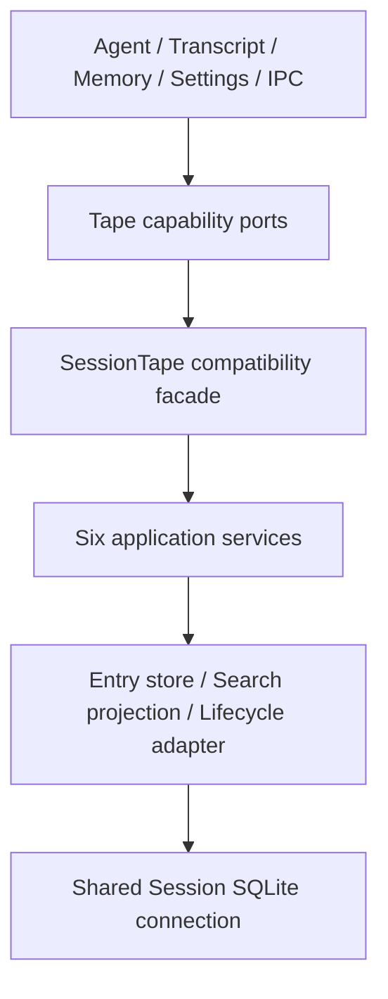

# Tape 系统

Tape 是 Session 同寿命的 append-only execution fact log。它保存可回放事实、anchor、ViewManifest 和
Subagent lineage；message transcript 是面向 UI 的 projection，不是 Tape 的替代品。

## 所有权和分层

| 能力 | 当前 owner |
| --- | --- |
| entry/fact/ref、effective semantics、ViewManifest/replay 纯逻辑 | `src/main/tape/domain/` |
| 消费方能力和 storage ports | `src/main/tape/ports/` |
| Fact、Reconciler、Recall、Lineage、View/Replay、Fork services | `src/main/tape/application/` |
| `SessionTape` 兼容 facade | `src/main/tape/application/sessionTape.ts` |
| append/read/query store | `src/main/tape/infrastructure/sqlite/tapeEntryStore.ts` |
| search projection | `src/main/tape/infrastructure/sqlite/tapeSearchProjectionStore.ts` |
| 物理 lifecycle delete | `src/main/tape/infrastructure/sqlite/tapeLifecycleAdapter.ts` |
| runtime assembly | `src/main/agent/deepchat/runtime/tapeViewAssembler.ts` |
| policy selection | `src/main/agent/deepchat/runtime/tapeViewPolicy.ts` |
| model-facing tools | `src/main/tool/agentTools/agentTapeTools.ts` |

Tape entry 只能 append。更正、压缩和 handoff 通过新 fact/anchor 表达，不原地改写旧 entry。
anchor 改变后续读取起点或重建状态，但不删除被覆盖的历史。



`src/main/session/data/tape*.ts` 和旧 table modules 只保留显式、冻结且标记 deprecated 的
compatibility re-export。新代码必须从 `src/main/tape/` 或能力 port 导入，不能把兼容路径重新当作
owner，也不能通过 canonical module 的新增导出隐式扩大旧路径合同。

## 能力端口和组合

| 消费方 | 允许依赖的 Tape 能力 |
| --- | --- |
| DeepChat loop runner | `TapeReconciliationPort`、`TapeViewManifestReader`、`TapeViewManifestWriter`、`TapeToolFactWriter` |
| Turn coordinator / ACP compatibility | `TapeReconciliationPort` |
| Transcript | `TapeMessageFactWriter` |
| Memory runtime | `TapeRawEntryReader`、`TapeAnchorWriter` |
| Settings / compaction | `TapeAnchorReader`、`TapeAnchorWriter`、`TapeLifecycleAdmin` |
| Memory routes | `TapeInspectionReader` |
| IPC / Session data | 现有 `SessionTapePort` |

`createSessionDataFromDatabase` 组合一个 `SessionTape`，把窄能力传给 transcript 和 settings，并在既有
IPC boundary 按原时序执行 `ensureSessionTapeReady`。facade 只做 service 组合和兼容转发，不承载新的
domain policy；外部方法的签名、同步/异步行为、异常和 fallback 语义保持稳定。

`TapeRawEntryReader` 只暴露 Memory runtime 实际需要的 `getBySession`。Memory routes 使用的
`TapeInspectionReader` 只返回 effective message source span 与 Memory ViewManifest DTO，不返回
`DeepChatTapeEntryRow`。完整的 manifest assembly source set 命名为
`TapeViewManifestAssemblySources`，domain lookup map 命名为 `TapeViewManifestLookupMaps`；两种历史
`TapeViewManifestSourceMaps` 形状只在各自原有 compatibility path 作为 type alias 保留。
`TapeAnchorReader` 只暴露 settings 实际使用的 latest reconstruction anchor；transcript/settings 必须
由 composition 注入 port，不允许在 consumer 内隐式构造 concrete facade。

## 存储与事务边界

- `TapeEntryStore` 只负责 append/read/query；物理删除由独立 lifecycle adapter 执行，只服务于
  Session lifecycle（包含 fork Session cleanup），不属于运行中 Tape 语义。
- transcript message mutation 与 replacement/retraction fact、summary compare-and-set 与 anchor append
  使用同一个 SQLite connection 和调用方 transaction，拆层不能拆开其原子边界。
- `clearMessages` 在同一外层 transaction 中删除 pending input、transcript projection 并 reset Tape；
  Tape generation transaction 作为 savepoint 嵌套，任一 hard failure 会同时恢复三类数据。
- `resetSessionTape` 在同一 transaction 内删除 entry、mutation projection、search/FTS projection 并
  创建新 bootstrap；lifecycle/cleanup/bootstrap 的 hard failure 会恢复旧 incarnation。既有 mutation
  projection append fail-open 策略仍可提交新 Tape，但旧 projection row 已删除且 meta 会标 stale。
- context projection 通过单条 `getByEntryIdsIfCurrent` SQL 校验 projection version、projection meta head
  与同步调用方提供的 current Tape head，并读取请求行；不 current 时从 effective Tape 重建
  summary/ref context。
- search projection 升为 version 3，一次性拒绝可能来自 pre-atomic reset、恰好复用相同 head 的 version
  2 row；current search 按需重建，linked read-only search 在重建前沿用 effective-Tape fallback。
- search projection 可以重建；projection 不可用或 coverage 不完整时回退 effective Tape search，fork
  cleanup 的 projection 删除失败仍不阻断主流程，但 discard receipt 会使后续 merge 和相同 fork ID
  的显式复用 fail closed。
- legacy chat import 的全表删除是 migration-only 例外，但消息 fact writer 复用 composition 已创建的
  `SessionTape` capability，不再另建 facade；Memory ingestion projection 为避免并发窗口，可以在一条
  只读 SQL 中同时比较 Tape head 和 projection head。除此之外消费方不得访问物理 Tape 表。
- reset 物理删除当前 Session Tape 后重新 bootstrap；本阶段没有 archive-on-reset，不能把 reset 解释成
  append-only 运行语义的一部分。

## View 和 provenance

每次 provider request 使用一个明确的 effective view：

```text
Tape entries + anchors + linked child head
  -> selected policy and version
  -> TapeViewAssembler
  -> ordered provider messages
  -> ViewManifest
  -> provider request trace
```

`ViewManifest` 记录 policy、version、context builder、selection reason、included/excluded entry、
synthetic contribution、anchor 和 token budget provenance。正常 chat、resume、tool loop 和 context
pressure recovery 都必须记录自己的 view；不得依赖无法复现的隐式 context builder 状态。summary、
reconstruction 和 Memory 生成的 synthetic user contribution 只记录 source entry ID 与 content hash，
不在 manifest 中复制原文。

新写入默认使用 `cache_aware_context_v1` / `cache-aware-v1` 和 schema version 3。旧
`legacy_context_v1`、schema version 1/2 与 `legacy-v1` builder 只在 read/replay boundary 继续兼容，
不得原地重写。tool loop 和 context pressure 必须继承初始 projection 的 synthetic provenance，不能
退化为仅按 message role 猜测来源。

每个真正启动的 provider request 另 append 一个幂等 `provider/attempt_completed` event，以
message ID 和 request sequence 关联同次 `view/assembled`。该 event 只保存终态、stop reason、最后一个
cumulative usage snapshot、cache read/write token 与合法的命中比率；不保存 prompt、header、secret、
raw response 或 error stack。Tape append 失败不能反向把已启动的生成改成失败。

## Message projection 与 tool facts

- user/assistant/reasoning/tool terminal result 在 projection 完成后写入对应 Tape fact；
- provider/tool retry 不得重复提交 terminal fact；
- Tape 写失败按当前 settlement policy 记录/隔离，不能把已经完成的用户回复变成无限挂起；
- replay 从 manifest 和 facts 重建 provider-visible context，不从 renderer block 猜测执行语义。

## Model capability

模型只可调用：

- `tape_search`：在授权 view 内查找；
- `tape_context`：读取已找到 entry 周边上下文。

`tape_info`、`tape_anchors` 是 diagnostic；`tape_handoff` 是 runtime-only。五个名称全部 reserved，
MCP 不能 shadow，持久化 disabled-tool 配置也不能关闭 system capability。

## Fork 和 Subagent lineage

Subagent 使用独立 Session 和独立 Tape。完成后父 Session append 一个 link，固定 child Tape head：

- 查询时只读该 frozen head，不自动读取 child 后续 entry；
- child entries 不复制进父 Tape；
- 只有显式授权的直接 child 可以跨 Tape 读取；missing、recreated 或 incarnation 不匹配必须 fail
  closed；
- 非直接 child、未授权 Session 或递归 Subagent 不能通过 Tape tool 越权读取。

普通 fork merge 只把 fork head 相对基线的 delta 作为新 entry append 到父 Tape，并追加 merge receipt；
不得改写父 Tape 旧 entry，也不得把整份 fork 历史重复复制。discard 和重复 merge 保持既有审计、幂等及
best-effort projection cleanup 语义。discard cleanup 成功时与 receipt 一起提交；cleanup 失败时回滚本次
cleanup、仍 append receipt 并记录 warning。此时残留 fork 是永久惰性数据，本阶段没有自动或后台重试
路径；discard receipt 仍保证它不能再次 merge，也不能用相同 fork ID 显式复用。

## 回放和兼容

Replay 必须保持 entry order、role、tool call/result pairing、anchor cursor、policy version、builder
version 和 synthetic contribution provenance。未知旧 fact 可以按兼容规则跳过或映射，但不能静默改变
已知 fact 的含义。测试至少覆盖正常 chat、resume、tool interaction、compaction、context pressure、
Subagent frozen head、provider attempt outcome 和旧 manifest 读取。

stored manifest validation、legacy `hashVersion` normalization、entry-id collection 和 replay slice hash
属于 `src/main/tape/domain/replay.ts` 的纯逻辑；SQLite row parsing、message trace 和 terminal evidence
读取仍属于 `TapeViewReplayService`，不能反向放进 domain。

关键行为测试位于 `test/main/session/data/tape*.test.ts`，分层守护位于
`test/main/tape/layerBoundaries.test.ts`；runtime 和 tool 契约继续位于
`test/main/agent/deepchat/` 与 `test/main/tool/`。历史的 Tape increment SDD 已合并到本文，详细实施
顺序从 Git 历史查询。
