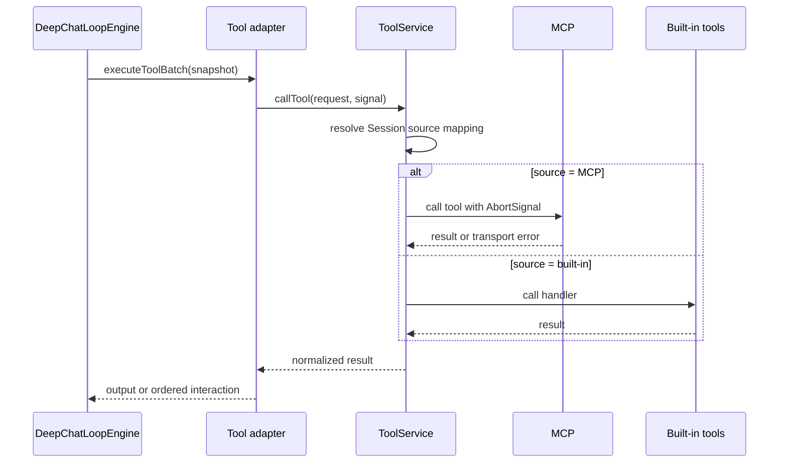

# Tool、MCP、Skill 与 Plugin

## 所有权

| 模块 | 位置 | 职责 |
| --- | --- | --- |
| Tool | `src/main/tool/` | catalog、source mapping、执行、权限和本地 Agent tools |
| MCP | `src/main/mcp/` | server/client 生命周期、OAuth、配置和 MCP tool 调用 |
| Skill | `src/main/skill/` | per-Agent Skill root、扫描、快照导入、选择和 Plugin contribution |
| Plugin | `src/main/plugin/` | package 安装状态、manifest 验证和能力登记 |
| DeepChat adapter | `src/main/agent/deepchat/runtime/toolAdapters.ts` | 把 loop ports 接到 ToolService 和 interaction |
| ACP adapter | `src/main/agent/acp/runtime/` | ACP protocol tools、filesystem、terminal 和 MCP config |

Plugin 只登记能力，不接管 MCP、Skill 或 Tool 的运行状态。Skill 模块是进程级 owner，但 mutable
Skill 文件、catalog cache、watcher 和 enablement 都按 DeepChat Agent 隔离。Session 只保存所选 Skill
名称；它不拥有文件，也不能读取另一个 Agent 的 root。

## Catalog 与 source mapping

`ToolService.getAllToolDefinitions()` 组合 MCP tools 和本地 Agent tools，处理 reserved name、disabled
配置和 model-visible capability，并为每个 Session 发布独立 source mapping。

- 已发布 mapping 是执行边界；不得从另一个 Session 的 snapshot 回退。
- 只有未持久化 draft 可以使用无 Session ID 的首次执行兼容 snapshot。
- configurable catalog 只返回 `user-configurable` Agent tools，不触碰 MCP runtime cache。
- MCP 同名工具不能覆盖 built-in reserved capability。

## Tool exposure

| Exposure | 含义 |
| --- | --- |
| `user-configurable` | 可以在设置中启停 |
| `system-model` | 由 runtime policy 决定是否给模型，不受 disabled list 控制 |
| `diagnostic` | 仅诊断 API，不生成模型 definition |
| `runtime-only` | 只有内部 runtime 可以调用 |

Tape 只向模型暴露 `tape_search` 和 `tape_context`。`tape_info`、`tape_anchors` 是 diagnostic，
`tape_handoff` 是 runtime-only。所有 Tape tool name 都是 reserved。

`subagent_orchestrator` 是 `system-model` capability：只有 regular DeepChat parent、当前 Agent policy
开启且至少一个 slot 有效时可见；调用前再次解析 policy，Subagent child 永远拒绝。

## 执行与交互

Tool batch 在执行前应用 permission mode、文件/命令/settings 授权和问题拦截；需要用户决定时写入
ordered interaction。最后一项决定完成后创建新的 resume Run。Side-effect tool 不因 output fitting
重跑。AbortSignal 必须一直传到 MCP client/provider adapter。

当前 MCP runtime 仍保留 `autoApprove`、session permission cache 和 server-form 配置；删除它们是
[remove-mcp-permission-system](./remove-mcp-permission-system/) 的 active goal，在该目标完成前不能把
未来设计写成当前事实。

## Agent-scoped extensions

- Agent policy 决定可用 MCP server、Plugin capability 和 Subagent slot；Skill capability 来自当前 Agent
  的 owned catalog 和符合条件的 Plugin runtime contribution，而不是 built-in Agent allow-list 或其他
  Agent policy。
- built-in `deepchat` 只拥有兼容 legacy root；manual Agent 使用
  `<skillsRoot>/.agent-scopes/<agentId>/`。缺失 scope 等价于空 owned catalog，禁止回退到 built-in root。
- effective Skills 是 `Session persisted selection ∩ current Agent valid enabled catalog`。transfer、rebind
  和 Subagent entry 都必须重新计算交集。
- 每次 Run 使用闭合 capability snapshot；配置变化通过 fingerprint/cache key 生效。
- Plugin unavailable、disabled 或 uninstall 时，相关 contribution 必须撤销，不能留下可执行 mapping。
- 内部 Agent 导入和外部 Agent 导入都要求显式 target Agent，先 preview 再执行，并在 main 重新解析
  source/target。导入复制快照，不跟随 symlink、不建立 live link，也不传播后续 source 修改。
- `skip` 保留目标，`rename` 选择首个合法可用名称，`overwrite` 先 staging/验证再原子替换。
- Plugin-owned Skills 不作为普通文件复制；外部格式 adapter 不能绕过 target root validation。
- child Session 重新解析自己的 capability，不继承父 Session 的 Skill 文件、mutable cache 或
  permission state。

## 调试入口

1. `src/main/agent/deepchat/loop/ports.ts`
2. `src/main/agent/deepchat/runtime/toolAdapters.ts`
3. `src/main/tool/index.ts`
4. `src/main/tool/toolMapper.ts`
5. `src/main/tool/agentTools/`
6. `src/main/tool/permission/`
7. `src/main/mcp/toolManager.ts`
8. `src/main/mcp/mcpClient.ts`
9. `src/main/skill/`
10. `src/main/plugin/`
