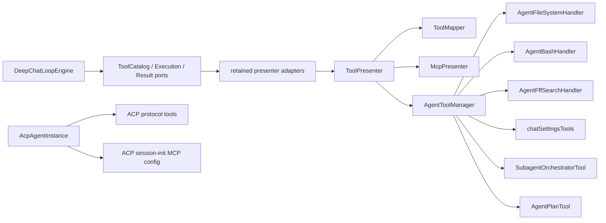
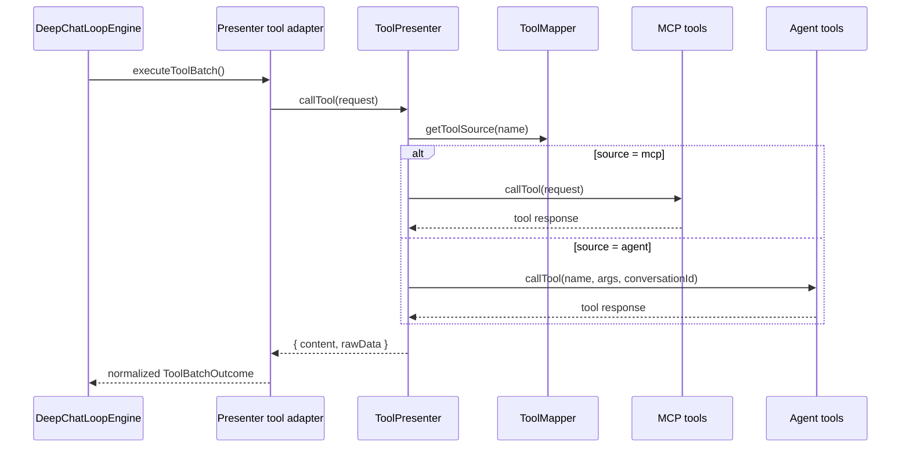

# 工具系统架构详解

本文档反映 retirement 后的工具系统分层。agent tools 已经从旧
`agentPresenter/acp/` 迁移到当前活跃目录。

## 当前组件

| 组件 | 位置 | 职责 |
| --- | --- | --- |
| DeepChat tool ports | `src/main/agent/deepchat/loop/ports.ts` | LoopEngine 使用的 catalog/execution/result contracts |
| DeepChat tool adapters | `src/main/presenter/agentRuntimePresenter/` | 将 loop ports 接到现有 ToolPresenter、permission、normalization/output guard |
| `ToolPresenter` | `src/main/presenter/toolPresenter/index.ts` | 聚合工具定义、建立映射、路由调用 |
| `ToolMapper` | `src/main/presenter/toolPresenter/toolMapper.ts` | `toolName -> source` 映射 |
| Agent tool exposure policy | `src/shared/agentTools.ts` | Agent tool 的配置、模型、诊断与 runtime-only 暴露分类 |
| `AgentToolManager` | `src/main/presenter/toolPresenter/agentTools/agentToolManager.ts` | 本地 agent tools 装配与执行 |
| `AgentFileSystemHandler` | `src/main/presenter/toolPresenter/agentTools/agentFileSystemHandler.ts` | 文件系统类工具 |
| `AgentBashHandler` | `src/main/presenter/toolPresenter/agentTools/agentBashHandler.ts` | 命令执行与后台 session |
| `AgentFffSearchHandler` | `src/main/presenter/toolPresenter/agentTools/agentFffSearchHandler.ts` | FFF-backed `glob` / `grep` code search |
| `chatSettingsTools` | `src/main/presenter/toolPresenter/agentTools/chatSettingsTools.ts` | chat/session settings 工具 |
| `SubagentOrchestratorTool` | `src/main/presenter/toolPresenter/agentTools/subagentOrchestratorTool.ts` | Agent-policy-gated subagent orchestration with call-time revalidation |
| `AgentPlanTool` | `src/main/presenter/toolPresenter/agentTools/agentPlanTool.ts` | `agent-core/update_plan` |
| `AgentTapeToolHandler` | `src/main/presenter/toolPresenter/agentTools/agentTapeTools.ts` | 模型可调用的原子 Tape recall pair：`tape_search` / `tape_context` |
| `AgentImageGenerationTool` | `src/main/presenter/toolPresenter/agentTools/agentImageGenerationTool.ts` | image generation tool |
| `McpPresenter` | `src/main/presenter/mcpPresenter/` | 外部 MCP servers 与 tools |
| `ACP helpers` | `src/main/agent/acp/` | ACP runtime、workdir、config、MCP 映射 |

## 路由关系



## 获取工具定义

工具目录分为 runtime catalog 与 configurable catalog。

`ToolPresenter.getAllToolDefinitions()` 是 runtime catalog，会按顺序：

1. 从 `mcpPresenter` 拉取 MCP tools。
2. 从 `AgentToolManager` 拉取本地 agent tools。
3. 保留 built-in reserved names，拒绝同名 MCP definition；其他重名仍按现有 collision policy 处理。
4. 只对 `user-configurable` definitions 应用 `disabledAgentTools`。
5. 用 `ToolMapper` 记录最终来源，并为每个 conversation 维护独立映射，同时记录兼容 mapping 的
   conversation 来源。已发布的 conversation mapping 是执行边界；mapping 不含目标工具，或 mapping
   缺失/已清理且兼容 snapshot 属于另一 conversation 时，不允许跨 conversation 回退。仅无 ID 的 draft
   snapshot 可作为首轮持久化执行的兼容桥，并继续兼容不带 conversation ID 的旧调用。

`ToolPresenter.getConfigurableAgentToolDefinitions()` 是 renderer settings 使用的 configurable
catalog。它只返回 `user-configurable` Agent tools，不解析 MCP catalog、不发布 `ToolMapper`，也不修改
conversation MCP access context 或 runtime cache。`tools.listDefinitions` 保持原 IPC name/wire shape，内部
读取该 configurable catalog。

`subagent_orchestrator` 属于 `system-model` capability，不进入 configurable catalog，也不受
`disabledAgentTools` 控制。其名称 reserved，MCP definition 不能 shadow 内建 orchestrator；持久化
disabled-tool 正规化会移除遗留同名值。模型可见性由一个 closed capability snapshot 决定：regular
DeepChat parent 必须同时满足当前 Agent policy 开启和至少一个有效 slot，Subagent child 始终不可用。
capability 的 canonical `cacheKey` 覆盖 policy 与所有 model-visible slot 字段，并进入 tool-profile
fingerprint，因此配置变化不依赖事件式 cache invalidation。definition 使用同一 snapshot 构建；真正
调用前重新解析当前 capability 并失败关闭，而已经 admission 的 run 保留启动时 task/slot snapshot。

Tape 的 exposure matrix 为：

| Tool | Exposure | Model behavior |
| --- | --- | --- |
| `tape_search` | `system-model` | 与 `tape_context` 成对提供，不受 disabled list 影响 |
| `tape_context` | `system-model` | 与 `tape_search` 成对提供，不受 disabled list 影响 |
| `tape_info` | `diagnostic` | 保留底层诊断 API，不生成模型 definition |
| `tape_anchors` | `diagnostic` | 保留底层诊断 API，不生成模型 definition |
| `tape_handoff` | `runtime-only` | 仅 runtime handoff 路径可写，模型 dispatcher 拒绝 |

五个 Tape 名称全部 reserved，防止同名 MCP 工具劫持。`disabledAgentTools` 的持久化正规化会永久移除
这些非配置能力；v2 startup cleanup 幂等清理旧 Session 和 DeepChat Agent Config，并且不更新
Session activity timestamp 或 environment recency。Agent tool 装配点必须显式声明预期 exposure，且与
共享 policy 不一致时拒绝发布 definition。

这意味着 `DeepChatLoopEngine` 不知道 tool 的真实来源，只接收 `MCPToolDefinition[]` snapshot 和窄
execution/result ports。`AgentRuntimePresenter` 保留 adapter wiring，但 tool mapping/collision/dispatch owner
仍是 `ToolPresenter`。

## 调用工具



tool batch 会按现有 policy 执行 pre-check permission、question interception、post-call permission 与
post-success skill-draft confirmation。需要用户处理时返回 ordered typed interaction outcome；当前 run
settle，中间项保持 paused，最后一项处理后才创建 fresh resume run。side-effect tool 不为 output fitting
重跑。

## 权限与 runtime port

本地 agent tools 不再直接依赖旧 presenter runtime，而是通过明确的 port 注入：

- `src/main/presenter/toolPresenter/runtimePorts.ts`
- `AgentToolRuntimePort`

port 负责提供：

- conversation workdir 解析
- 已批准路径查询
- settings approval 消费
- Lifecycle / Turn / AgentAssignment / Projection session ports

## FFF Search

Agent code/file search uses `@ff-labs/fff-node` through `AgentFffSearchHandler`.

Current model-facing search tools:

| Tool | Backing API | Output |
| --- | --- | --- |
| `glob` | `FffSearchService.findFiles()` | JSON file hits with `path` and score |
| `grep` | `FffSearchService.grep()` | JSON line hits with `path`, `lineNumber`, snippet, and score |

Search policy:

- Agent prompts should prefer `glob -> grep -> read`.
- Shell search commands are outside the model-facing code search path.
- FFF unavailable errors stay tool errors.
- Tool metadata reports `source: "fff"` so downstream rendering/debug paths can identify search
  origin.

权限能力拆分：

- 文件访问：`filePermissionService`
- settings 变更：`settingsPermissionService`
- shell/command：`CommandPermissionService`

## ACP 相关 helper

ACP provider 仍然是活跃兼容能力，但 ACP helper 已经收拢到独立 domain owner：

```text
src/main/agent/acp/
├── catalog/                 # registry/catalog cache and migration
├── client/                  # connection/prompt/workspace client runtime
├── launch/                  # install/launch spec and setup terminal
└── runtime/                 # process/session/persistence/protocol mapping
```

`src/main/presenter/llmProviderPresenter/providers/acpProvider.ts` 仍是 DeepChat 选择 ACP provider
时的兼容 adapter；它仍在 DeepChat LoopEngine 外层收到 DeepChat tool/resource context，但 ACP provider
不会把该 `_tools` array 当作 direct ACP tool delivery。`kind=acp` 使用 `AcpAgentInstance` 和 ACP
session-init MCP config/protocol callbacks，不经过 DeepChat ToolPresenter/LoopEngine。ACP process/session
实现不再由 provider 目录持有。

## 调试建议

排查工具问题时，优先顺序：

1. `src/main/agent/deepchat/loop/ports.ts` 与 `deepChatLoopEngine.ts`
2. `src/main/presenter/agentRuntimePresenter/toolAdapters.ts` / `dispatch.ts`
3. `src/main/presenter/toolPresenter/index.ts`
4. `src/main/presenter/toolPresenter/toolMapper.ts`
5. `src/main/presenter/toolPresenter/agentTools/agentToolManager.ts`
6. 具体 handler 或 `src/main/presenter/mcpPresenter/toolManager.ts`

如果看到旧路径 `src/main/presenter/agentPresenter/acp/*`，那属于已经归档的历史实现。
