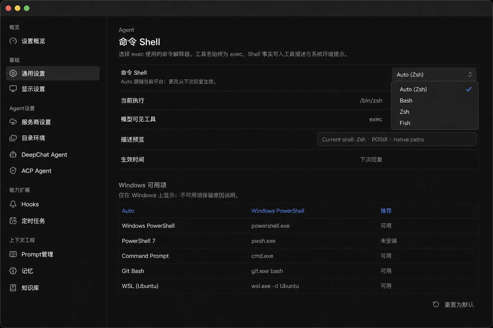

# 实验性工具模式

状态：已实施。

## 产品结论

DeepChat 只增加一个会话级 `ToolMode`，提供三个互斥选项：

```ts
type ToolMode = 'agent' | 'code' | 'minimal'
type ToolModeOverride = ToolMode | null
```

- **Agent Mode**：保持现有工具调用方式。
- **Code Mode**：文件、计划等能力收敛到一个代码编排入口；依赖 Agent Loop 的问答和
  Subagent 工具保留在顶层。
- **Minimal Mode**：只简化文件操作工具，保留当前已启用的其他能力。

没有 `Tool set`、`Calling mode`、`Protocol`、`Transport` 或 `Runtime` 等用户配置，也没有
第四个 `Auto` 模式。`null` 只表示「使用模型默认」，不作为单独选项显示。

现有 `ChatMode = 'agent' | 'acp agent'` 继续负责选择 DeepChat Agent 或 ACP runtime；
`ToolMode` 只对 DeepChat Agent 生效。

## 三种模式

| 模式 | 执行目录 | 模型可见工具 | 高级配置中的工具区域 |
| --- | --- | --- | --- |
| Agent Mode | 当前启用的 Agent、MCP、插件工具 | 原有 direct tools | 原有分组与开关 |
| Code Mode | 当前启用目录中可安全嵌套调用的工具，加顶层 Loop 工具 | Codex 路由为 `exec`、`wait`；其他路由为 `run_code`；两者按可用性直接保留 `deepchat_question`、`deepchat_subagents` | 顶层工具和「Code 可调用」工具 |
| Minimal Mode | 精简文件工具加当前已启用的非文件工具 | 直接工具 | 精简文件工具和原有能力分组 |

### Agent Mode

Agent Mode 是兼容基线。工具 registry、disabled-tool 配置、权限、执行、输出限制和回放路径
保持不变。唯一新增信息是 `exec` 描述会注明本次实际选择的 Shell。

### Code Mode

Code Mode 保留当前已启用工具的能力，但不把这些工具逐个发送给模型：

- `openai-codex` 路由使用 Codex 风格的 raw JavaScript `exec` 和续跑 `wait`；
- 其他 function-tool 路由只发送 `run_code`，参数固定为
  `{ code: string, description: string }`；
- 两种入口都进入同一个 `RunCodeRuntimeManager`，不存在 `transport` 或第二套 runtime；
- function-tool 路由把当前目录生成成 TypeScript SDK，Codex 路由把嵌套声明写入 `exec`
  描述；
- 提示词把 SDK 中的嵌套工具统一称为 subtools，并明确 subtool 只能在 code 入口内部通过
  `tools.<name>(...)` 调用，不能作为顶层工具调用；
- Codex 工具名只在 JavaScript SDK 中规范化，真实工具名和执行映射保持不变；
- 名称不安全、`run_code` 保留名冲突和规范化后冲突会在 Provider 请求前失败；
- `deepchat_question` 和 `deepchat_subagents` 依赖顶层 Agent Loop 的交互、确认和持久状态协议，
  因此不进入 Code Mode SDK 或 nested execution binding；
- 两者在当前会话可用时，作为独立顶层 Provider tools 与 code 入口并列暴露，继续走原有 Loop；
- `update_plan`、CronJob、文件、MCP、插件等其余已启用能力仍作为 subtools，只能在 code 入口
  内通过 `tools.<name>(...)` 调用。
- 计划提示按模式投影：Agent Mode 和 Minimal Mode 直接调用顶层 `update_plan`；Code Mode 只在
  code 入口内调用 `tools.update_plan(...)`，并继续发送完整计划快照。

Code Mode 当前要求 `full_access`，高级配置中的 Code 描述会明确显示该要求；其他权限模式下
code 入口返回可恢复的工具错误且不启动 cell。这不是把
UtilityProcess 当成安全沙箱，而是避免一个任意组合程序在普通逐工具审批语义下造成错误预期。
嵌套调用仍然通过 `ToolService`、现有 authority 检查、permission broker、effect observer、
handler、输出限制和取消信号执行，UtilityProcess 不能直接访问工具 handler。

需要 command lease 的嵌套 `exec` 不绕过现有权限服务。外层 `full_access` 调度为每次命令调用
签发精确的一次性 grant，并在同一个 code cell、同一个 Provider tool-call ID 下恢复对应调用；
此前已经完成的 JavaScript 和 subtool 不会重放。

`deepchat_subagents` 的 `spawn` 和 `follow_up` 继续遵守 `explicit | proactive` 编排策略，并由顶层
Agent Loop 处理确认、暂停、恢复和工具卡投影。Code cell 不调用或等待 Subagent，因此 cell 的
完成、失败、取消、超时与子 Session 生命周期没有耦合。子 Session 独立解析自己的模型 Tool
Mode，不继承父会话的 `toolModeOverride`。

每个 `run_code`、`exec` 或 `wait` wrapper 先提交自己的外层 execution-journal dispatch；每个
实际 subtool 再以稳定 `childOrdinal` 独立提交 nested dispatch 和
outcome，保留真实 target、arguments、definition hash 与 capability hash。外层 outcome 只能在其
所有已 dispatch 的 nested operation 结算后提交，新的 `wait` 使用新的外层 operation。

### Minimal Mode

Minimal Mode 简化的是内置文件操作面，不是整个 Agent 能力面。它移除 `read`、`write`、`edit`、
`glob` 和 `grep` 等细粒度文件工具，保留 `exec`、配套的 `process` 和一个 Provider 对应编辑
工具。Provider 对应关系固定为：

| Provider 入口 | 精简文件工具 |
| --- | --- |
| `openai-codex` | `exec`、`process`、freeform `apply_patch` |
| 其他 function-tool Provider | `exec`、`process`、`str_replace_editor` |

除上述文件工具替换外，当前已启用的非文件能力继续直接投影，包括 `deepchat_subagents`、
`cronjob`、plan、question、memory、browser、image、skills、MCP 和插件工具。Minimal Mode 不会
强制启用被 Session、Agent 或用户禁用的能力，也不会扩大 MCP allowlist 或权限；它只改变文件
工具的选择。只有原始 `read`、`write`、`edit` 三项都处于启用状态时才合成对应编辑工具，任一项
被禁用时不暴露这个能力更大的替代入口。`exec` 或其 `process` 配套能力不可用时 fail closed，
避免后台命令返回无法继续管理的 session ID。

`apply_patch` 使用 V4A patch 格式，支持 add、delete、update、move 和多 hunk 顺序应用。
`str_replace_editor` 保持 `view | create | str_replace | insert` schema、绝对路径和唯一 literal
match 规则。两者复用 `AgentFileSystemHandler` 的 workspace containment、真实路径和 symlink
校验；`apply_patch` 新增或移动文件时会先验证最近的现存祖先，再创建父目录。多 operation patch
会在第一次写入前完成路径、文件类型、内容匹配和目标路径预检；实际 I/O 仍可能部分失败，错误会
要求模型重新查看所有受影响文件后再重试。

切换到 Minimal Mode 不会删除原有 disabled-tool 配置，切回 Agent 或 Code Mode 后原配置继续
生效。

## 模式默认值与记忆

解析顺序固定为：

1. 当前会话的非空 `toolModeOverride`；
2. 精确模型目录给出的 `defaultToolMode`；
3. 回退到 Agent Mode。

默认进入 Code Mode 的内置精确规则：

- `gpt-5.6`、`gpt-5.6-sol`、`gpt-5.6-terra`、`gpt-5.6-luna`；
- DeepSeek Provider 中精确命中模型目录且 `tool_call: true` 的模型。

模型目录显式写入的 `default_tool_mode` 优先于内置建议。未知模型、歧义身份、显示名相似但未
精确命中的模型都回退 Agent Mode；Minimal Mode 不会自动选择。

`new_sessions` 在 schema v68 增加一个 nullable 字段：

```sql
tool_mode_override TEXT
  CHECK (tool_mode_override IS NULL OR tool_mode_override IN ('agent', 'code', 'minimal'))
```

首次消息前由 draft store 保存 override，创建会话时复制。已创建会话通过 typed route 更新；
运行中的回复拒绝切换。LoopRun 保存不可变 mode snapshot，因此一次回复内不会更换工具 schema。

## Provider 展示与执行目录

`MCPToolDefinition` 继续是唯一工具定义，只增加 Provider presentation 元数据以表达 function
或 freeform 输入。没有新增平行 registry。

```text
session override + model capability + enabled tools + resolved shell
                              |
                              v
                    configureToolMode()
                     /               \
                    v                 v
           execution catalog    Provider tools
                    |                 |
                    +------ ToolService ------+
                              |
                  permission / authority / handler
```

- Agent Mode：执行目录和 Provider tools 相同；
- Code Mode：执行目录保留嵌套工具，Provider tools 暴露 code 入口和可用的两个顶层 Loop
  工具；
- Minimal Mode：执行目录替换内置文件工具，其他已启用能力继续直接投影给 Provider；
- Code Mode 与 Minimal Mode 不叠加 Tool Surface 虚拟化；只有 Agent Mode 参与该能力；
- direct call 不能绕过 Code Mode wrapper；stale 或伪造 binding ID 会被拒绝；
- MCP 有 `structuredContent` 时，code cell 得到结构化结果，否则得到常规 content。

## `run_code` UtilityProcess

每个外层 code cell 使用一个新的 `utilityProcess.fork()`，不使用进程池或常驻 daemon。构建产物
包含独立的 `codeModeUtilityHost.js` entry。

### 运行边界

- 模型代码不在 renderer 或 Electron main context 执行；
- UtilityProcess 内再创建新的 `node:vm` context，关闭 string code generation 和 WebAssembly；
- context 只注入生成的 `tools`、输出 helpers、受控 timer、Codex store/load 和 yield helper；
- 不注入 `process`、`require`、`Buffer`、Electron、filesystem、network 或 subprocess API；
- main 与 context 之间的参数、结果和 store 均经过受限 JSON 序列化与大小校验；
- function 路由使用 Node erasable TypeScript stripping，只接受可擦除语法；
- 所有嵌套调用通过随机 opaque binding ID 回到 main process。

`node:vm` 本身不被描述为恶意代码安全沙箱。隔离边界来自每 cell 独立 UtilityProcess、最小环境、
IPC allowlist、V8 内存限制、heartbeat 和强制回收的组合。

### 限制

| 项目 | 限制 |
| --- | --- |
| source | 256 KiB |
| 总输出与 store | 各 1 MiB |
| 嵌套调用 | 每 cell 128 次 |
| 嵌套并发 | 8 |
| V8 old space | 64 MiB |
| READY | 5 秒 |
| heartbeat 丢失 | 约 3.5 秒后终止 |
| VM 同步执行 slice | 2 秒 |
| cell 总执行时间 | 5 分钟 |
| yielded / permission cell lease | 60 秒 |
| RSS hard ceiling | 512 MiB |
| STOP grace | 500 ms 后 `kill()` |

成功、异常、取消、超时、进程退出、会话清理和应用退出都进入同一个幂等 cleanup：取消嵌套
调用，清理 timer/listener/active map，发送 `STOP`，超时后强制 `kill()`。失败 cell 不自动
重放，避免重复执行 Shell、文件或 MCP 副作用。

Codex `store`/`load` 只保存在 main process 的 session 内存中，并且只在自然完成时提交；取消、
终止和失败不会提交，关闭会话或应用退出时清除。

## `exec` 与 Shell

命令工具在所有模式、SDK、权限和回放中都叫 `exec`。Shell 不投影成工具名，而是由同一个
`ResolvedCommandShell` 同时决定：

1. `exec` 描述中的 Shell facts；
2. 系统环境提示；
3. 实际 executable 和 args；
4. background process 与 skill script 的平台校验。

当前设置项：

- macOS/Linux：Auto、Bash、Zsh、Fish；
- Windows：Auto、Windows PowerShell、PowerShell 7、Command Prompt、Git Bash。

显式选择的 Shell 不可用时 fail closed，不静默回退。PowerShell 7 会做 identity probe，Git
Bash 沿用现有安全探测和 executable override。

WSL 没有纳入本次实现。原因不是 UI 缺少一个选项，而是还没有完成 distribution、Windows/WSL
cwd 映射及 scoped process-group cleanup；在这些边界完成前加入 WSL 会扩大错误终止其他用户
进程的风险。

## 高级配置交互

Tool Mode 位于现有输入框高级配置 Popover 中，在「模型设置」与 `TOOLS` 之间，复用
`DcPopover`、`DcButton`、shadcn `RadioGroup` 和 `Switch`，不增加 footer chip 或独立设置页。

```text
BEFORE
高级配置
├─ 系统提示词
├─ 模型设置
└─ TOOLS

AFTER
高级配置
├─ 系统提示词
├─ 模型设置
├─ MODE  [Agent] [Code] [Minimal]
│         模型默认                  使用模型默认
└─ TOOLS  （随所选模式立即投影）
```

交互规则：

- radio 只有三项，点击后先更新本地工具 projection，再持久化；失败时回滚并显示行内错误；
- 「使用模型默认」把 override 清为 `null`，不是第四个模式；
- Agent Mode 保持现有工具分组与开关；
- Code Mode 显示实际 code 入口、顶层 `deepchat_question`/`deepchat_subagents` 和可嵌套调用的
  工具；
- Minimal Mode 显示精简文件工具以及当前已启用的其他能力，MCP 与插件列表保持可见；
- Code Mode 把 `deepchat_question` 和 `deepchat_subagents` 显示在顶层工具分组，不显示在
  「Code 可调用」分组；
- 子 Agent 继续使用原有 Subagent 工具卡、Activity 和侧边栏持久投影；`run_code`/`exec` 消息只
  展示 code cell 与 nested-call 摘要；
- session 处于工作状态时禁用切换；
- 所有用户文案使用 `vue-i18n`，控件保留 radio、disabled 和 aria 语义。

视觉稿只表达信息层级，实际实现使用 DeepChat 现有 spacing、typography、color token 和组件：




## 验收标准

1. 高级配置只有 Agent、Code、Minimal 三项，没有组合式高级参数。
2. override 使用一个 nullable session 字段持久化，draft、会话重开和 fork 都能携带。
3. GPT-5.6 精确型号和 DeepSeek 工具模型默认 Code，其他模型默认 Agent。
4. Code Mode 对 Provider 发送 `exec`/`wait` 或 `run_code`，并按可用性并列发送
   `deepchat_question`、`deepchat_subagents`；内部仍只有一个 code runtime。
5. Minimal Mode 用 `exec`、`process` 和 Provider 编辑器替换细粒度文件工具，同时保留当前已
   启用的非文件能力。
6. `exec` 名称稳定，Shell 描述、提示和实际执行来自同一次 resolved snapshot。
7. UtilityProcess 所有终态都清理进程、timer、listener 和 pending call；session store 在关闭
   会话或应用退出时清理。
8. UI 使用现有 DeepChat 控件，并在模式变化后立即同步下方工具区域。
9. Code Mode 在 Provider 顶层保留可用的 `deepchat_question` 和 `deepchat_subagents`，两者不
   进入 code SDK；其他 subtools 仍拒绝直接调用。
10. Subagent 的确认、等待和持久状态继续由顶层 Agent Loop 与 live-delegation runtime 管理，
    不与 code cell 生命周期耦合。
