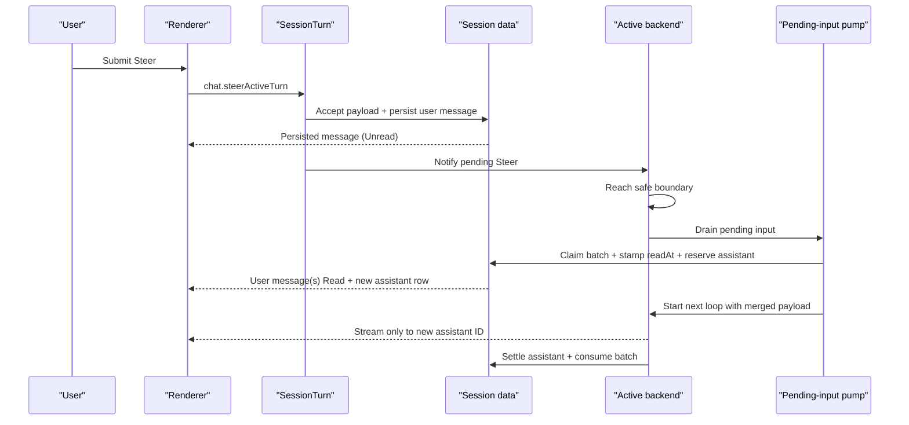

# IM-style Steer Messages Implementation Plan

## Status

Implemented on `codex/steer-message-lifecycle` against `dev`.

The implementation is organized into four reviewable slices: durable lifecycle, backend turn
boundaries, renderer interaction, and regression coverage.

## Engineering Context

### Target

- User-visible behavior: accepted Steers appear as user messages with `Unread -> Read` receipts;
  the receipt then disappears and the response starts in a new assistant message.
- Current rendering component: `MessageItemUser.vue` inside the virtualized ChatPage message list.
- Logical owner: pending-input persistence and claim lifecycle in main; receipt presentation in the
  user-message component.
- Route/layout owner: `ChatPage.vue`.
- Trigger path: `ChatInputToolbar` -> `useComposerSubmit.onSteer` ->
  `chat.steerActiveTurn` -> `SessionTurn` -> selected backend pending-input runtime.
- Existing patterns: `ChatMessageRecord`, `SessionPendingInputs`, `PendingInputPump`,
  `MessageStartResult`, typed route/event contracts, `messageStore.upsertMessageRecord`, and
  `MessageInfo`.

### Context map

- Vue owner chain: `ChatPage` -> `MessageList` / `MessageListRow` -> `MessageItemUser` ->
  `MessageInfo`.
- DOM/render chain: one authoritative ordered `DisplayMessage[]`, windowed by the existing message
  virtualization layer.
- State source: SQLite pending-input and transcript rows.
- Derived state: `MessageMetadata.inputReceipt` becomes the display receipt.
- Events: one typed session-message change event updates active and cached renderer views.
- Side effects: composer acceptance, scroll request, receipt timeout, stream handoff.
- Layout constraint: receipt changes must not alter row height or trigger scroll correction.
- Performance-sensitive area: high-frequency assistant stream updates and the virtualized message
  list.
- Accessibility: receipt announcement, focus retention, reduced motion, and accurate blocker
  tooltips.
- Electron boundary: typed route response plus typed event; no raw IPC access from Vue.

### Diagnosis

- Root cause: Steer is represented as a pending command instead of a durable user message, and
  DeepChat uses generic cancellation rather than a message/turn handoff.
- Correct ownership layer: the pending-input aggregate must own acceptance and claim atomically;
  the message list only renders the resulting transcript facts.
- Affected consumers: DeepChat, ACP, session data, route contracts, renderer message cache,
  composer, pending lane, and message components.
- Constraint: a newly accepted Steer must never be ordered before the current turn's durable user
  fact or after the assistant row reserved for its own response.
- Existing pattern to reuse: the current Steer payload merge and pending-input priority.

### Decision

- Selected approach: keep one pending Steer batch, link every accepted submission to its own user
  message, claim the whole batch once, and reserve a distinct assistant row at claim.
- State impact: two additive pending-input columns and one optional message metadata field.
- DOM impact: one short receipt span inside the existing fixed-height `MessageInfo` row.
- Render impact: no separate Steer list, no new global store, and no broad stream watcher.
- IPC impact: extend the Steer response and add one batched message-change event.
- Dependencies: none.

## Architecture Overview



## 1. Shared Data Contract

### Pending-input record

Extend the existing record; do not introduce another queue or batch entity:

```ts
export interface PendingSessionInputRecord {
  // existing fields
  messageIds: string[]
  assistantMessageId: string | null
}
```

Rules:

- Queue records keep `messageIds = []` and `assistantMessageId = null` until promoted to Steer.
- A new Steer batch starts with one message ID.
- Another Steer accepted while that record is still `pending` appends one message ID and merges its
  payload with the existing `appendSteerInput` behavior.
- Claim assigns `assistantMessageId` exactly once.
- Consumed Steer records retain both fields for recovery and diagnostics.

### User-message metadata

Add one optional field to `MessageMetadata`:

```ts
export interface MessageMetadata {
  // existing fields
  inputReceipt?: {
    mode: 'steer'
    readAt: number | null
  }
}
```

Do not add a second receipt state enum. The source mapping is:

```text
readAt == null -> Unread
readAt != null -> Read until the renderer deadline
```

`ChatMessageRecord.status` remains the processing fence:

```text
pending while the linked Steer batch is pending or claimed
sent after the linked batch is consumed
```

### SQLite migration

Add one migration to `deepchat_pending_inputs`:

```sql
ALTER TABLE deepchat_pending_inputs
  ADD COLUMN message_ids_json TEXT NOT NULL DEFAULT '[]';

ALTER TABLE deepchat_pending_inputs
  ADD COLUMN assistant_message_id TEXT;
```

Update `schemaCatalog.ts` and the table migration tests in the same slice.

No new table or index is required:

- lookup begins from a known pending-input row;
- linked message IDs are a small ordered list;
- transcript rows remain keyed by their normal message IDs.

## 2. Atomic Session-data Lifecycle

Keep lifecycle ownership in `SessionPendingInputs`. Give it the narrow transcript and transaction
operations it needs instead of adding a new coordinator class.

### Acceptance

Add a focused operation equivalent to:

```ts
acceptSteerMessage(
  sessionId: string,
  input: SendMessageInput,
  mergeItemId?: string | null
): {
  pendingInput: PendingSessionInputRecord
  message: ChatMessageRecord
}
```

In one SQLite transaction:

1. Validate that `mergeItemId`, when present, is a `pending` Steer for the same session.
2. Create one user message with:
   - a new message ID;
   - the next transcript `orderSeq`;
   - `status: 'pending'`;
   - `metadata.inputReceipt = { mode: 'steer', readAt: null }`;
   - the existing structured `UserMessageContent`.
3. Create a new pending Steer row or merge the payload into the open row.
4. Append the user message ID to `message_ids_json`.
5. Persist user-content projections, search document, and initial Tape fact through
   `SessionTranscript`.

Publish pending-input and message-change events only after the transaction commits.

If any write fails, roll back both the pending row and transcript facts. The route reports failure
and the renderer retains the draft.

### Claim

Replace the standalone Steer claim with an atomic operation equivalent to:

```ts
claimSteerBatch(
  sessionId: string,
  itemId: string
): {
  pendingInput: PendingSessionInputRecord
  userMessages: ChatMessageRecord[]
  assistantMessage: ChatMessageRecord
}
```

In one SQLite transaction:

1. Re-read and validate the pending row.
2. Change `pending -> claimed` and stamp `claimedAt`.
3. Close the merge window for that batch.
4. Stamp every linked user message with the same `inputReceipt.readAt`.
5. Create a new empty assistant message after the last linked user message.
6. Store its ID in `assistant_message_id`.

This transaction is the read boundary. A later Steer acceptance must observe the claimed row and
create a new batch after the reserved assistant row.

### Settlement

For a claimed Steer:

- `completed`, `aborted`, and `error` all consume the pending record;
- mark every linked user message `sent`;
- preserve `readAt`;
- append Tape replacement facts for the status transition;
- leave the assistant row as the normal completed, interrupted, or error projection.

Do not use `release-after-rollback` after the Steer read boundary. Automatic replay of a visibly
`Read` message risks duplicate provider input. Queue claims keep their existing release/retry
semantics.

### Legacy reconciliation

On session/runtime restore:

- pending Steer with empty `messageIds`: create one `Unread` user message from its stored payload and
  attach it;
- claimed legacy Steer without a message: recover it to pending, then create the `Unread` message;
- blocked legacy Steer: convert it to blocked Queue because it never passed attachment acceptance;
- consumed legacy Steer: do not synthesize a second historical user message.

The reconciliation must be idempotent.

## 3. Typed Route and Event Changes

### Steer route

Extend `chat.steerActiveTurn` output:

```ts
{
  accepted: boolean
  message: ChatMessageRecord | null
  attachmentPreparation?: AttachmentPreparationSummary
}
```

Use the existing `ChatMessageRecordSchema`.

- `accepted: true` always includes the durably persisted user message.
- `accepted: false` always returns `message: null`.
- The route response is the active renderer's immediate insertion path.

`MessageStartResult` may gain an optional `userMessage` field so both backend implementations can
return the same typed result through `SessionTurn` and `ChatService`. Do not overload
`messageId`, which continues to mean the assistant response identity.

### Message-change event

Add one event:

```ts
sessions.messages.changed {
  sessionId: string
  messages: ChatMessageRecord[]
  version: number
}
```

Use it for acceptance, claim, and settlement projections.

Renderer rules:

- active committed session: monotonic upsert by `updatedAt`;
- inactive cached session: invalidate the recent view;
- stale record: ignore it;
- event loss: the next message restore remains authoritative.

Do not reuse `chat.stream.completed` for user-message lifecycle updates. That event owns assistant
stream settlement and its request-generation tombstones would misclassify user receipt updates as
stream completions.

## 4. DeepChat Runtime

### Admission

In `PendingInputAdmissionCoordinator`:

- replace `queueVisibleSteerInput` persistence with `acceptSteerMessage`;
- retain `activeSteerPendingInputId` only as the open batch identity;
- retain the current payload merge helper;
- remove `runLifecycle.cancel(sessionId)` from the active-generation Steer path;
- schedule the pump immediately only when no active turn owns the session;
- during pre-stream, materialize or reuse the current claimed Queue user fact in the Steer
  acceptance transaction, then abort preparation with cause `pending_input`.

The pre-stream transaction publishes the source user fact and Steer together, preserving durable
ordering even when no assistant row exists yet. The renderer replaces the matching optimistic source
bubble when that authoritative source record arrives.

### Safe yield

Keep the existing loop hook:

```ts
shouldYieldForPendingInput: () =>
  Boolean(pendingInputCoordinator.getNextSteerInput(sessionId))
```

The existing tool-batch boundary returns:

```ts
{
  status: 'completed',
  stopReason: 'pending_input'
}
```

Ensure the normal provider-only completion path also schedules pending-input drain when a Steer is
waiting.

### Pump and turn start

When Steer has priority:

1. Call `claimSteerBatch`.
2. Clear `activeSteerPendingInputId`.
3. Build the claim handle from the returned record.
4. Pass `messageIds` and `assistantMessageId` into `TurnCoordinator.start`.

The Steer branch in `TurnCoordinator` must:

- load and validate all linked pending user messages;
- use the merged pending payload as `newUserContent`;
- exclude those pending records from historical context;
- use the last linked user ID as the primary turn anchor for Memory and ViewManifest metadata;
- never call `createUserMessage`;
- never call the normal `createAssistantMessage`; use the reserved assistant ID;
- insert a compaction projection before the first linked user message with
  `createCompactionMessageAtOrderSeq(..., { shiftExistingMessages: true })` when required;
- stream only into the reserved assistant message.

Normal send and Queue paths retain their current user/assistant creation behavior.

### Terminal behavior

- `pending_input` finalizes the old assistant without an error block.
- A pre-stream `pending_input` handoff deletes an empty assistant reservation, transitions the old
  operation to idle, and lets the pending-input pump claim the Steer.
- A claimed Steer always settles once.
- A post-claim pre-stream error writes a terminal error into the reserved assistant row.
- The old and new assistant request IDs remain distinct in stream lifecycle tracking.

## 5. ACP Runtime

ACP uses the same session-data acceptance and claim operations.

### Steer acceptance and old prompt

Change `AcpAgentRuntime.steer`:

1. Persist the Steer message/batch.
2. Before ACP projection begins, materialize the claimed Queue input's user fact in the same
   transaction.
3. If a prompt is active, call `instance.cancel('pending_input')`.
4. Await the active operation settlement.
5. Drain and claim the Steer batch.

Add a narrow cancel cause:

```ts
type AcpCancelCause = 'user_stop' | 'pending_input'
```

For `pending_input`, the compatibility projection finalizes the old assistant without adding the
generic user-cancel error block.

### New prompt projection

Pass the claimed Steer context into `AcpAgentInstance.send` and
`AcpCompatibilityProjectionAdapter.begin`.

When that context exists:

- reuse the linked user messages;
- reuse `assistantMessageId`;
- do not create duplicate transcript rows;
- send the merged pending payload as the current ACP prompt;
- stream ACP events into only the reserved assistant row.

Direct ACP sends and normal Queue claims retain their existing projection creation path.

## 6. Renderer State and IPC Binding

### Message store

Expose the existing internal upsert behavior as a focused action:

```ts
applyPersistedMessageRecords(records: ChatMessageRecord[]): void
```

It must:

- require the active committed session before mutating the visible cache;
- ignore records older than the cached `updatedAt`;
- keep `messageIds` sorted by `orderSeq`;
- invalidate parsed metadata only for changed records;
- increment the persisted revision once per batch, not once per record.

Subscribe to `sessions.messages.changed` with cleanup in the existing store IPC binding.

### Composer

In `useComposerSubmit`:

1. Capture the draft exactly as today.
2. Await `chatClient.steerActiveTurn`.
3. On accepted response, upsert `result.message`.
4. Clear the matching draft revision.
5. request one guarded scroll-to-bottom.

Keep the internal `steeringSessionIds` mutex or replace it with the existing dispatch token, but
remove its visible spinner role.

Do not add an optimistic Steer row. Local IPC plus the synchronous SQLite acceptance transaction
returns the authoritative ID and order quickly, avoids temporary IDs, and guarantees that every
visible Steer survives reload.

### Pre-stream admission

Steer availability follows the active-turn state:

```text
session is generating
and no interaction/preparation gate blocks submission
```

Before the first stream update:

- the renderer submits Steer through the normal path;
- main persists the current user fact before the Steer;
- the Steer appears as `Unread`;
- the old pre-stream operation ends with `pending_input`;
- the next assistant row starts below the Steer.

No optimistic row or renderer-only ordering rule is added.

## 7. Renderer Presentation

### Display model

Parse `metadata.inputReceipt` in `useDisplayMessages` and add a narrow field to user display
messages:

```ts
type DisplayInputReceipt = {
  mode: 'steer'
  readAt: number | null
}
```

Do not pass the entire pending-input record into message rows.

### User message

`MessageItemUser.vue`:

- derives only `Unread` or `Read` from `inputReceipt`, then renders no receipt after the deadline;
- owns one deadline timeout only while a recent `readAt` is visible;
- clears the timeout on metadata change and unmount;
- treats `message.status === 'pending'` as read-only for destructive toolbar actions;
- passes the receipt to `MessageInfo`;
- keeps Copy available through the existing `MessageToolbar` read-only behavior.

`MessageInfo.vue`:

- accepts an optional receipt prop;
- renders it next to the timestamp in the existing `h-4` flex line;
- uses `aria-live="polite"` only for the `Read` transition;
- uses opacity-only transition tokens;
- disables the transition under reduced motion.

No new component is needed.

### Pending lane

Refactor `PendingInputLane.vue` to accept/render Queue items only:

- delete the Steer header count and row template;
- keep Queue controls and blocked Queue UI;
- make `showLane` depend only on Queue items.

Keep the `pendingInputStore.steerItems` getter only if a non-visual gate still consumes it.
Otherwise remove that derived getter after all call sites migrate.

### Toolbar

`ChatInputToolbar.vue`:

- remove the Steer spinner and `aria-busy`;
- keep the icon and label stable;
- keep real attachment-preparation disabling;
- remove the pre-stream-only disabled tooltip.

## 8. Ordering and Race Handling

### Acceptance versus claim

Serialize acceptance and claim at the existing per-session pending-input boundary:

```text
accept S1 -> commit message S1 in open batch
accept S2 -> commit message S2 in same open batch
claim     -> close batch + Read S1/S2 + reserve Assistant B
accept S3 -> new batch after Assistant B
```

No route may append to a `claimed` batch.

### Stream events

- A late update for Assistant A is accepted only until A's normal terminal event.
- Assistant B uses a new request/message identity and starts a new stream generation in
  `messageIpc`.
- Existing request tombstones reject late A updates after B becomes current.

### Session switch

- The route result only writes the visible cache if the submit session is still committed.
- Otherwise invalidate that session's recent view and let restore load the durable record.
- Receipt deadlines use persisted `readAt`, never time spent mounted.

### Stop and previous-turn errors

- User Stop settles the current assistant and then allows the `Unread` Steer batch to drain.
- A terminal previous-turn error also schedules the durable Steer unless a permission/question
  blocker remains.
- The pending message is not silently abandoned because the previous answer failed.

## 9. File-level Change Map

| Area | Primary files | Change |
| --- | --- | --- |
| Shared types | `src/shared/types/agent-interface.d.ts` | Pending links and receipt metadata |
| Route contracts | `src/shared/contracts/routes/chat.routes.ts` | Return accepted user message |
| Event contracts | `src/shared/contracts/events/sessions.events.ts` | Batched message-change event |
| Pending table | `src/main/session/data/tables/deepchatPendingInputs.ts` | Add two columns/migration |
| Schema catalog | `src/main/data/schemaCatalog.ts` | Register migration |
| Pending store | `src/main/session/data/pendingInputStore.ts` | Encode/decode links and close merge window |
| Pending lifecycle | `src/main/session/data/pendingInputs.ts` | Atomic accept, claim, settle, reconcile |
| Transcript | `src/main/session/data/transcript.ts` | Pending user creation and receipt/status updates |
| Session composition | `src/main/session/data/index.ts` | Inject narrow transcript/transaction/event ports |
| Session route | `src/main/session/chatService.ts`, `turn.ts`, `routes.ts` | Carry accepted message |
| DeepChat admission | `src/main/agent/deepchat/runtime/pendingInputAdmissionCoordinator.ts` | Persist without active cancel |
| DeepChat pump | `src/main/agent/deepchat/runtime/pendingInputPump.ts` | Claim batch and reserve assistant |
| DeepChat turn | `src/main/agent/deepchat/runtime/turnCoordinator.ts` | Reuse visible facts/new assistant |
| ACP runtime | `src/main/agent/acp/instance/acpAgentRuntime.ts` | Cause-aware handoff and drain |
| ACP instance | `src/main/agent/acp/instance/acpAgentInstance.ts` | Reuse claimed projection facts |
| ACP projection | `src/main/agent/acp/compatibility/adapters.ts` | No duplicate rows/cancel error |
| Renderer client | `src/renderer/api/ChatClient.ts`, `SessionClient.ts` | New response/event binding |
| Message store | `src/renderer/src/stores/ui/message.ts`, `messageIpc.ts` | Monotonic persisted upsert |
| Composer | `src/renderer/src/features/chat-page/composables/useComposerSubmit.ts` | Insert accepted message |
| Display model | `displayMessage.ts`, `useDisplayMessages.ts` | Derive receipt |
| Message UI | `MessageItemUser.vue`, `MessageInfo.vue` | Render receipt and lock actions |
| Queue UI | `PendingInputLane.vue`, `ChatPage.vue` | Remove Steer rail |
| Toolbar | `ChatInputToolbar.vue` | Remove visible Steer loading |
| i18n | `src/renderer/src/i18n/*/chat.json` | Receipt copy |

This is a map, not a requirement to touch every file if an existing port already carries the needed
data.

## 10. Test Strategy

### Session data

Add focused tests for:

- atomic new Steer batch + user message creation;
- payload merge with two distinct linked message IDs;
- transaction rollback leaves neither row;
- claim stamps one `readAt` across all messages and creates one assistant;
- acceptance after claim starts a new batch after that assistant;
- consume marks all linked user messages sent;
- pre-stream acceptance materializes and links the claimed source user before the Steer;
- legacy pending/claimed/blocked reconciliation is idempotent;
- migration defaults and schema catalog.

### DeepChat

Add focused tests for:

- active Steer does not call generic run cancellation;
- content-only turn drains after provider completion;
- tool loop yields after its current tool batch with `pending_input`;
- old and new assistant IDs differ;
- merged payload is supplied once;
- linked pending user messages are excluded from history;
- compaction divider is inserted before the first Steer message;
- pre-stream Steer cancels preparation with `pending_input`, keeps source/Steer order, and leaves no
  empty assistant row;
- post-claim pre-stream failure keeps user facts and writes an assistant error;
- Stop and previous-turn error still drain `Unread` Steer.

### ACP

Add focused tests for:

- Steer message persists before cancel;
- pre-projection Steer materializes the claimed source user before cancellation;
- `pending_input` cancel settles without user-cancel error copy;
- claim waits for the active ACP operation;
- new projection reuses linked user messages and reserved assistant;
- no duplicate transcript rows;
- cancel failure keeps the Steer `Unread`.

### Renderer stores and composables

Add focused tests for:

- accepted route message is inserted by real ID and `orderSeq`;
- stale session result does not mutate the active view;
- message-change event upserts newer records and ignores stale records;
- cache invalidation for inactive sessions;
- accepted Steer clears the matching draft and requests one scroll;
- failure retains the draft;
- no visible Steer spinner;
- pre-stream Steer remains available while the session is generating.

### Components

Add focused tests for:

- `Unread` receipt;
- `Read` transition;
- 1.5-second deadline and 150 ms fade class;
- expired restored receipt not rendered;
- reduced-motion style;
- receipt does not add row height;
- pending Steer toolbar exposes Copy only;
- Queue lane no longer renders Steer rows and still renders all Queue controls.

### End-to-end

Use a deterministic test provider:

1. Start Assistant A and hold its stream.
2. Submit S1 and S2 as Steers.
3. Assert visible order `Assistant A, S1, S2`.
4. Release the safe boundary.
5. Assert both receipts become `Read`.
6. Assert Assistant B has a different ID and is below S2.
7. Emit a late Assistant A update and assert it is ignored.
8. Advance timers and assert receipts disappear without scroll jump.

Run the same ordering assertion through one ACP fixture.

## 11. Review and Delivery Slices

### Slice 1: persistence and contracts

- Migration, shared types, transcript operations, atomic pending lifecycle.
- Route result and message-change event.
- Session-data tests.
- Suggested commit: `feat(chat): persist steer messages`

### Slice 2: runtime handoff

- DeepChat safe yield and claimed-message reuse.
- ACP cause-aware cancellation and projection reuse.
- Main-process tests.
- Suggested commit: `feat(chat): split steer response turns`

### Slice 3: renderer interaction

- Message-store event/upsert.
- Composer result handling.
- Queue-only lane.
- Receipt UI, action lock, i18n, and pre-stream admission.
- Renderer tests.
- Suggested commit: `feat(chat): render steer receipts`

### Slice 4: regression closure

- End-to-end ordering and restart coverage.
- Remove dead Steer-rail/spinner code.
- Update task status and retained architecture docs after behavior lands.
- Suggested commit: `test(chat): cover steer lifecycle`

## 12. Verification Gates

During implementation, run the smallest relevant suite after each slice. Before handoff run:

```bash
pnpm run format
pnpm run i18n
pnpm run lint
pnpm run typecheck
pnpm exec vitest run test/main/session
pnpm exec vitest run test/main/agent
pnpm exec vitest run test/renderer/stores/messageStore.test.ts
pnpm exec vitest run test/renderer/features/chat-page/composables/useComposerSubmit.test.ts
pnpm exec vitest run test/renderer/components/ChatPage.test.ts
```

Also verify manually:

- DeepChat and ACP;
- text, files, mentions, and active Skills;
- rapid consecutive Steers;
- Queue promotion;
- Stop, error, session switch, restore, and restart;
- light/dark themes;
- keyboard focus and screen-reader announcement;
- reduced motion;
- narrow and resized chat view;
- scroll position and virtual-row stability.
